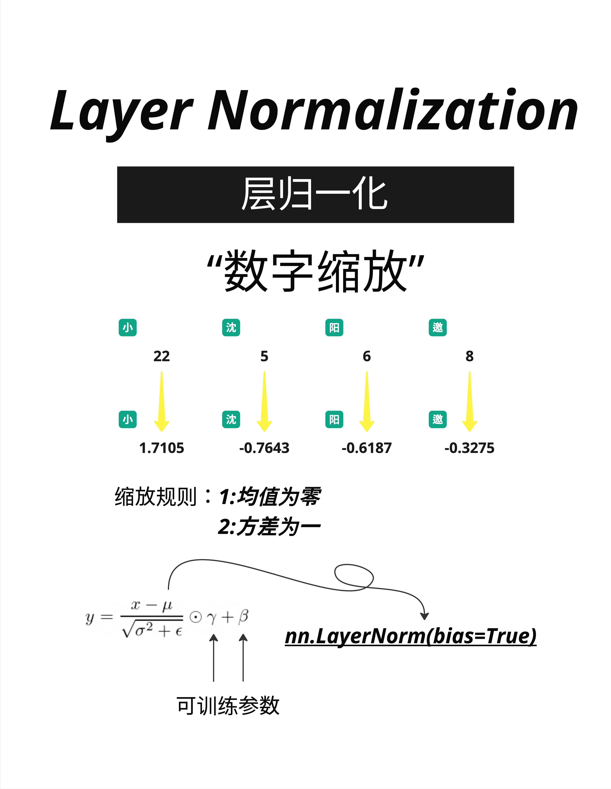

- LayerNorm 让数字保持在合理范围（均值为 0，方差为 1），Softmax 把任意数字变成概率分布（总和为 100%）。这两个工具在 Transformer 中无处不在。
  
- 为什么叫 LayerNorm？因为它是在每一层（Layer）进行的归一化（Normalization）。它的作用是让每一层的输入保持稳定，避免数值过大或过小导致训练困难。
  还有一种叫 Batch Normalization，是在 batch 维度上归一化。但 Transformer 主要使用 Layer Normalization，因为它更适合处理变长序列。
- 在使用 Softmax 时，有一个重要的参数叫 Temperature（温度）。
  当你使用 ChatGPT 时，可以调整 temperature 参数：

  temperature=0：输出最确定，每次结果相同（确定性解码）
  temperature=0.7：平衡创造性和一致性（常用值）
  temperature=1.0+：更有创造性，但可能更随机
