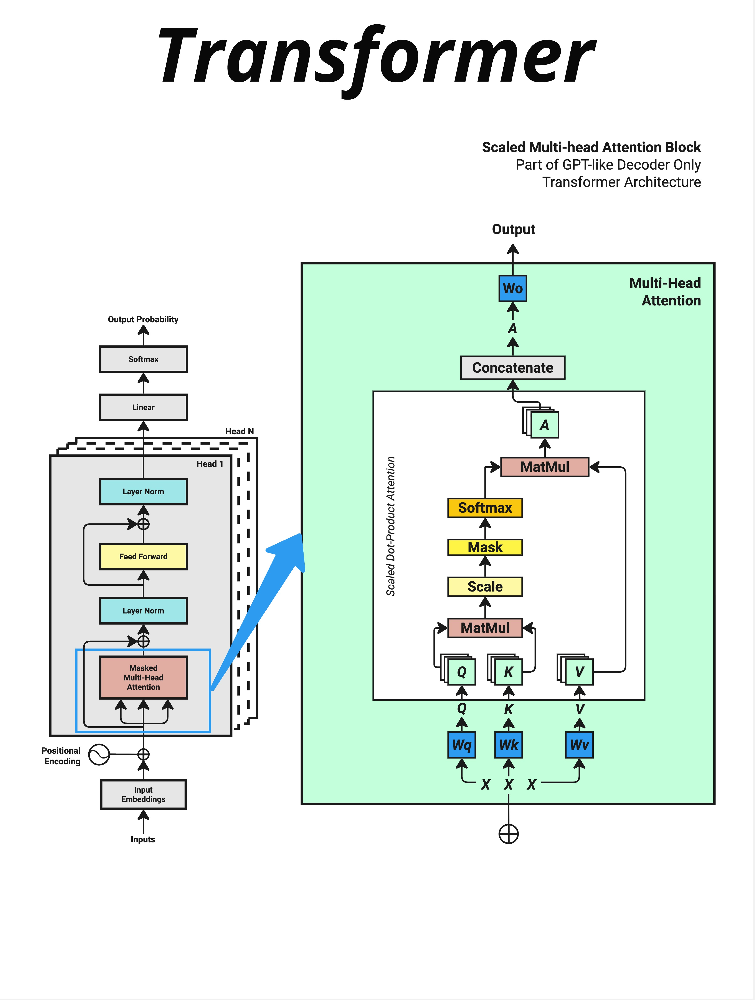

- Attention 的几何本质是用点积计算"相似度"。通过 Q @ K 找出哪些词和当前词最相关，用 Softmax 把相似度变成注意力权重，最后用这些权重对 V 进行加权求和。这让模型能够动态地把注意力集中在最重要的位置。
- 

  输入 X
  ↓
  生成 Q, K, V（通过 Wq, Wk, Wv 三个权重矩阵）
  ↓
  MatMul（Q @ K^T，计算相似度）
  ↓
  Scale（除以 √d_key，缩放）
  ↓
  Mask（遮挡未来信息，仅在 Decoder 中使用）
  ↓
  Softmax（转换为概率分布）
  ↓
  MatMul（与 V 相乘，加权求和）
  ↓
  Concatenate（多头合并）
  ↓
  Wo（输出投影）
  ↓
  输出

- Attention 的核心思想是：让每个词都能直接"看到"所有其他词。
  RNN 模式：传话游戏，信息从第一个人传到最后一个人
  Attention 模式：圆桌会议，每个人都能直接听到所有人的发言
- 如果要计算所有词两两之间的相似度，一个个算太慢了。
  用矩阵乘法，一次搞定！
  `词向量矩阵 [n, d] @ 词向量矩阵转置 [d, n] = 相似度矩阵 [n, n]`
  
- Attention 的本质：
  不是平等对待所有词
  而是有选择地关注最相关的词
  把"注意力"集中在重要的地方
- 在 Softmax 之前，还有一个 Scale（缩放） 步骤：

  Attention(Q, K, V) = softmax(QK^T / √d_key) × V
  为什么要除以 √d_key？

  原因：防止点积结果太大
  这会导致 Softmax 的输出变得极端：

  最大值接近 1
  其他值接近 0
  **梯度消失，难以训练**

- 为什么点积最佳
  - GPU 对矩阵乘法有极致优化，这让 Attention 能够并行处理所有位置。
  - 几何意义清晰
  - 可学习的权重矩阵
- Self-Attention（自注意力）vs Cross-Attention（交叉注意力）
  - Self-Attention：在同一序列内部计算注意力，适用于 Encoder 和 Decoder 的第一部分。
  - Cross-Attention：在 Decoder 中计算注意力，Query 来自 Decoder，Key 和 Value 来自 Encoder，用于连接输入和输出。

  GPT 是 Decoder-only 架构，只使用 Self-Attention：

  只有一个输入序列
  每个词关注自己和之前的词
  通过 Mask 防止"偷看"未来的词
