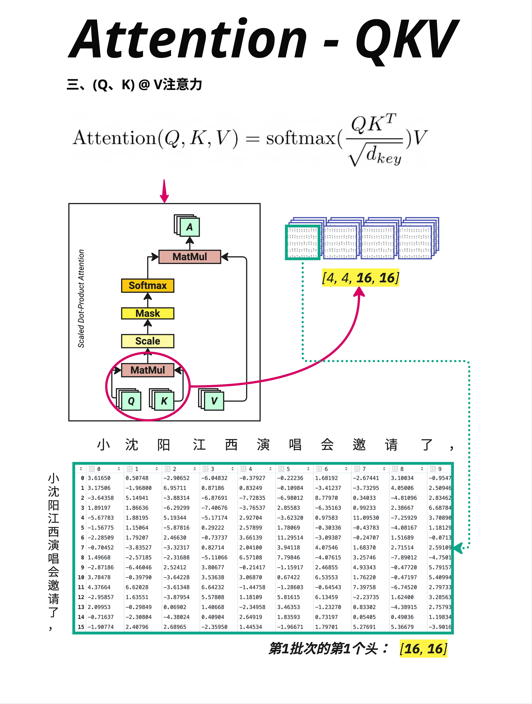
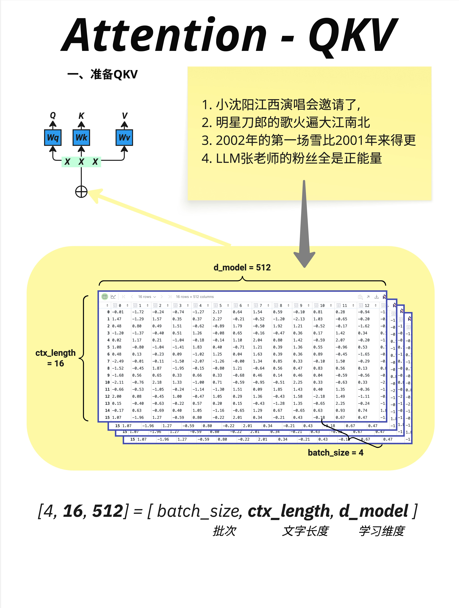

- Q、K、V 是 Attention 的三个主角。Q 代表"查询"，K 代表"键"，V 代表"值"。通过 Q @ K 找到相关的位置，用注意力权重对 V 加权求和，得到融合了上下文信息的新表示。这就是 Attention 让模型"理解"语言的方式。
  
- 
  batch_size = 4：同时处理 4 个句子（批次大小）
  ctx_length = 16：每个句子有 16 个 token（上下文长度）
  d_model = 512：每个 token 用 512 维向量表示（模型维度）
- Q、K、V 的形状和输入 X 完全相同
  [4, 16, 512] @ [512, 512] = [4, 16, 512]
- 既然形状都一样，为什么要用三个不同的矩阵？

  答案是：Q、K、V 承担不同的角色。

  Q（Query，查询）：代表"我在找什么信息"
  K（Key，键）：代表"我有什么信息可以被找到"
  V（Value，值）：代表"如果被找到，我提供什么内容"

  通过学习不同的 Wq、Wk、Wv，模型可以学会：
  把同一个词转换成不同的"角色"
  在不同的"语义空间"中进行匹配

- 用一个三角形 Mask 把未来的位置"遮住", 把右上角（未来的位置）设为负无穷（-inf）。

---

```
步骤1：生成 Q, K, V
        Q = X @ Wq    [4, 16, 512]
        K = X @ Wk    [4, 16, 512]
        V = X @ Wv    [4, 16, 512]
              ↓
步骤2：计算相似度
        scores = Q @ K^T    [4, 16, 16]
              ↓
步骤3：缩放
        scores = scores / √d_key    [4, 16, 16]
              ↓
步骤4：Mask（可选，仅 Decoder）
        scores[mask] = -inf    [4, 16, 16]
              ↓
步骤5：Softmax
        weights = softmax(scores)    [4, 16, 16]
              ↓
步骤6：加权求和
        output = weights @ V    [4, 16, 512]
```
