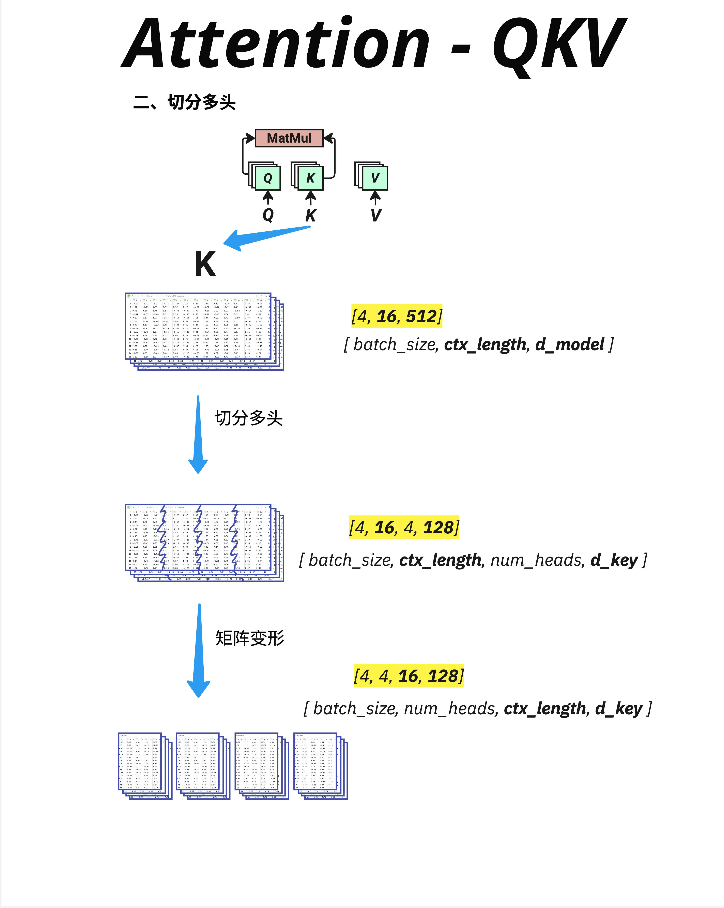

- Multi-Head Attention 是 Transformer 的核心创新之一。它把 Attention 分成多个头，每个头可以学习不同的注意力模式——有的关注语法，有的关注语义，有的关注位置。最后通过 Concatenate + Wo 把所有头的信息融合起来。这让模型能够从多个角度理解语言，比单头 Attention 更加强大。

- 
  Multi-Head 的核心操作是切分维度。

  ```
  原始 K: [batch_size, ctx_length, d_model]
        = [4, 16, 512]
                ↓
  切分：  [batch_size, ctx_length, num_heads, d_key]
        = [4, 16, 4, 128]
                ↓
  转置：  [batch_size, num_heads, ctx_length, d_key]
        = [4, 4, 16, 128]
  ```

  对于每个 batch 中的样本
  有 num_heads 个独立的 Attention 头
  每个头处理 ctx_length 个位置
  每个位置用 d_key 维向量表示

- 一次大矩阵乘法比多次小矩阵乘法更高效、GPU 更擅长处理大的连续矩阵运算
- Wo 输出投影矩阵，融合各头信息
- 流程图

```
输入 X [batch, seq, d_model]
        ↓
   生成 Q, K, V（通过 Wq, Wk, Wv）
        ↓
   切分多头 [batch, num_heads, seq, d_key]
        ↓
   并行计算 Attention（每个头独立）
        ↓
   合并多头 [batch, seq, d_model]
        ↓
   输出投影（@ Wo）
        ↓
输出 [batch, seq, d_model]
```

- 增加头的数量意味着减小 d_key：

  d_key = d_model / num_heads
  如果 d_key 太小：

  每个头的表达能力下降
  可能无法捕捉复杂的模式
  **常见的 d_key 通常是 64 或 128，这是一个经验性的平衡点。**

- 维度变化

```
输入:     [batch, seq, d_model]
             ↓
切分:     [batch, num_heads, seq, d_key]
             ↓
Attention: [batch, num_heads, seq, d_key]
             ↓
合并:     [batch, seq, d_model]
             ↓
Wo 投影:  [batch, seq, d_model]
```
