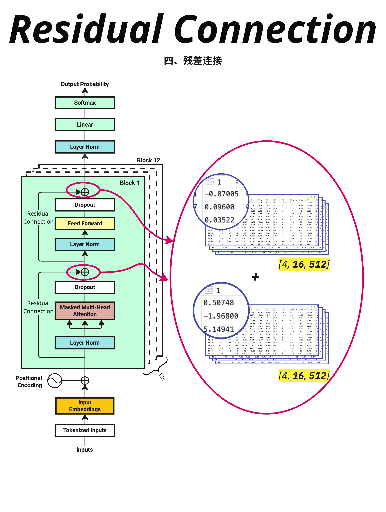

残差连接把 Attention 的输出和原始输入相加，让信息可以"走捷径"直接传到后面的层，解决深度网络的`梯度消失`问题；Dropout 在训练时随机"丢弃"一些神经元，防止模型`过拟合`。

- 
  输入 X
  ↓
  Layer Norm
  ↓
  Masked Multi-Head Attention
  ↓
  Dropout
  ↓
  残差连接（+ X） ← 第一个残差连接
  ↓
  Layer Norm
  ↓
  Feed Forward (FFN)
  ↓
  Dropout
  ↓
  残差连接（+ 上一步输出） ← 第二个残差连接
  ↓
  输出

- 残差连接的核心思想非常简单：让输入可以直接"跳过"某些层。
  输出 = Layer(X) + X
  这样做的好处是：
  - 在反向传播时，梯度可以通过残差连接直接传回去
  - 如果某一层"不知道该学什么"，它可以学习成恒等映射
  - 原始信息总是被保留的。即使经过很多层，输入的信息也不会完全丢失

  ```py

  class TransformerBlock(nn.Module):
      def __init__(self, d_model, num_heads, d_ff, dropout=0.1):
          super().__init__()
          self.attention = MultiHeadAttention(d_model, num_heads)
          self.ffn = FeedForward(d_model, d_ff)
          self.norm1 = nn.LayerNorm(d_model)
          self.norm2 = nn.LayerNorm(d_model)
          self.dropout = nn.Dropout(dropout)

      def forward(self, x, mask=None):
          # 第一个残差连接
          attn_output = self.attention(self.norm1(x), mask)
          x = x + self.dropout(attn_output)  # 残差连接！

          # 第二个残差连接
          ffn_output = self.ffn(self.norm2(x))
          x = x + self.dropout(ffn_output)   # 残差连接！

          return x
  ```

- PyTorch 的 Dropout 会自动处理训练/推理模式的切换
- 研究发现 Pre-Norm 的训练更稳定(PreNorm 是在残差连接前进行 LayerNorm)，因此现在的 Transformer 大多采用 Pre-Norm 结构。

---

LayerNorm 稳定输入
Attention/FFN 学习特征
Dropout 增加正则化
残差连接保留原始信息

- 有趣的趋势：模型越大，Dropout 率越低，甚至不用。
  原因：大模型的参数量已经足够大，过拟合风险降低。`而且大数据集本身就提供了足够的正则化。`
