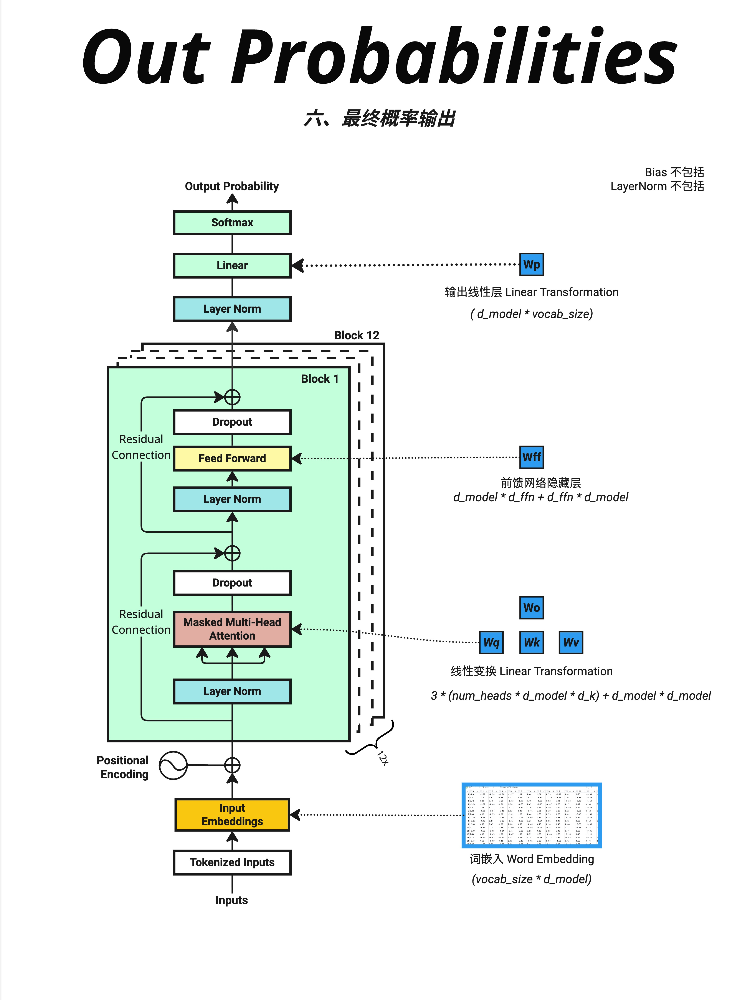

Transformer 的前向传播就是：文字 → Token → Embedding+位置 → N层Block（Attention+FFN）→ Linear映射到词表 → Softmax得概率 → 输出预测词。理解这个完整流程，就理解了 GPT 如何"思考"。

- GPT、LLaMA、Claude 等现代语言模型都采用 Decoder-Only 架构。与原始 Transformer 的 Encoder-Decoder 结构不同，Decoder-Only 只保留了解码器部分，专注于自回归生成任务。

- 每个 Transformer Block 包含两个子层：

输入 [16, 512]，输出还是 [16, 512]——维度不变！

```
输入 X [16, 512]
    ↓
┌─────────────────────────────┐
│  Layer Norm                 │
│      ↓                      │
│  Multi-Head Attention       │  ← 理解词之间的关系
│      ↓                      │
│  Dropout → + X (残差连接)    │
└─────────────────────────────┘
    ↓
┌─────────────────────────────┐
│  Layer Norm                 │
│      ↓                      │
│  Feed Forward Network       │  ← 特征变换
│      ↓                      │
│  Dropout → + X (残差连接)    │
└─────────────────────────────┘
    ↓
输出 [16, 512]
```

- 

  Embedding: ~31% ████████
  Attention: ~23% ██████
  FFN: ~46% ████████████
  LayerNorm: `&lt;1%

  FFN 占了将近一半的参数！ 这也是为什么有人说 FFN 存储了模型的"知识"。

- 训练时，我们有正确答案（下一个词），可以计算交叉熵损失
  Loss = CrossEntropy(predicted_probs, target_token)
