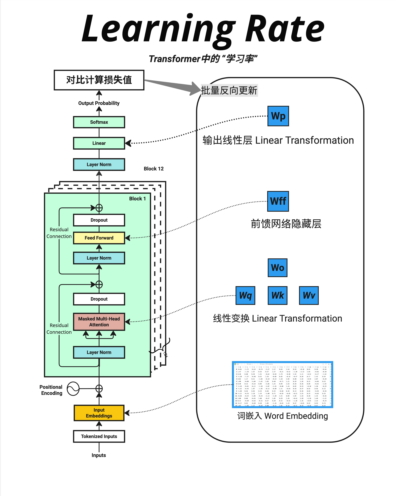

- 学习率是训练神经网络最重要的超参数之一。它决定了每次更新的步长：太大会震荡发散，太小会收敛太慢。配合 Warmup 和 Cosine Decay 等调度策略，可以让训练更加稳定高效。对于大模型，常用 AdamW 优化器，配合 3e-4 左右的学习率和 0.1 左右的 weight decay。
- 学习率决定了每次更新参数时"走多大一步"。太大会震荡发散，太小会收敛太慢，只有合适的学习率才能让模型稳定地学到知识。
- 新的权重 = 旧的权重 - learning_rate × 误差梯度
- "3e-4 is the best learning rate for Adam, hands down."
  "(i just wanted to make sure that people understand that this is a joke...)"
  最佳学习率取决于具体任务、模型大小、批次大小等因素。
- 

- 常见`学习率调度`策略
  一个固定的学习率往往不是最优的：
  训练初期：需要较大的学习率快速下降
  训练后期：需要较小的学习率精细调整

  Warmup + Cosine Decay（最常用）：

  ```
  学习率
    ↑
    |    /\
    |   /  \__
    |  /      \___
    | /           \____
    +------------------------→ 训练步数
      ↑        ↑
    warmup   cosine decay
  Warmup 阶段：学习率从很小逐渐增加到目标值
  Decay 阶段：学习率按余弦函数逐渐减小
  ```

- 更大的批次 → 可以用更大的学习率
  原因：更大的批次意味着梯度估计更准确，可以走更大的步。
  更大的模型 → 通常需要更小的学习率
