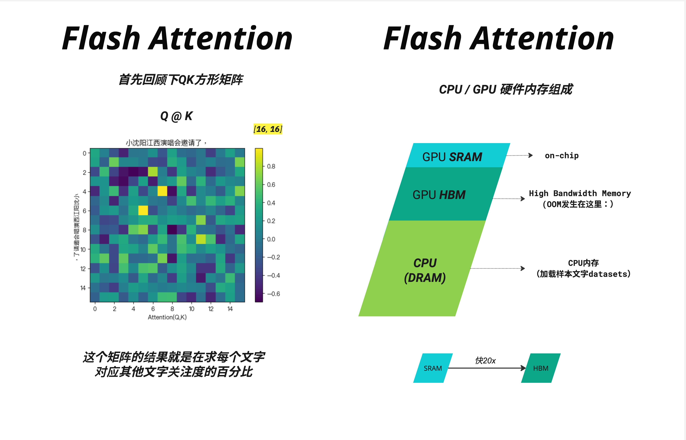
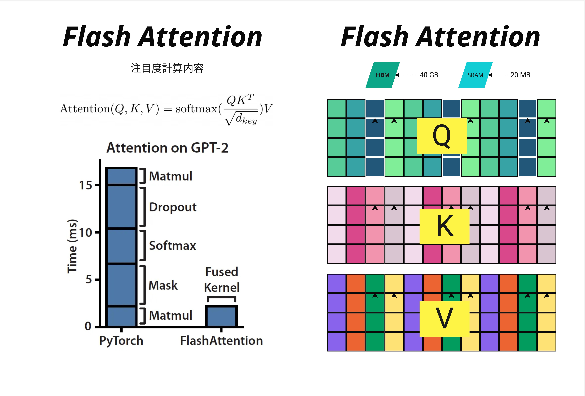

KV Cache 和 Flash Attention 是互补的技术：
Flash Attention：优化单次 Attention 计算的内存效率
KV Cache：避免推理时的重复计算
两者结合使用（如 Flash Decoding），可以实现更快的推理速度。

---

Flash Attention 的核心洞察：`GPU 的计算速度远快于内存读写速度`，通过巧妙的`分块(tiling)`策略和`在线算法(Online Softmax)`，我们可以用"多算一点"换取"少读写很多"，最终实现 2-4 倍的端到端加速。

- 内存带宽
  当序列长度增加时，训练速度急剧下降，而且经常出现 OOM（Out of Memory）错误。
  更诡异的是，即使 GPU 显存还有剩余，即使 GPU 利用率看起来很高，Attention 计算仍然成为瓶颈。这是为什么？
  
  GPU 的内存并不是一个统一的整体，而是分为多个层级：

  | 层级 | 名称                       | 容量      | 速度        | 说明       |
  | ---- | -------------------------- | --------- | ----------- | ---------- |
  | 片上 | SRAM（共享内存/L1/L2缓存） | ~20 MB    | ~19 TB/s    | 极快但极小 |
  | 显存 | HBM（高带宽内存）          | ~40-80 GB | ~1.5-3 TB/s | GPU 主内存 |
  | 主机 | CPU DRAM                   | ~1 TB     | ~12.8 GB/s  | 更大更慢   |

  每一步都涉及大量的 HBM 读写！这就是瓶颈所在。

  ```py
  # 标准 Attention 实现
  def standard_attention(Q, K, V):
      # 步骤 1: 计算 QK^T，结果存入 HBM
      scores = torch.matmul(Q, K.transpose(-2, -1)) / math.sqrt(d_k)

      # 步骤 2: 从 HBM 读取 scores，计算 softmax，结果存回 HBM
      attention_weights = torch.softmax(scores, dim=-1)

      # 步骤 3: 应用 dropout（可选），又是一次 HBM 读写
      attention_weights = dropout(attention_weights)

      # 步骤 4: 从 HBM 读取权重和 V，计算输出
      output = torch.matmul(attention_weights, V)

      return output
  ```

  

- tiling 分块：
  GPU 内存瓶颈：现代 GPU 的计算速度远快于内存带宽，Attention 计算的瓶颈在于 HBM 读写，而非算力
  - 将大矩阵分成小块，在 SRAM 中完成所有计算
  - 避免将 N^2 的 Attention 矩阵写入 显存
- Online Softmax
  边处理边更新，不需要看到完整的一行

- 效果：
  端到端训练速度提升 2-4 倍
  内存占用大幅降低
  支持更长的序列长度
