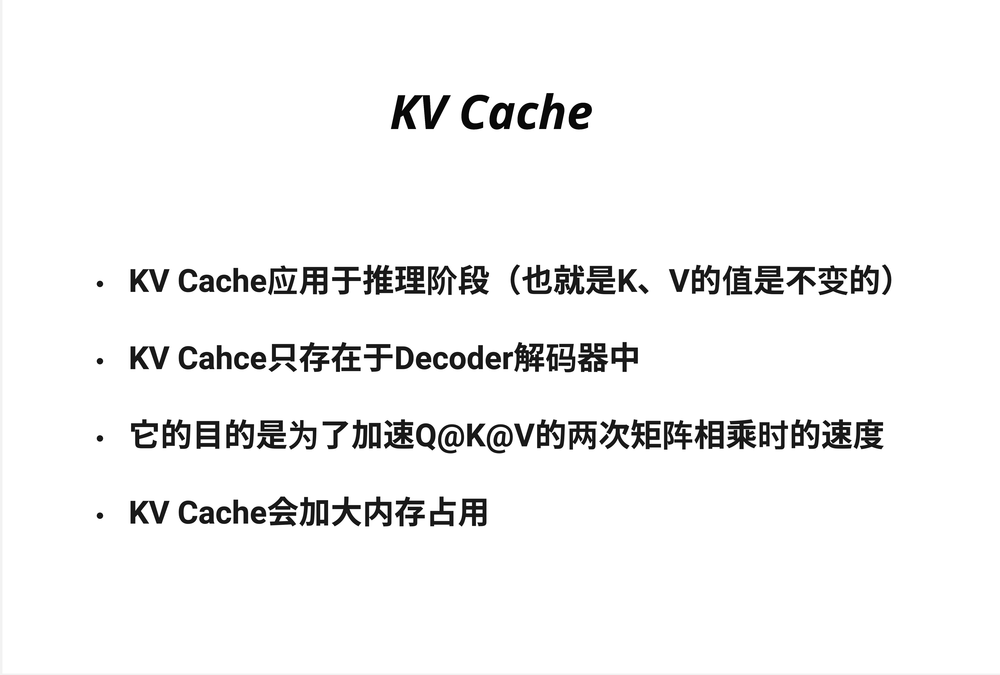

KV Cache 通过缓存已计算过的 Key 和 Value，避免`自回归生成时的Attention重复计算`，将推理速度提升 5 倍以上——这是所有生产级 LLM 的标配优化。

- 
  KV Cache 应用于推理阶段（也就是 K、V 的值是不变的）
  KV Cache 只存在于 Decoder 解码器中
  它的目的是为了加速 Q@K@V 的两次矩阵相乘时的速度
  KV Cache 会加大内存占用

  从 O(n^2) 降到 O(n)，生成 1000 token 节省 99.9%

- 如果上下文长度是 4096，每个请求需要约 2GB KV Cache
  KV Cache 随上下文线性增长
  `KV Cache 内存占用往往是限制并发量的瓶颈，而不是模型参数本身。这就是为什么后来出现了 MQA、GQA 等优化技术`

- ChatGPT 的流式响应之所以能做到"打字机效果"，部分原因就是 KV Cache 让每个新 token 的生成非常快。

- PyTorch 代码实现逻辑

```py
# 初始化每层的键和值缓存
num_layers = 96  # 假设 Transformer 有 96 层
key_cache = [[] for _ in range(num_layers)]
value_cache = [[] for _ in range(num_layers)]

# 处理输入序列（Prefill 阶段）：
for token in input_sequence:
    for layer in range(num_layers):
        # 计算当前标记在该层的键和值
        new_key = compute_key(layer, token)
        new_value = compute_value(layer, token)

        # 将新键和值添加到该层的缓存中
        key_cache[layer].append(new_key)
        value_cache[layer].append(new_value)

# 生成新 token（Decode 阶段）：
# 推理过程中的新标记生成
for new_token in generate_sequence:
    for layer in range(num_layers):
        # 计算当前时间步在该层的 Query
        query = compute_query(layer, new_token)

        # 使用该层缓存的 Key 和 Value 以及当前的 Query 进行自注意力计算
        output = attention(query=query, keys=key_cache[layer], values=value_cache[layer])

    # 使用输出生成下一个标记
    next_token = generate_next_token(output)
    generate_sequence.append(next_token)
```

- 现代 LLM 推理分为两个阶段：

| 阶段     | Prefill（预填充）    | Decode（解码）     |
| -------- | -------------------- | ------------------ |
| 输入     | 用户的完整 prompt    | 上一步生成的 token |
| 计算     | `并行`处理所有 token | 串行生成每个 token |
| KV Cache | 初始化缓存           | 追加新的 K、V      |
| 瓶颈     | 计算密集             | 内存带宽密集       |

`Decode 阶段是瓶颈`
Prefill 阶段虽然 token 多，但可以并行计算，充分利用 GPU 的计算能力。

Decode 阶段：
每次只处理 1 个 token
GPU 大量算力空闲
主要时间花在从显存读取 KV Cache
这就是为什么 Decode 阶段是"Memory Bound"（内存带宽受限）的。

`优化方向：这解释了为什么后续章节要学习 MQA/GQA（减少 KV 数量）和量化（减少 KV 精度）。`

- 首 token 延迟：Prefill 阶段无法加速

- KVCache 优化技术
  - 减少 KV 数量
    MQA (Multi-Query Attention)：所有 Query head 共享一组 K、V
    GQA (Grouped-Query Attention)：多个 Query head 共享一组 K、V
  - 减少 KV 精度
    KV Cache 量化：用 INT8 或 FP8 存储 K、V
    内存减半，精度损失微小
  - 压缩/淘汰 KV
    Sliding Window Attention：只保留最近 N 个 token 的 KV
    StreamingLLM：保留"attention sink" + 最近 token
    `PagedAttention (vLLM)：像操作系统管理内存一样管理 KV`

- KV Cache 是 LLM 推理的"必选项"，不是"优化选项"。所有生产级部署都会开启它。理解 KV Cache 是理解 LLM 系统优化的基础——接下来的 MQA、GQA、PagedAttention 等技术，都是在 KV Cache 基础上的进一步优化。
