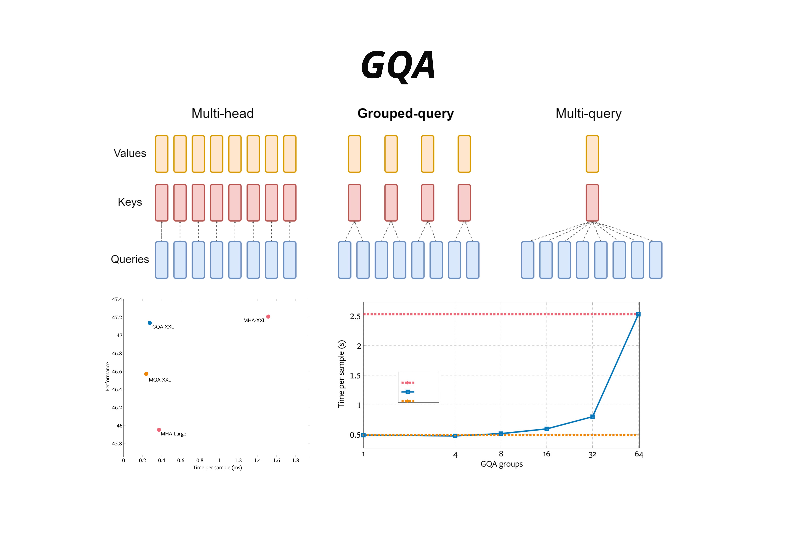

从 MHA 到 MQA 到 GQA 的演进，体现了深度学习工程化的一个核心主题：在模型质量和部署效率之间寻找最佳平衡。GQA 通过分组共享 K、V，用 25% 的内存换取接近 100% 的质量，成为了现代大模型的主流选择。

MHA 让每个注意力头都有独立的 K、V，表达能力最强但内存开销巨大；MQA 让所有头共享同一组 K、V，内存最省但质量下降；**GQA** 是折中方案，分组共享 K、V，在内存效率和模型质量之间找到了最佳平衡点，已成为 Llama-3、Mistral、Qwen 等主流模型的标配。

- MHA（Multi-Head Attention）的设计理念是：让每个头都能学习不同的表示。
  Below is a table summarizing the memory and performance trade-offs:
  

  | 机制 | 全称                    | 核心思想            | 内存开销 | 模型质量 |
  | ---- | ----------------------- | ------------------- | -------- | -------- |
  | MHA  | Multi-Head Attention    | 每个头独立的 K、V   | 最大     | 最优     |
  | MQA  | Multi-Query Attention   | 所有头共享一组 K、V | 最小     | 下降     |
  | GQA  | Grouped-Query Attention | 分组共享 K、V       | 中等     | 接近MHA  |

  GQA 的核心价值：用接近 MQA 的推理效率，获得接近 MHA 的模型质量。

- 在 MHA 中，不同头的 K、V 表示存在高度相似性
  共享 K、V 并不会导致严重的信息损失
- KV 头数通常是 8，这是一个经验上的甜点
  研究表明，KV 头数从 1 增加到 8 时，模型质量显著提升；但从 8 增加到更多时，边际收益递减。
  同时，8 这个数字对 GPU 的张量并行（Tensor Parallelism）也很友好——可以均匀分配到 2、4、8 个 GPU 上。

- Flash Attention 优化计算效率，GQA 优化内存效率
- GQA 是一种参数化的设计，n_kv_heads 是可调的超参数。MHA 和 MQA 是 GQA 的两个极端情况。
- KV 头数与模型质量存在权衡。过少的 KV 头会导致显著的质量下降。8 是一个经验上的良好选择。
