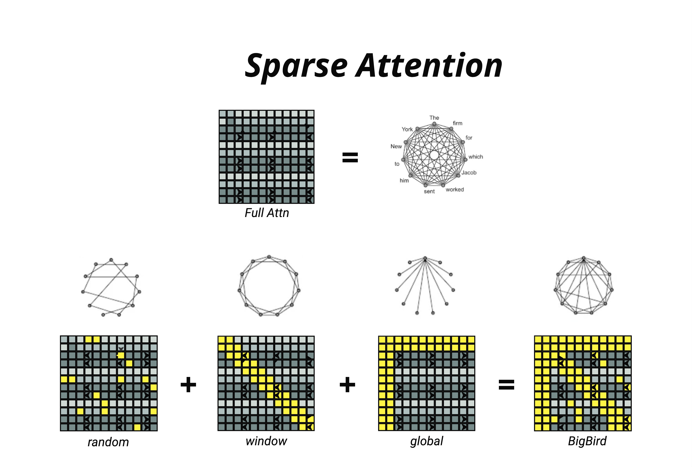
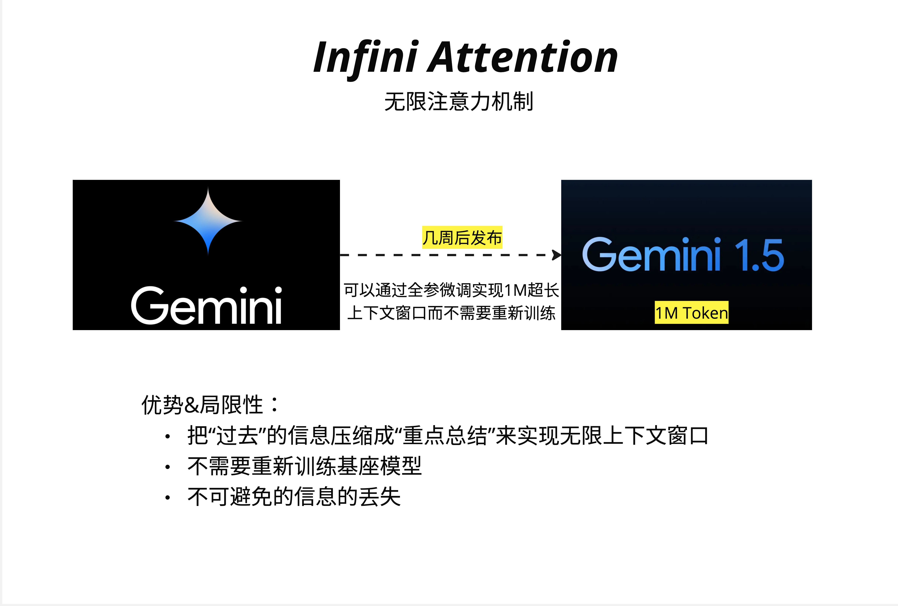
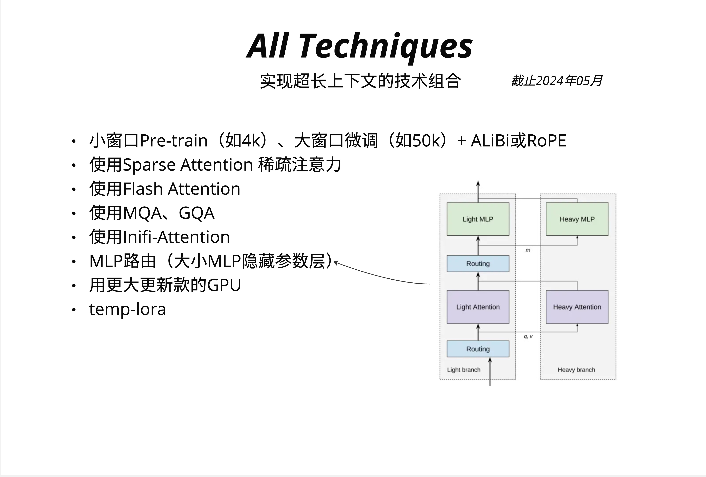

稀疏注意力（Sparse Attention）

- 当序列长度从千级跃升到百万级，O(n^2) 的 Full Attention 成为不可逾越的瓶颈。Sparse Attention 通过"选择性关注"降低复杂度，而 Infini Attention 则用压缩记忆实现理论上无限的上下文窗口。

- 现实世界的需求却在不断推动上下文窗口的扩展：

长文档理解：一本书可能有 50 万字，约 100 万 tokens
代码分析：一个完整的代码仓库可能有数万行代码
多轮对话：长时间的对话历史需要被记住
视频理解：一小时视频可能产生数十万个 token

`这就引出了本章的核心问题：如何在不牺牲太多性能的前提下，突破 O(n^2) 的限制？`

- Sparse Attention 的关键在于如何选择"重要"的连接。业界发展出三种主要的稀疏模式：

1. Random Attention（随机注意力）
   随机选择一些 token 进行关注。虽然看起来很粗暴，但理论上可以保证信息在图中的传播。

2. Window/Sliding Window Attention（滑动窗口注意力）
   每个 token 只关注其周围固定窗口内的 token。这基于`局部性假设`：局部上下文通常最重要。

3. Global Attention（全局注意力）
   指定某些特殊 token（如 [CLS] 或句首词）与所有其他 token 相连。这些"枢纽"token 负责收集和分发全局信息。

- BigBird（由 Google 提出）是 Sparse Attention 的经典实现，它组合了三种稀疏模式：

  BigBird Attention = Random + Window + Global
  

- Linear Attention 的思想——改变计算顺序来降低复杂度——启发了后续很多工作。
  Linear Attention 并非完美：
  表达能力下降：去掉 softmax 后，注意力分布的"尖锐度"降低
  训练不稳定：某些核函数会导致数值问题
  实际效果：在很多任务上不如标准 Attention
- Infini Attention：无限上下文的终极方案
  即使使用了 Sliding Window，传统方法在处理超长上下文时仍有问题
  传统的 KV Cache会线性增长——每一轮对话都要缓存更多的 K 和 V。当对话持续很久或者需要处理整本书时，显存会爆炸。
  Google 在 2024 年提出的 Infini Attention 给出了一个优雅的解决方案：
  **用固定大小的"压缩记忆"来存储无限长的历史信息。**
  
  Compressed Memory（压缩记忆）+ Linear Access（线性访问）
  压缩记忆的大小是固定的（d x d），与历史长度无关。
  无论你处理了 1 万、10 万还是 100 万个 token，memory 矩阵的大小始终是 d_model x d_model。
  这就像人类的记忆：我们不可能记住生活中的每一个细节，但我们会不断压缩和更新我们的记忆，保留最重要的信息。

- 实现超长上下文的完整方案
  

---

1. Full Attention 的 O(n^2) 瓶颈：序列长度增加 10 倍，计算量增加 100 倍，显存是更大的瓶颈

2. Sparse Attention 的三种模式：

   Random：随机连接，保证信息传播
   Window：局部连接，捕捉局部依赖
   Global：全局枢纽，收集分发全局信息

3. BigBird = Random + Window + Global：组合三种模式，复杂度降为 O(n)

4. Linear Attention 的核心技巧：改变计算顺序，先算 K^T @ V，用核函数替代 softmax

5. Infini Attention 的创新：

   固定大小的压缩记忆
   增量更新
   融合局部注意力和记忆检索

6. 实践建议：根据上下文长度需求选择合适的技术组合
