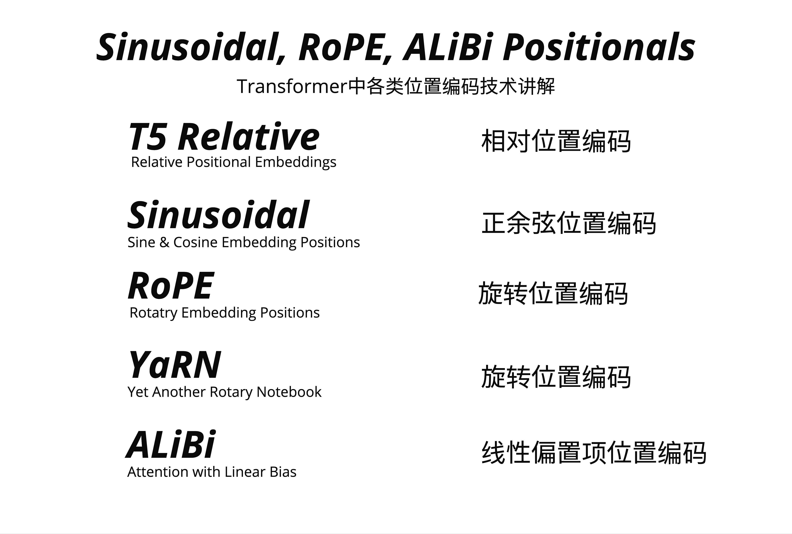
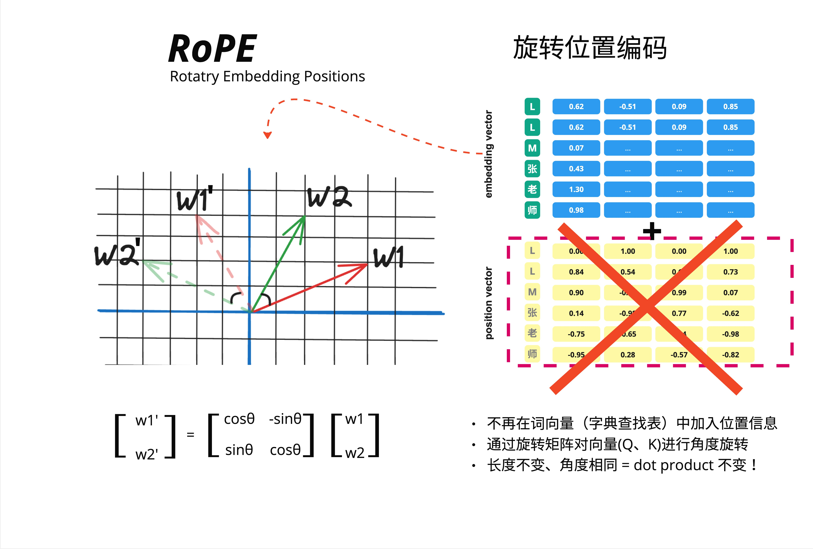

位置编码从`"固定加法"演进到"旋转乘法"再到"注意力偏置"`，RoPE 用旋转矩阵让相对位置自然涌现，ALiBi 用线性惩罚让远距离 token 自动衰减，而 YaRN 则让模型突破训练时的上下文长度限制。


- **外推能力：推理长度超过训练长度时的性能保持**

- 我们能否设计一种位置编码，既能捕获相对位置信息，又能高效推理？

| 方案        | 英文全称                          | 中文名             | 代表模型         |
| ----------- | --------------------------------- | ------------------ | ---------------- |
| T5 Relative | Relative Positional Embeddings    | 相对位置编码       | T5               |
| Sinusoidal  | Sine & Cosine Embedding Positions | 正余弦位置编码     | 原始 Transformer |
| RoPE        | Rotary Position Embedding         | 旋转位置编码       | LLaMA, GPT-NeoX  |
| YaRN        | Yet another RoPE extensioN        | RoPE 扩展          | Code Llama, Qwen |
| ALiBi       | Attention with Linear Bias        | 线性偏置项位置编码 | BLOOM, MPT       |

Sinusoidal 是绝对的，RoPE/ALiBi 是相对的
我们能否设计一种位置编码，既能捕获相对位置信息，又能高效推理？本章将深入讲解 RoPE、ALiBi 和 YaRN 这三种现代方案。

- 为什么早期的 GPT 模型有严格的上下文长度限制：训练多长，就只能用多长。
  Sinusoidal 编码的是绝对位置。模型学到的是"位置 5"的模式，而不是"相距 3 个位置"的模式。当推理长度超过训练长度时，模型会遇到从未见过的绝对位置，性能急剧下降。

- 2021 年，苏剑林提出了 RoPE（Rotary Position Embedding），彻底改变了位置编码的范式。
  
  RoPE 的革命性想法：不再把位置信息加到词向量上，而是用旋转矩阵对 Q、K 向量进行旋转。
  RoPE 的核心洞察：**如果我们把位置信息编码成旋转角度，那么相对位置自然就体现在两个向量的相对旋转角度中。**
- 2021 年，Press 等人提出了另一种完全不同的方案：ALiBi（Attention with Linear Biases）。
  ALiBi 的想法非常简洁：不修改 embedding，而是在注意力分数上加一个线性惩罚。距离越远，惩罚越大。
  经过 softmax 后，近处的 token 自然获得更高的注意力权重。

- RoPE 虽然优秀，但有一个问题：当推理长度超过训练长度时，性能会下降。
  YaRN（Yet another RoPE extensioN）就是为了解决这个问题而生。RoPE 的扩展，支持超长上下文

```
2017: Sinusoidal (原始 Transformer)
  |
  | 问题：绝对位置，外推差
  v
2021: RoPE (苏剑林)
  |
  | 问题：超长上下文
  v
2021: ALiBi (Press et al.)
  |
  | 简洁但粗暴
  v
2023: YaRN (扩展 RoPE)
  |
  | 支持 100k+ 上下文
  v
未来: ?
```

Sinusoidal 用加法告诉模型绝对位置，RoPE 用旋转让相对位置自然涌现，ALiBi 用惩罚让远距离 token 说话声音变小。没有完美的方案，只有合适的选择。
