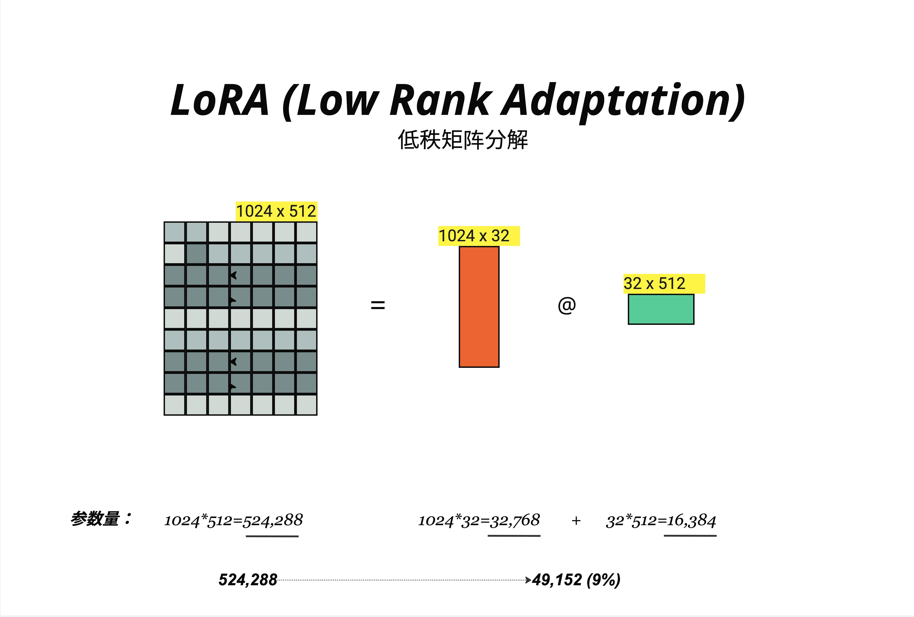

LoRA 通过低秩矩阵分解，只训练原始权重的一小部分参数（通常 0.1%-1%），就能达到接近全参数微调的效果；QLoRA 在此基础上将模型量化到 4-bit，让你在消费级显卡上也能微调 7B 甚至 13B 的大模型。

- 预训练模型已经学到了绝大部分通用知识。
  微调只是让模型"适应"特定任务，而不是从头学习。这种"适应"可能只需要调整一小部分参数。
  微调时权重的变化量 ΔW 是低秩的（low-rank）。也就是说，ΔW 可以用两个更小的矩阵相乘来近似。
- 
  任何矩阵都可以用两个低秩矩阵的乘积来近似
  ΔW (N×D) ≈ B (N×r) @ A (r×D)
  其中 r 远小于 N 和 D。LoRA 的关键洞察是：权重更新 ΔW 往往是低秩的，因此可以用小矩阵高效表示。
  LoRA 的核心想法是：不修改原始权重 W，而是学习一个低秩的增量 ΔW。

- QLoRA（Quantized LoRA）：把模型量化到 4-bit，再应用 LoRA
  parameters = W (量化) + B @ A (LoRA)
  QLoRA 让你在 RTX 3090（24GB） 上就能微调 7B 模型！甚至 RTX 4080（16GB） 也可以尝试。

- LoRA 使用场景
  - 适合用 LoRA：
    显存有限（消费级显卡）
    需要快速迭代（实验不同配置）
    需要多个适配器（法律、医疗、代码等）
    微调任务相对简单

  - 可能需要全参数微调：
    任务与预训练数据差异很大
    追求极致效果
    有充足的计算资源

---

LoRA 是大模型时代最重要的微调技术之一。它基于一个简单而深刻的洞察：微调时权重的变化是低秩的。通过只学习两个小矩阵 B 和 A，LoRA 能在保持 95%+ 效果的同时，将训练参数减少到原来的 0.1%。配合 QLoRA 的 4-bit 量化，即使在消费级显卡上也能微调 7B 甚至更大的模型。
