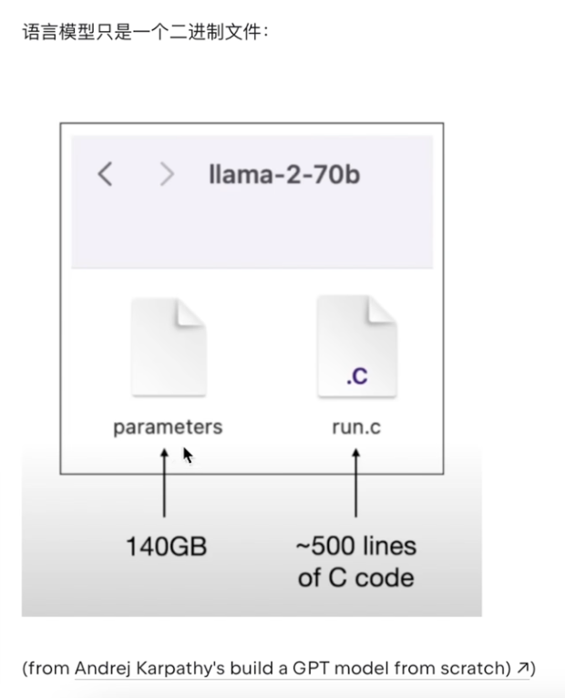

https://www.bilibili.com/video/BV1EJ4m1t7Zs

## 大语言模型（LLM）的本质与内核可以概括为以下四点：

### 1. 核心本质：词汇接龙的“概率统计器”

LLM 并不是真的“理解”人类语言，它本质上是一个通过海量文本训练得出的**概率分布模型**。当你输入一段话时，它在计算并返回后续最可能出现的字符。

- **参数即概率**：所谓的千亿参数，实质上是记录了文字与文字之间关联密切程度的数字。

### 2. 底层架构：Transformer

所有的主流 LLM（如 GPT、Llama）都建立在 2017 年提出的 **Transformer** 架构之上。

- **突破点**：引入了注意力机制，解决了长文本上下文关联的难题，让模型能处理理论上无限长的语境。

### 3. 物理形态：巨大的二进制文件


模型在计算机中表现为两个核心部分：

- **权重文件**：存储参数的二进制大文件（如 70B 模型约 140GB），决定了模型的“智力”。
- **推理代码**：一段运行代码（如 Python 或 C），负责加载权重并处理用户输入。

### 4. 进化趋势：从单体到 MoE（混合专家模型）

为了解决超大规模模型运行速度慢、资源消耗高的问题，现代架构（如 GPT-4）转向 **MoE**：

- **分而治之**：将一个巨型模型拆分为多个领域的专业小模型（如数学专家、代码专家、写作专家）。
- **精准调用**：根据用户问题仅激活相关的子专家，平衡了高性能与高效率。

---

## 大语言模型（LLM）从“海量文本”进化为“贴身助理”，核心在于以下三个阶段的进化逻辑：

### 1. 预训练（Pre-training）：炼制“全书通”

- **本质**：**文档补全器**。通过吞噬整个互联网的数据，学习字符出现的统计概率（如“中华人民”后面接“共和国”）。
- **内核**：建立海量的知识索引和语言规律，但它只会“接话”，不会“对话”。

### 2. 指令微调（SFT）：培养“对话感”

- **本质**：**格式矫正**。通过几万条人工编写的问答对（Q&A），教会模型明白“问句”后面应该跟着“答案”，而不是接龙类似的句子。
- **内核**：让模型从“乱说话”变成“懂规矩”的助理，掌握指令遵循能力。

### 3. 人类反馈强化学习（RLHF）：对齐“好坏观”

- **本质**：**价值观对齐**。让人类给模型的多个回答打分/排序，告诉模型哪个回答更人类化、更准确、无害。
- **内核**：消除幻觉，压缩错误空间，使回答更符合人类的偏好和逻辑。

### 4. 架构内核：Decoder-only Transformer

- **进化**：GPT等模型抛弃了Encoder（编码器），只使用 **Decoder（解码器）** 架构。
- **逻辑**：专注“预测下一个点”，证明了只要模型足够大、数据足够多，简单的预测机制也能产生复杂的推理能力。

### 5. 提示工程（Prompt Engineering）：激活“隐藏属性”

- **本质**：**语境唤醒**。模型权重不变，通过在输入中加入逻辑示例（In-context Learning）或结构化指令，从概率空间中定向“钓出”更高质量的回答。

---

## Transformer 架构是现代 LLM 的心脏。要系统性掌握它，只需理解以下四个核心环节：

### 1. 语义数字化：Embedding + Positional Encoding

- **词嵌入 (Embedding)**：将文字映射为高维空间中的坐标（向量）。相近意思的词，坐标靠得更近。
- **位置编码 (Positional Encoding)**：Transformer 并行处理所有文字，本身没有“先后”概念。因此必须在向量中“揉入”位置信息，让模型知道词序。

### 2. 内核引擎：Self-Attention (Q, K, V 机制)

这是 Transformer 能够理解上下文的秘密。它通过矩阵运算实现“自动划重点”：

- **Q (Query)**：我要找什么？
- **K (Key)**：我有什么标签？
- **V (Value)**：我包含的具体信息。
- **逻辑**：通过计算 **Q 与 K 的相似度**（点积），决定要给对应的 **V** 分配多少注意力权重。最终，每个词都融合了周围词的信息，从“静态词”变为了“带语境的词”。

### 3. 多重感官：Multi-Head Attention (多头注意力)

- **本质**：多组 QKV 并在运行。
- **作用**：有的“头”负责看语法关系（代词指代谁），有的“头”负责看逻辑关联。多个头让模型能从多个维度同时理解一句话。

### 4. 预测闭环：解码与概率输出

- **线性层 (Linear) & Softmax**：将处理后的复杂向量投射回词表大小的维度，并计算概率。
- **自回归生成**：预测出下一个概率最高的词 -> 将该词放入输入序列 -> 再次运行整个模型 -> 预测再下一个词。

---

### **总结：Transformer 在做什么？**

它把一串**死板的数字**（原始 Embedding），通过**层层注意力计算**（关注上下文），提炼出**精准的语境向量**，最后映射回词表，完成一次高概率的“**词汇接龙**”。

---

## 嵌入向量与位置信息

### 1. Tokenization：文字的“数字化编码”

- **本质**：建立词表索引。
- **细节**：通过 BPE 或 tiktoken 等工具将句子拆解为 Token（子词）。例如 `report` 可能拆为 `re` + `port`。
- **目的**：让计算机能处理离散的符号，并提升词表复用率。

### 2. Embedding：从“编号”到“语义空间”

- **本质**：**高维查找表**。
- **内核**：每个 Token 映射为一个向量（如 64 维）。
- **逻辑**：每一维代表一个隐含的属性（如词性、情感、语境）。此时，语义相近的词在空间中距离更近。

### 3. Positional Encoding：找回“消失的顺序”

- **本质**：**时间戳叠加**。
- **痛点**：Transformer 并行处理序列，天然丢失了词与词的先后关系。
- **方案**：利用正余弦函数（Sine/Cosine）生成一组波浪形的固定向量，叠加到 Embedding 上。
- **逻辑**：通过不同频率的交织，为每个位置打上唯一的水印，使模型能区分“张三打李四”和“李四打张三”。

---

### Python 代码模拟实现

```python
import numpy as np

def get_input_vectors(batch, seq_len, d_model):
    # 1. 模拟 Embedding: 随机初始化 (Batch_Size, Seq_Len, Dimension)
    # 每一个词都被赋予了 d_model 维度的隐含语义
    emb = np.random.randn(batch, seq_len, d_model)

    # 2. 模拟 Positional Encoding: 正余弦编码
    # 生成位置信息矩阵，形状必须与 Embedding 一致以便相加
    pos = np.zeros((seq_len, d_model))
    for p in range(seq_len):
        for i in range(0, d_model, 2):
            # 偶数位用 sin，奇数位用 cos
            pos[p, i] = np.sin(p / (10000 ** (i / d_model)))
            if i + 1 < d_model:
                pos[p, i + 1] = np.cos(p / (10000 ** (i / d_model)))

    # 3. 融合语义与位置
    # 本质是矩阵加法，将“这个词是什么”和“这个词在哪”融合成最终特征
    x = emb + pos
    return x

# 模拟：4个批次，每句16个词，每个词64维
final_input = get_input_vectors(4, 16, 64)
print(f"Final tensor shape: {final_input.shape}")
```

### 一针见血的掌握点

- **Embedding** 是“静态的词义”。
- **Positional Encoding** 是“刻在骨子里的词序”。
- **最终输入** = 词义 + 词序。这为后续 Self-Attention 识别上下文之间的逻辑距离打下了地基。

---

## [注意力机制与输出预测](https://www.bilibili.com/video/BV1fr421s7Kp)

### 1. Transformer Block 的核心：矩阵相乘

Transformer 的本质是**通过矩阵运算建模序列中词与词之间的关联度**。

- **输入 $(X)$**：$16 \times 64$ 的矩阵（16个字，每个字64维映射）。
- **Q/K/V 变换**：通过三个随机初始化并不断学习的权重矩阵 ($W_Q, W_K, W_V$)，将 $X$ 转化为查询量 (Q)、键值量 (K) 和能量值 (V)。

### 2. 注意力机制 (Attention) 的本质

- **$Q \times K^T$ (相似度计算)**：计算词与词之间的点积。**点积越大，余弦相似度越高，关联性越强**。
  > 矩阵相乘：句子相似度
- **Scale (缩放)**：除以 $\sqrt{d_k}$，防止梯度爆炸，保持数值稳定。
- **Mask (掩码)**：在训练时遮盖“未来”信息（将矩阵右上三角设为零），迫使模型只根据上文预测下文。
- **Softmax**：将得分转化为概率（总和为 1）。
- **乘以 V**：根据计算出的概率权重，重新加权提取特征信息。

### 3. 残差连接与归一化 (Add & Norm)

- **Residual Connection**：将输入 $X$ 直接加到输出上，保留原始信息，解决深层网络梯度消失问题。
- **Layer Norm**：缩放数据区间，缩小绝对值差距，保证特征分布稳定。

### 4. 前馈网络 (Feed Forward)

- 对特征进行非线性变换，进一步增强模型的表达能力。

### 5. 输出预测 (Linear & Softmax)

- **线性变换**：将输出矩阵映射回词表大小（如 10 万维度）。
- **预测**：得分最高的词即为模型预测出的下一个 Token。通过与真实标签对比产生的误差（Loss）来回传优化 $W$ 权重。

**一针见血：** Transformer 就是通过 $Q \times K$ 寻找“该看哪”，通过 $V$ 获取“看什么”，最后映射回词表“猜是谁”。

---

## 手写代码

本节视频的核心逻辑在于**将原始文本转化为模型可理解的数学张量**。其本质过程是：**数字化（Tokenize） -> 向量化（Embedding） -> 空间定位（Positional Encoding）**。

下文是基于视频内容的 Python 代码实现：

```python
import torch
import torch.nn as nn
from torch.nn import functional as F
import os
import requests
import tiktoken
import math

# 超参数 (Hyperparameters)
bs = 4      # Batch Size: 同时训练的样本数
clen = 16   # Context Length: 文本窗口长度
dm = 64     # d_model: 向量维度

# 1. 数据加载与下载
fname = 'sales_textbook.txt'
if not os.path.exists(fname):
    url = "https://raw.githubusercontent.com/brunoklein99/deep-learning-notes/master/languagemodels/data/sales_textbook.txt"
    resp = requests.get(url)
    with open(fname, 'w') as f:
        f.write(resp.text)

with open(fname, 'r') as f:
    text = f.read()

# 2. Tokenize: 将文本编码为数字 ID
enc = tiktoken.get_encoding("gpt2")
tokens = torch.tensor(enc.encode(text), dtype=torch.long)

# 3. 划分训练集与验证集 (90/10)
n = int(0.9 * len(tokens))
train_ds = tokens[:n]
val_ds = tokens[n:]

# 4. 获取批次数据 (Batching)
def get_batch(split):
    data = train_ds if split == 'train' else val_ds
    # 随机选择起始点
    ix = torch.randint(len(data) - clen, (bs,))
    # X 为原始序列，Y 为向后偏移一位的预测目标
    x = torch.stack([data[i:i+clen] for i in ix])
    y = torch.stack([data[i+1:i+clen+1] for i in ix])
    return x, y

xb, yb = get_batch('train')

# 5. Token Embedding: 建立词嵌入查找表
v_size = tokens.max().item() + 1
tok_emb_tbl = nn.Embedding(v_size, dm)
x_emb = tok_emb_tbl(xb) # 输出形状: (bs, clen, dm)

# 6. Positional Encoding: 正余弦位置编码
def get_pos_enc(clen, dm):
    pe = torch.zeros(clen, dm)
    pos = torch.arange(0, clen, dtype=torch.float).unsqueeze(1)
    # 计算分母的缩放因子
    div_term = torch.exp(torch.arange(0, dm, 2).float() * (-math.log(10000.0) / dm))
    # 偶数列使用 sin，奇数列使用 cos
    pe[:, 0::2] = torch.sin(pos * div_term)
    pe[:, 1::2] = torch.cos(pos * div_term)
    return pe.unsqueeze(0) # 扩展维度以匹配 batch

pos_enc = get_pos_enc(clen, dm)

# 7. 相加: 融合语义信息与位置信息
x = x_emb + pos_enc # (bs, clen, dm)

print(f"输入矩阵形状: {x.shape}")
```

### 核心解析：

1.  **Tiktoken**: 相比按字符切分，Tiktoken（GPT 风格）能更高效地捕捉语义单元。
2.  **Y 偏移**: $Y$ 总是比 $X$ 晚一个位置，这正是 Decoder-only 模型“根据上文预测下一个字”的训练目标。
3.  **位置编码**: 正余弦编码赋予了词向量“位置感”。**如果不加这一层，Transformer 就会变成“词袋模型”，无法分辨“我爱吃鱼”和“鱼爱吃我”。**

---

Transformer Block 的核心在于**多头注意力机制（Multi-Head Attention）**、**残差连接（Residual Connection）**和**前馈网络（Feed-Forward Network）**。

以下是实现 Transformer 核心计算逻辑的代码：

```python
# ...existing code...
# 接上一节生成的 x (bs, clen, dm)

# 超参数
n_h = 4        # num_heads: 4个头
h_d = dm // n_h # head_dim: 每个头的维度 (64/4=16)

# 1. 生成 Q, K, V
wq = nn.Linear(dm, dm)
wk = nn.Linear(dm, dm)
wv = nn.Linear(dm, dm)

q = wq(x) # (bs, clen, dm)
k = wk(x)
v = wv(x)

# 2. 多头切分与维度变换 (bs, clen, n_h, h_d) -> (bs, n_h, clen, h_d)
q = q.view(bs, clen, n_h, h_d).transpose(1, 2)
k = k.view(bs, clen, n_h, h_d).transpose(1, 2)
v = v.view(bs, clen, n_h, h_d).transpose(1, 2)

# 3. Scaled Dot-Product Attention
# 计算 QK^T 并进行缩放
sc = (q @ k.transpose(-2, -1)) * (h_d**-0.5) # (bs, n_h, clen, clen)

# 应用掩码 (Mask): 遮盖未来信息，让模型只能看到当前及之前的词
mask = torch.tril(torch.ones(clen, clen))
sc = sc.masked_fill(mask == 0, float('-inf'))

# Softmax 归一化为概率
att = F.softmax(sc, dim=-1)
# 乘以 V 得到加权特征
out = att @ v # (bs, n_h, clen, h_d)

# 4. 合并多头 (Concatenate)
out = out.transpose(1, 2).contiguous().view(bs, clen, dm)

# 5. 输出投影与残差连接
wo = nn.Linear(dm, dm)
x = x + wo(out) # Add & Norm 之前的 Add

# 6. 层归一化 (Layer Norm)
ln1 = nn.LayerNorm(dm)
x = ln1(x)

# 7. 前馈网络 (Feed-Forward Network)
ffn = nn.Sequential(
    nn.Linear(dm, 4 * dm),
    nn.ReLU(),
    nn.Linear(4 * dm, dm)
)
x = x + ffn(x) # 第二次残差连接
ln2 = nn.LayerNorm(dm)
x = ln2(x)

# 8. 输出投影到词表维度 (Final Linear Layer)
# v_size 为词表大小 (约 10 万)
unlm = nn.Linear(dm, v_size)
logits = unlm(x) # (bs, clen, v_size)

# 9. 预测下一个 Token
# 选取最后一个时间步的输出，计算概率分布
probs = F.softmax(logits[:, -1, :], dim=-1)
next_id = torch.argmax(probs, dim=-1)

print(f"预测的下一个 Token ID: {next_id}")
# ...existing code...
```

### 核心逻辑解析：

1.  **Q/K/V 投影**: 通过线性层将输入向量变换为查询（Q）、键（K）和值（V）。
2.  **多头切分**: 将高维向量切分为多个低维子空间，并行捕捉不同的语义关联。
3.  **计算注意力**: `$Q @ K^T$` 算出词与词的相关性，`masked_fill` 确保预测第 $i$ 个词时不会看到第 $i+1$ 个词。
4.  **残差连接 (x = x + sublayer(x))**: 保证深层网络中梯度能有效回传。
5.  **线性层回归**: 最终将隐藏层维度（64）映射回巨大的词表空间（10万+），通过 `argmax` 找到概率最大的下一个词。

---

## 如何训练一个写小说的大模型

训练一个写小说的大模型，本质是**海量文本的统计规律学习**。以下是实现逻辑的一针见血式总结：

### 核心步骤

1.  **数据清洗与聚合**：收集大量小说文本（.txt），通过脚本合并为单一语料库。
2.  **字符映射 (Tokenization)**：将中文单字映射为唯一索引整数，构建词表索引。
3.  **模型架构 (Decoder-only)**：采用类似 GPT 的架构，设置 `context_length` (如 128) 和 `d_model` (如 512)。
4.  **预测训练**：利用 GPU 进行“下一个字预测”训练，不断缩小预测值与真实字之间的损失（Loss）。
5.  **自回归推理**：给定一个“开头”，模型根据概率分布逐字生成后续内容。

### 训练代码核心逻辑示例

基于提供的视频逻辑，简化变量后的 Python 代码：

```python
import torch
import torch.nn as nn

# 超参数
ctx_len = 128  # 文本窗口长度
d_mdl = 512    # 隐藏层维度
heads = 8      # 多头注意力头数
lyrs = 12      # Transformer 块层数

# 1. 字符映射处理 (简化逻辑)
chars = sorted(list(set(text))) # text 为读取的小说全文
v_size = len(chars)
c_to_i = {ch: i for i, ch in enumerate(chars)}
i_to_c = {i: ch for i, ch in enumerate(chars)}
encode = lambda s: [c_to_i[c] for c in s]
decode = lambda l: ''.join([i_to_c[i] for i in l])

# 2. 模型训练循环逻辑
def train_step(m, x, y, opt):
    # m: 模型, x: 输入序列, y: 目标序列
    logits, loss = m(x, y) # 前向传播计算损失
    opt.zero_grad()        # 清除梯度
    loss.backward()        # 反向传播
    opt.step()             # 更新权重

# 3. 推理生成逻辑
def generate(m, start_str, max_tokens=500):
    idx = torch.tensor(encode(start_str)).unsqueeze(0)
    for _ in range(max_tokens):
        # 截取窗口长度
        idx_cond = idx[:, -ctx_len:]
        logits, _ = m(idx_cond)
        # 获取最后一个位置的概率并采样
        probs = torch.softmax(logits[:, -1, :], dim=-1)
        next_idx = torch.multinomial(probs, num_samples=1)
        idx = torch.cat((idx, next_idx), dim=1)
    return decode(idx[0].tolist())
```

### 总结

- **本质**：通过 2 万次以上的循环（Epochs），让模型记住“奥特曼”后面接“出生在”的概率最高。
- **局限**：目前的模型仅是“接龙”，若需实现问答式写作（如：请帮我写个武侠片段），还需进行 **SFT (指令微调)**。

---

## LayerNorm层归一化到底做什么的

针对 LayerNorm（层归一化）的本质与内核，以下是一针见血的解析：

### 1. LayerNorm 的核心本质

**LayerNorm 的本质是“抹平差异，统一分布”。**
它针对**单个 Token 的所有特征维度**（Horizontal 维度）进行标准化处理，强制将这一组数据的**均值 $(\mu)$ 变为 0，方差 $(\sigma^2)$ 变为 1**。

### 2. 为什么要这么做？（一针见血的逻辑）

- **防止梯度爆炸/消失**：将数据缩放到 0 和 1 附近，确保进入激活函数（如 ReLU 或 GeLU）时，数值处于敏感区间，避免梯度由于数值过大或过小而失效。
- **几何层面的“对齐”**：如果不做归一化，高维空间里的向量分布是凌乱的。LayerNorm 将这些点投影到一个超平面/环上。这样在做 $Q \times K$ 注意力计算时，每个维度都能被模型“公平捕捉”，而不是被某些数值巨大的维度霸占。
- **加速收敛**：Pre-Norm（在 Attention 前做 LayerNorm）已成为 LLM 主流。它像是一个“守门员”，确保进入核心层的数据永远是干净、整洁的，从而提升 3 倍以上的训练速度。

### 3. 数学内核

LayerNorm 的三个步骤：

1.  **标准化**：$\hat{x} = \frac{x - \mu}{\sqrt{\sigma^2 + \epsilon}}$ （$\epsilon$ 是为了防止除以 0 的极小值）。
2.  **重缩放 ($\gamma$) 与位移 ($\beta$)**：$y = \gamma \cdot \hat{x} + \beta$。
3.  **可学习参数**：$\gamma$ 和 $\beta$ 是模型要学习的权重，平衡了“强制归一化”和“保留原始特征表达”之间的关系。

### 4. 代码实现 (Python)

```python
import torch
import torch.nn as nn

class SimpleLN(nn.Module):
    def __init__(self, dim, eps=1e-5):
        super().__init__()
        # γ (scale) 和 β (offset) 是可学习参数
        self.g = nn.Parameter(torch.ones(dim))
        self.b = nn.Parameter(torch.zeros(dim))
        self.eps = eps

    def forward(self, x):
        # 针对最后一个维度计算均值和标准差
        m = x.mean(-1, keepdim=True)
        v = x.var(-1, keepdim=True, unbiased=False)

        # 归一化核心公式
        # x_hat = (x - mean) / sqrt(var + eps)
        x_n = (x - m) / torch.sqrt(v + self.eps)

        # 线性变换还原特征表达能力
        return self.g * x_n + self.b
```

**总结一句话：** LayerNorm 是给 Token 特征做“强力脱水”和“整容”，把它们拉回到同一个量级，让模型在计算注意力时不再“厚此薄彼”。

---

### GPT 大语言模型微调原理精简解析

1. **本质：带权重的二次训练**
   微调并非新算法，而是**在已有权重基础上进行有监督学习 (SFT)**。它复用模型结构，通过改变输入数据的分布来校准模型输出。

2. **核心转变：从“续写”到“对齐”**
   - **预训练**：让模型学预测下一个字的统计概率（学习语言规律）。
   - **微调**：让模型学习特定的行为范式（如指令遵循、QA、情感分类），实现逻辑从“概率续写”向“用户意图对齐”的转变。

3. **技术约束与关键点**
   - **参数守恒**：字典大小 (Vocab Size) 和维度等超参数必须与原模型完全一致。
   - **低学习率**：微调通常使用极小的学习率（如预训练的 1/10），以防“灾难性遗忘”破坏基础知识。
   - **特殊标记 (Special Tokens)**：通过固定指令边界（如 `BOS`/`EOS`），明确界定输入指令与输出答案。

4. **高效演进 (LoRA)**
   - **全参数微调**：更新全量权重，算力开销大。
   - **LoRA (低秩自适应)**：冻结原模型参数，仅训练新增的“适配层” (Adapter)，通过低秩矩阵分解实现极低成本的性能飞跃。

---

## 浅谈模型超参数的设计原理

### LLM 超参数设计原理：核心要素与本质逻辑

1.  **架构规模 (Model Capacity)**
    - `context_length` (上下文长度)：决定模型的“记忆宽度”，即单次处理信息的范围。
    - `d_model` (维度) & `n_blocks` (层数)：决定模型的“思维深度”。维度越高，语义表达越精细；层数越多，逻辑推理越复杂。

2.  **训练动力学 (Optimization)**
    - `batch_size` (批大小)：权衡“训练速度”与“显存占用”。利用 GPU 并行能力，在显存允许范围内越大越能稳定梯度。
    - `learning_rate` (学习率)：控制收敛的“步长”。过大会导致模型崩溃（梯度爆炸），过小会导致训练停滞。

3.  **泛化约束 (Regularization)**
    - `dropout`：本质是通过“随机遗忘”部分特征，强制模型学习更稳健的特征关联，防止对训练样本的死记硬背（过拟合）。

4.  **推理随机性 (Inference)**
    - `Temperature` & `Top-k`：通过调整概率分布的熵值，平衡输出的“确定性”与“创造性”。

```python
class ModelConfig:
    def __init__(self):
        # 架构参数：定义模型容量
        self.ctx_len = 128      # token数量限制
        self.dim = 512          # 每个token的语义维度
        self.heads = 8          # 注意力头数 (每个头 dim // heads)
        self.depth = 12         # 迭代层次

        # 训练参数：定义学习效率
        self.lr = 1e-4          # 初始步长
        self.batch = 12         # 并行处理样本数
        self.drop = 0.1         # 丢弃率防止过拟合
```

## 试试Stable Diffusion模型生成图片

### Stable Diffusion (SD) 逻辑与本质精简解析

1. **核心本质：逆向去噪 (Reverse Diffusion)**
   - **训练阶段**：给清晰图片不断加噪直到变成纯噪点，记录每一步加噪的特征。
   - **生成阶段**：模型从一个随机的纯噪点矩阵开始，根据提示词（Prompt）引导，逐步剔除噪声，还原出符合语义的清晰图像。

2. **跨模态桥梁：文本编码器 (Text Encoder)**
   - 图像生成并非直接从文字变图片。模型通过 Transformer 结构的文本编码器将 Prompt 转化为**语义向量 (Embeddings)**。
   - 这一步将文字的“意图”映射到图像生成器的特征空间中，作为去噪过程的“导航仪”。

3. **空间压缩：隐空间 (Latent Space)**
   - **逻辑**：直接在高清像素级（如 1024x1024）处理矩阵运算量极其巨大。
   - **优化**：SD 在压缩后的“隐空间”进行去噪计算，最后通过解码器 (VAE Decoder) 将数学矩阵还原为像素图片，极大降低了显存需求。

4. **演示代码核心实现**：

```python
import torch
from diffusers import AutoPipelineForText2Image

# 加载 SDXL Turbo 模型：减小步数，实现秒级出图
pipe = AutoPipelineForText2Image.from_pretrained(
    "stabilityai/sdxl-turbo",
    torch_dtype=torch.float16,
    variant="fp16"
).to("cuda") # 移动至 GPU

prompt = "A high-quality photo of an astronaut riding a horse on mars"

# 推理：将噪点矩阵转化为图片
# num_inference_steps=1 是 Turbo 模型的特性，极速去噪
img = pipe(prompt=prompt, num_inference_steps=1, guidance_scale=0.0).images[0]
img.save("output.png")
```

5. **总结**
   Stable Diffusion 的本质是**语义引导下的概率采样**。它将图像视作高维矩阵，通过学习“噪声-图像”的对应关系，实现了从混沌（随机噪声）到有序（特定语义图像）的受控演变。
