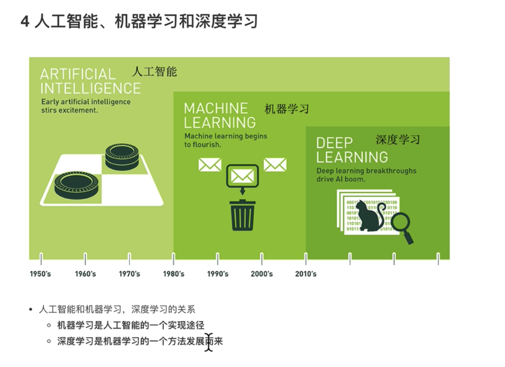
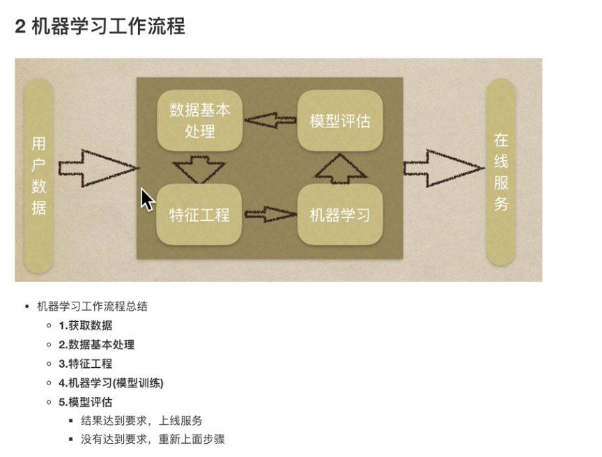
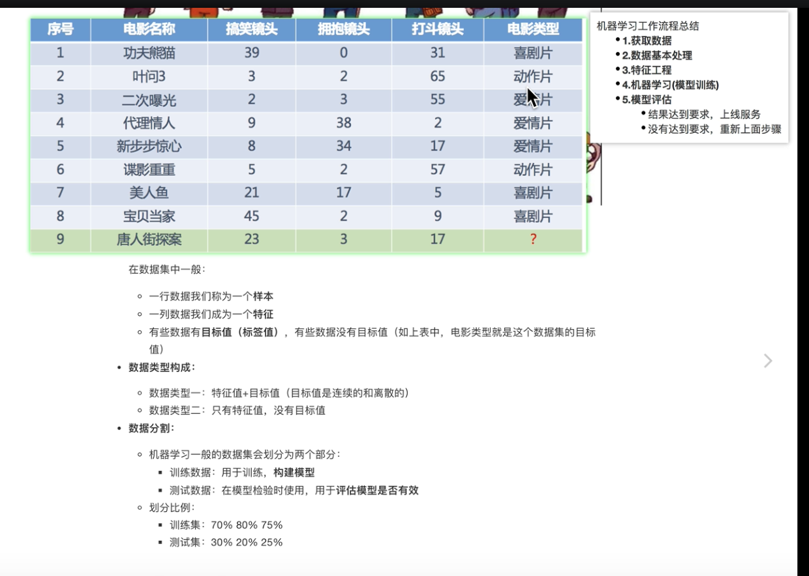
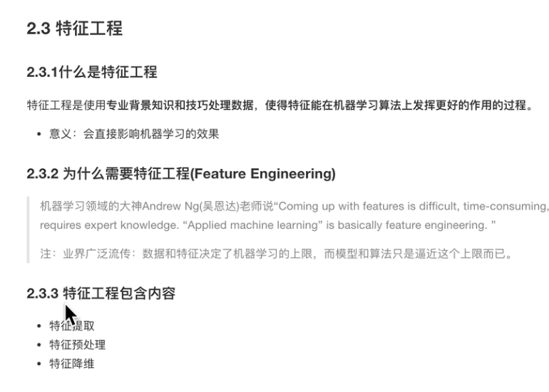
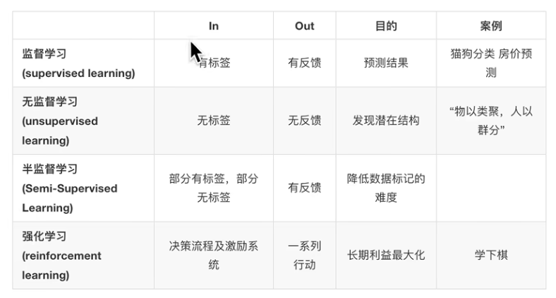
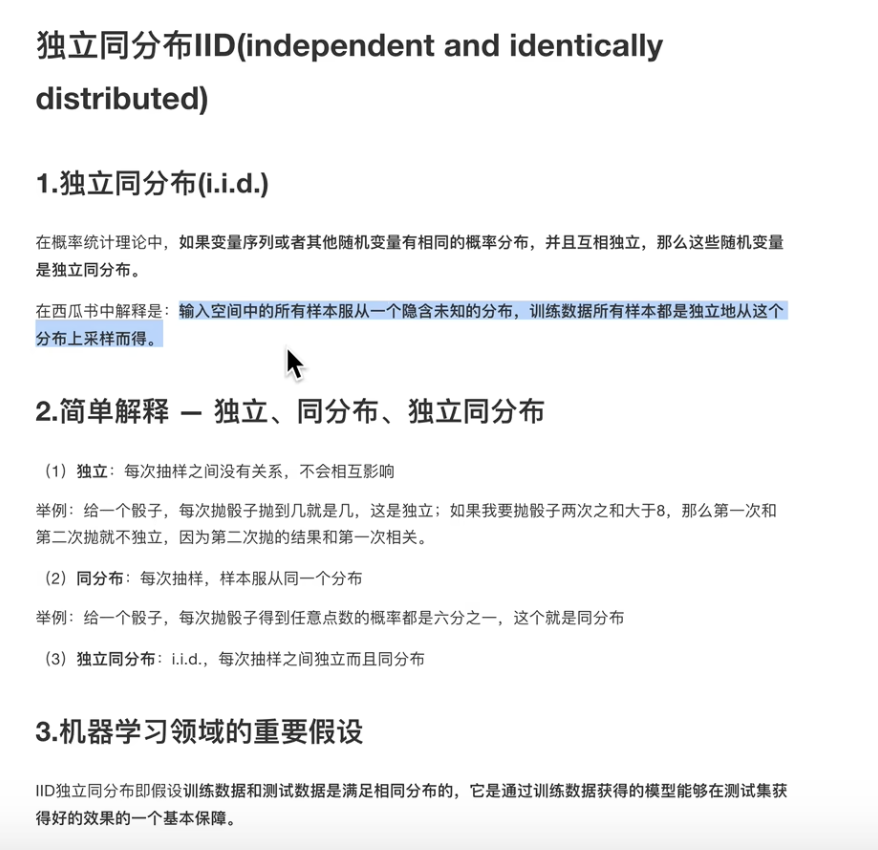
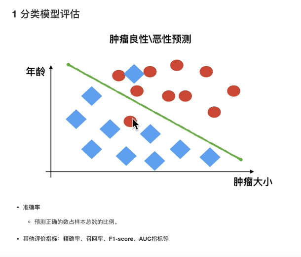
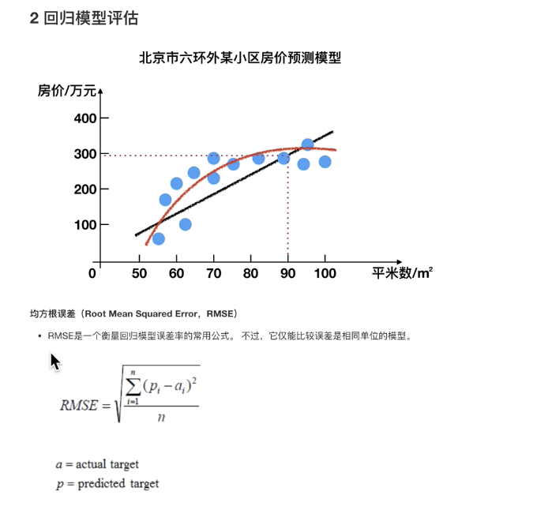

1. [快速涂鸦](https://quickdraw.withgoogle.com/?locale=zh_CN)
2. 人工智能发展三要素：
   - 数据(data)
   - 算法(algo)
   - 算力(infra)
3. 
4. 图灵测试、达特茅斯会议
5. 分支：CV、NLP(语音识别、文本挖掘分类、机器翻译)、机器人
6. 语音识别依赖于云，难以离线
7. 机器学习是从数据中自动分析获得模型，并利用模型对未知数据进行预测。
   
8. 获取数据、处理数据、特征工程、模型训练、模型评估/部署
   [完整机器学习项目的流程介绍](https://zhuanlan.zhihu.com/p/621949160)
   - 获取数据集：样本、特征、目标值
     
   - 特征工程(对数据进行进一步处理：提取、预处理、降维)
     
     数据和特征决定了机器学习的上限，而模型和算法只是逼近这个上限而已。
     > 数据标注，是对原始的数据打标（比如标记一张图片是猫还是狗，这类型的工作）；
     > 特征工程，是对数据进行处理，方便模型更好学习到数据的特征（比如把所有的数据都映射到0到1之间）
9. 算法分类
   - 按照数据集分类：监督(回归、分类)、无监督(聚类、降维)、半监督、强化学习(决策)
     
10. 独立同分布(i.i.d.)
    
11. 模型评估
    - 
    - 
    - 拟合：过拟合、欠拟合
12. AZure 平台可视化训练
13. 
    ](image-9.png)

---

1、抽象成数学问题

明确问题是进行机器学习的第一步。机器学习的训练过程通常都是一件非常耗时的事情，胡乱尝试时间成本是非常高的。
这里的抽象成数学问题，指的明确我们可以获得什么样的数据，抽象出的问题，是一个分类还是回归或者是聚类的问题。

2、获取数据

`数据决定了机器学习结果的上限，而算法只是尽可能逼近这个上限。(吴恩达)`
数据要有代表性，否则必然会过拟合。
而且对于分类问题，数据偏斜不能过于严重，不同类别的数据数量不要有数量级的差距。
而且还要对数据的量级有一个评估，多少个样本，多少个特征，可以估算出其对内存的消耗程度，判断训练过程中内存是否能够放得下。如果放不下就得考虑改进算法或者使用一些降维的技巧了。如果数据量实在太大，那就要考虑分布式了。

3、特征预处理与特征选择

良好的数据要能够提取出良好的特征才能真正发挥作用。
特征预处理、数据清洗是很关键的步骤，往往能够使得算法的效果和性能得到显著提高。归一化、离散化、因子化、缺失值处理、去除共线性等，数据挖掘过程中很多时间就花在它们上面。这些工作简单可复制，收益稳定可预期，是机器学习的基础必备步骤。
筛选出显著特征、摒弃非显著特征，需要机器学习工程师反复理解业务。这对很多结果有决定性的影响。特征选择好了，非常简单的算法也能得出良好、稳定的结果。这需要运用特征有效性分析的相关技术，如相关系数、卡方检验、平均互信息、条件熵、后验概率、逻辑回归权重等方法。

4、训练模型与调优

直到这一步才用到我们上面说的算法进行训练。现在很多算法都能够封装成黑盒供人使用。但是真正考验水平的是调整这些算法的(超)参数，使得结果变得更加优良。这需要我们对算法的原理有深入的理解。理解越深入，就越能发现问题的症结，提出良好的调优方案。

5、模型诊断

如何确定模型调优的方向与思路呢?这就需要对模型进行诊断的技术。
`过拟合、欠拟合` 判断是模型诊断中至关重要的一步。常见的方法如交叉验证，绘制学习曲线等。过拟合的基本调优思路是增加数据量，降低模型复杂度。欠拟合的基本调优思路是提高特征数量和质量，增加模型复杂度。
`误差分析` 也是机器学习至关重要的步骤。通过观察误差样本全面分析产生误差的原因:是参数的问题还是算法选择的问题，是特征的问题还是数据本身的问题……
诊断后的模型需要进行调优，调优后的新模型需要重新进行诊断，这是一个反复迭代不断逼近的过程，需要不断地尝试， 进而达到最优状态。

6、模型融合

一般来说，模型融合后都能使得效果有一定提升。而且效果很好。
工程上，主要提升算法准确度的方法是分别在模型的前端(特征清洗和预处理，不同的采样模式)与后端(模型融合)上下功夫。因为他们比较标准可复制，效果比较稳定。而直接调参的工作不会很多，毕竟大量数据训练起来太慢了，而且效果难以保证。

7、上线运行

这一部分内容主要跟工程实现的相关性比较大。工程上是结果导向，模型在线上运行的效果直接决定模型的成败。 不单纯包括其准确程度、误差等情况，还包括其运行的速度(时间复杂度)、资源消耗程度(空间复杂度)、稳定性是否可接受。
这些工作流程主要是工程实践上总结出的一些经验。并不是每个项目都包含完整的一个流程。这里的部分只是一个指导性的说明，只有大家自己多实践，多积累项目经验，才会有自己更深刻的认识。
