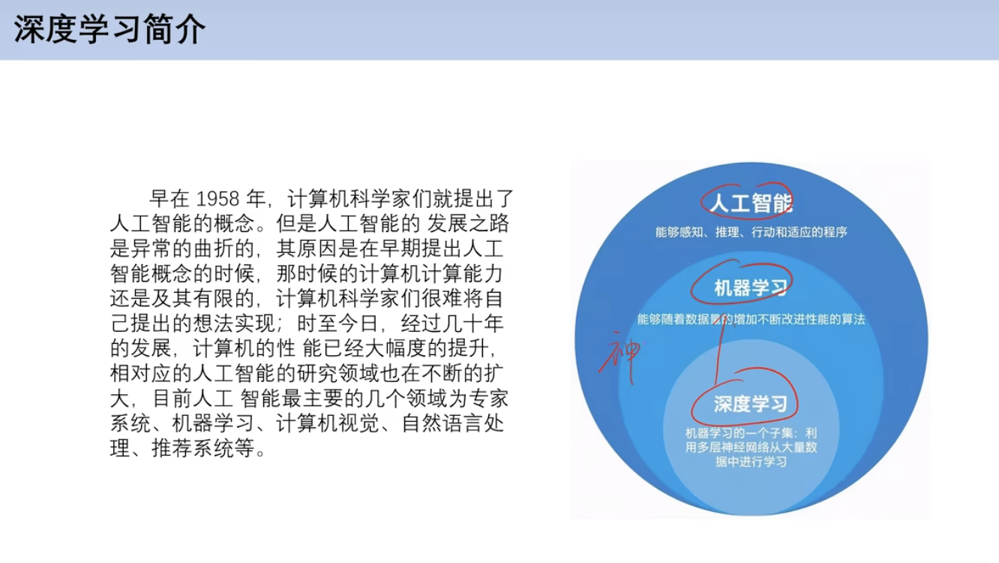
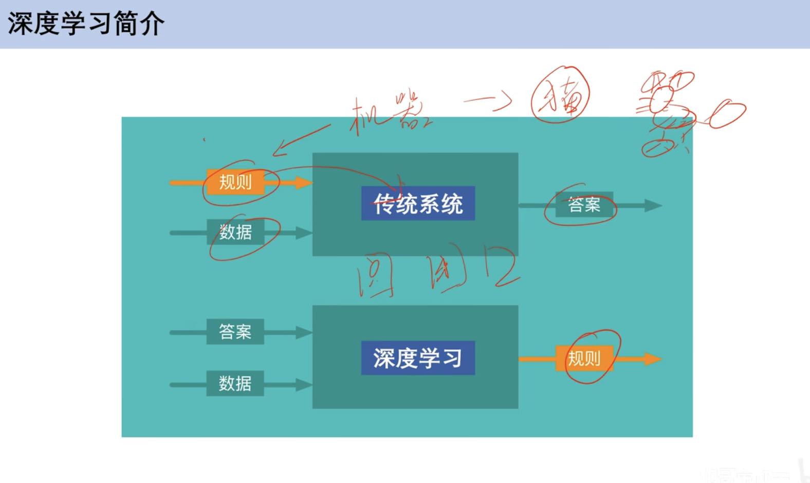

## 深度学习简介

### 1. 什么是深度学习？

深度学习（Deep Learning）是机器学习的一个分支，它基于**人工神经网络（Artificial Neural Networks, ANN）**。其核心思想是构建包含多个处理层（即“深度”网络）的计算模型，让模型能够从大规模数据中自动学习和提取复杂的特征，从而完成分类、识别、预测等任务。

与传统的机器学习方法相比，深度学习最大的特点是**端到端学习（End-to-End Learning）**和**特征自动提取**。传统方法通常需要人工设计“特征提取器”来从原始数据（如图像的像素、文本的词语）中提取有用的信息，而深度学习模型可以直接处理原始数据，并在其深层结构中自动学习出从低级到高级的抽象特征。

### 2. 深度学习、机器学习与人工智能的关系

这三者是包含关系，可以想象成三个同心圆：

- **人工智能 (AI)**：最外层的概念，指让机器像人一样思考和行动的广泛领域。
- **机器学习 (ML)**：是实现人工智能的一种方法。它让机器通过分析数据来“学习”，而不是通过明确的编程指令来执行任务。
- **深度学习 (DL)**：是机器学习的一个更具体的子领域，它使用深度神经网络作为其核心模型，在处理复杂模式（如图像、声音、自然语言）方面取得了巨大成功。

### 3. 深度学习如何工作？

深度学习模仿了人脑神经元网络处理信息的方式。

#### a. 人工神经元 (Artificial Neuron)

这是最基本的处理单元。它接收多个输入，每个输入都有一个对应的**权重（Weight）**。神经元将所有加权的输入相加，再加上一个**偏置（Bias）**，然后通过一个**激活函数（Activation Function）**处理，最终产生一个输出。

- **公式**：`输出 = 激活函数(Σ(输入 × 权重) + 偏置)`
- **权重**：决定了某个输入的重要性。
- **偏置**：用于微调神经元的输出，使其更容易被激活。
- **激活函数**：为模型引入非线性能力，使其能学习更复杂的模式。常用的有 ReLU、Sigmoid、Tanh 等。

#### b. 神经网络 (Neural Network)

将大量的神经元按**层（Layer）**组织起来，就构成了神经网络。

- **输入层 (Input Layer)**：接收原始数据，如一张图片的像素值。
- **隐藏层 (Hidden Layers)**：位于输入层和输出层之间，负责大部分的计算和特征提取。
- **输出层 (Output Layer)**：产生最终结果，如分类的概率。

#### c. “深度”的含义

当一个神经网络包含**多个隐藏层**时，它就被称为“深度”神经网络。每一层都会在前一层提取的特征基础上，学习到更复杂、更抽象的特征。

- **例如，在图像识别中**：
  - 第一层可能学习到边缘、角点等**低级特征**。
  - 中间层可能将低级特征组合成眼睛、鼻子等**中级特征**。
  - 更深的层则可能组合成完整的人脸轮廓等**高级特征**。

#### d. 学习过程：训练 (Training)

训练的目标是找到一组最佳的权重和偏置，使得模型对于给定的输入能产生最接近真实标签的输出。

1.  **前向传播 (Forward Propagation)**：将一批数据输入网络，从输入层开始，逐层计算，直到输出层得到预测结果。
2.  **计算损失 (Loss Calculation)**：使用**损失函数（Loss Function）**来衡量预测结果与真实标签之间的差距。差距越大，损失值越高。
3.  **反向传播 (Backward Propagation)**：根据损失值，从输出层开始，反向逐层计算每个权重和偏置对总损失的“贡献”（即梯度）。
4.  **更新参数 (Parameter Update)**：使用**优化器（Optimizer）**，如梯度下降（Gradient Descent），根据计算出的梯度来微调网络中所有的权重和偏置，目标是让损失值变小。

这个过程会重复成千上万次，直到模型的损失值收敛到一个很小的范围，此时模型就“学会”了如何完成特定任务。

### 4. 常见的深度学习架构

不同的任务需要不同结构的网络：

- **卷积神经网络 (Convolutional Neural Networks, CNN)**：专门用于处理网格状数据，如图像。通过卷积核（滤波器）来高效提取空间特征。广泛应用于图像识别、目标检测、图像分割等。
- **循环神经网络 (Recurrent Neural Networks, RNN)**：专门用于处理序列数据，如文本、时间序列。网络中的神经元具有“记忆”功能，可以将前一时刻的信息传递到当前时刻。常用于自然语言处理（机器翻译、情感分析）、语音识别等。
  - **LSTM (长短期记忆网络)** 和 **GRU (门控循环单元)** 是 RNN 的改进变体，解决了其长期依赖问题。
- **Transformer**: 最初为自然语言处理设计，现在已成为许多领域的主流模型。它使用**自注意力机制（Self-Attention）**来并行处理序列中的所有元素，极大地提高了训练效率和性能。GPT（如 ChatGPT）和 BERT 等模型都基于 Transformer 架构。
- **生成对抗网络 (Generative Adversarial Networks, GAN)**：包含一个生成器（Generator）和一个判别器（Discriminator）。生成器试图创造逼真的数据（如图片），判别器则试图区分真实数据和生成的数据。两者相互博弈，共同进步。用于图像生成、风格迁移等。

### 5. 主要应用领域

- **计算机视觉**：人脸识别、自动驾驶、医疗影像分析。
- **自然语言处理**：机器翻译、智能客服、文本摘要、情感分析。
- **语音识别**：智能助手（Siri, Alexa）、语音输入法。
- **推荐系统**：电商商品推荐、视频平台内容推荐。
- **游戏**：AlphaGo 等棋类 AI。

### 6. 面临的挑战

- **数据依赖**：需要大量高质量的标注数据进行训练。
- **计算成本高**：训练大型模型需要强大的计算资源（如 GPU/TPU）。
- **可解释性差**：深度神经网络通常被视为“黑箱”，其决策过程难以解释。
- **调参复杂**：模型结构、学习率等超参数的选择对结果影响很大，通常需要大量实验。

---

