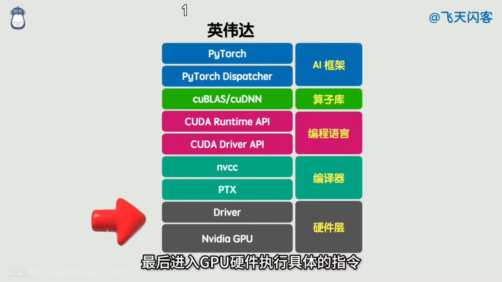

## GPU 相关

https://www.bilibili.com/video/BV1Td6eB5EQr

### 1. GPU 的核心原理与性能误区

- **CPU vs GPU**:
  - **CPU**: 像是“专家”，擅长复杂的顺序逻辑处理，指令集复杂。
  - **GPU**: 像是“一大群实习生”，擅长简单的并行计算，核心逻辑是 **SIMD (Single Instruction, Multiple Data)**，即单指令多数据流。
- **算力 vs 吞吐量**:
  - **误区**: 很多人认为 GPU 的核心数越多、频率越高（峰值算力/FLOPS）就越强。
  - **真相**: 真正的瓶颈在于 **数据传输 (Data Movement)**。
    - 计算本身的耗时往往远小于数据从内存搬运到显存、再从显存搬运到计算核心寄存器的时间。
    - **内存墙 (Memory Wall)** 是限制性能的关键。

### 2. 硬件加速与架构优化

单纯增加核心数只能线性提升算力，为了解决数据传输瓶颈，GPU 引入了硬件层面的优化：

- **Tensor Core / 专用算子**:
  - 将最常用的计算（如神经网络中的矩阵乘法、Transformer 中的 Attention）直接固化为硬件电路。
  - 这就好比把软件层面的 `for` 循环直接刻进芯片里，大幅减少指令读取和数据搬运次数。
- **硬件工程优化 (以天数智芯为例)**:
  - **LSU Broadcast**: 当多个计算单元请求同一地址数据时，合并请求，读取一次后广播给所有单元。
  - **无损矩阵转置**: 将 `transpose` 这种纯粹的内存读写操作直接由硬件完成，不消耗通用计算资源。

### 3. 被忽视的真正壁垒：CUDA 生态

视频强调，就算你能手搓出算力更强的硬件，也无法成为首富，因为 **生态 (Ecosystem)** 才是英伟达真正的护城河。

- **CUDA 的意义**: 英伟达将硬件底层的 SIMD 逻辑抽象为面向程序员的 **SIMT (Single Instruction, Multiple Threads)**。
- **开发链路**: `Python (PyTorch)` -> `AI Framework` -> `算子库 (cuBLAS/cuDNN)` -> `CUDA` -> `PTX` -> `硬件指令`。
  
- **兼容性困境**:
  - 新的 GPU 厂商必须重写整个软件栈（驱动、编译器、算子库）。
  - 开发者不愿意修改代码或学习新语言。
  - 二进制翻译（类似 JVM）效率低且很难完美兼容闭源的 CUDA。

### 4. 国产 GPU 的两条破局之路

面对英伟达的垄断，国产厂商主要有两种策略：

1.  **另起炉灶 (如华为昇腾)**:
    - 自研架构，提供迁移工具。
    - 优点：自主可控，上限高。
    - 缺点：开发者迁移成本高，初期阵痛明显。
2.  **原生兼容 (如天数智芯)**:
    - 硬件层面实现对 CUDA 逻辑的原生支持（GPGPU）。
    - 优点：开发者无需改代码，直接复用 CUDA 生态。
    - 挑战：需要在编译器和硬件指令设计上高度适配。

### 5. AI 计算的新趋势：PD 分离

针对大模型（LLM）的特性，计算架构正在从通用向专用场景优化：

- **Prefill (推理前)**: 计算量大（矩阵运算），需要高算力卡。
  - 生成 KV Cache。
- **Decode (推理中)**: 逐个 token 输出，且依懒 KV Cache，不仅吃显存，更吃**带宽**。
- **PD 分离技术**: 训练和推理集群中，针对这两个阶段使用不同侧重点（高算力 vs 高带宽）的异构芯片组合，以提升整体效率。

### 总结

视频的核心观点是：**制造 GPU 不仅仅是堆砌晶体管和算力，更是一场关于数据传输效率（带宽/延迟）和软件生态兼容性的系统工程。**

## 三年AI年度总结！割裂感

### 1. 为什么会有“割裂感”？

视频提出了一个普遍的感受：**一方面 AI 越来越强，另一方面觉得 AI 没啥用。** 这种割裂感来源于两个方面：

- **主观感受与客观发展的错位**：
  - **客观上**：AI 的发展速度是相对平稳上升的。
  - **主观上**：人类只有在 AI 跨越某个临界点（如 AlphaGo 战胜人类、ChatGPT 涌现智能）时才会感到震撼，导致感觉 AI 是爆发式跳跃发展的。
- **高维天才与低维白痴的矛盾（OOD 问题）**：
  - AI 在高维复杂问题（如数学难题、推理拍摄地）上表现如天才。
  - AI 在低维简单问题（如数手指、简单几何动画、简单的逻辑一致性）上经常犯错。
  - **原因**：这是 **Out of Distribution (OOD，分布外)** 问题。一旦问题不符合训练数据的统计分布，模型就容易失效。
  - **理论上限**：基于当前的 LLM 框架，上下文、推理、幻觉、检索质量、多模态能力这五类问题只能缓解，无法从理论上彻底消除。

### 2. 三年 AI 发展回顾（视频视角）

视频将 AI 发展分为几个阶段（设定在 2026 年回顾）：

- **2022 年及以前：深度学习的跌宕起伏**
  - ChatGPT 发布（2022.11.30）是分水岭，触及通用智能，让全球无法忽视。
- **2023 年：AI 在各领域的新首秀（惊喜密度最高）**
  - GPT-4 与 Llama 分别推动闭源与开源模型跃迁。
  - 大模型向图像、视频、编程等领域渗透，虽粗糙但冲击力强 "能力外挂"。
  - Gemini 首次在设计层面整合多模态。
- **2024 年：被遗忘的爬坡期**
  - 没有全新范式出现，处于中间爬坡阶段。
  - Sora 是期货，GPT-4o 延迟推送，Apple AI 水花不大。
  - 但在底层工程体系层面完成了重要铺垫。
- **2025 年：工程上的质变**
  - DeepSeek R1 带动开源全面开花。
  - Gemini 3 Pro 凭借原生多模态再次震撼世界。
  - Agent (智能体) 从概念落地到终端（如 MANUS、豆包手机）。
  - **瓶颈转移**：从技术瓶颈转向生态瓶颈（如 APP 厂商封杀、接口不开放）。

### 3. AI 的真正挑战与人的价值

- **AI 的局限**：
  - 不仅是技术问题，更多是 **生态和人** 的问题（如接口规范、商业博弈）。
  - 随着模型能力增强，其错误（幻觉）也变得更强、更自信、更难被发现。
- **人的不可替代性：选择与有限性**
  - AI 可以在可能性的空间里无限高效地采样（生成图片、视频、文案）。
  - **人的意义**：不在于创造新的可能性，而在于在无穷的可能性中，**固执地选择了其中一个**，并为此承担后果。
  - **根本区别**：AI 不怕浪费和后悔，而人受限于时间、精力和生命。**有限的选择** 才是人类独有的浪漫和价值所在。

### 总结

视频的核心观点是：**AI 的强大在于对可能性的无所畏惧和不知疲倦，而人的尊严在于在有限生命中做出的排他性选择。** 技术不再是壁垒时，真正的“人味”反而成了稀缺资源。
