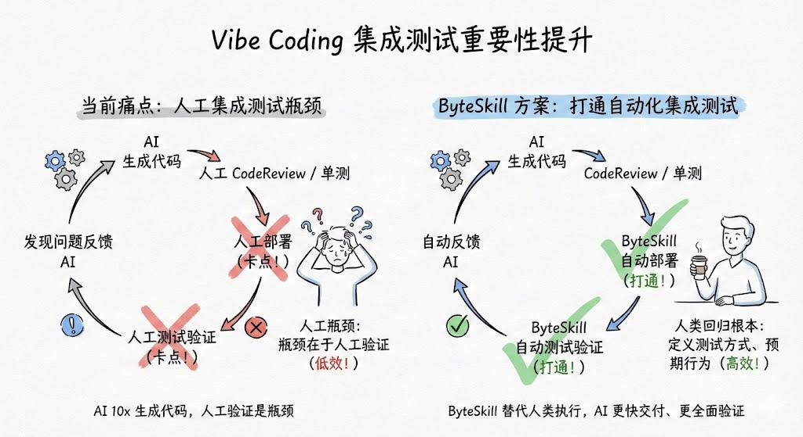
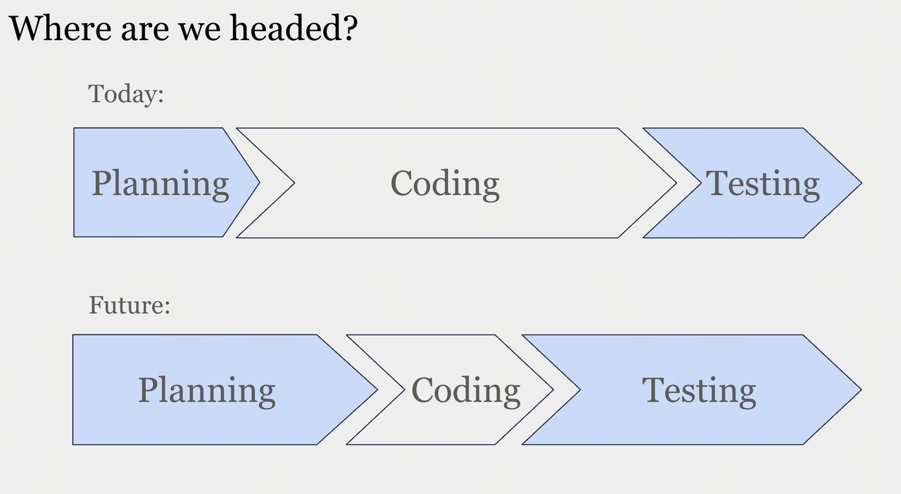

# VideCoding 指南

本次分享将围绕「从结对编程走向自动驾驶」的 Vibe Coding 实践展开，系统讲解如何用清晰意图驱动 Code Agent 完成推理、编码与验证，涵盖 Claude Code / CodeX 等工具实战组合，以及基于 OpenSpec 的 Spec-Driven 工作流。内容将串起从 Repo 理解、设计规划、实现与测试到评审与归档的完整闭环，并分享在落地中应对幻觉、上下文丢失与压缩、质量与数据安全等问题的实用方法，帮助大家通过「可验证的工作 + 充分上下文 + 人工把关」显著提升研发效率，把更多精力投入到架构和决策等高价值创造。

1. Code 补全(Inline Sug) -> Copilot(IDE) -> Agent(CLI)
2. TL;DR
   - 核心理念：从“手写代码”转向“自然语言编程”。不仅是补全，而是让 AI 完成推理和实现。
   - 核心工具：
     - Claude Code / CodeX：CLI 命令行 Agent，负责核心开发。
     - OpenSpec：用于复杂需求的 Spec-Driven 开发流。
     - Trae / IDE：用于轻量级修改和可视化。
   - 核心原则：
     - 尽可能给 AI 提供完善的上下文
     - 尽力构建可验证的工作，为 Agent 构建更长的 loop
     - 当前阶段人工反馈必不可少
   - 收益预期：日常编码任务提效因人而异（上限可能是指数级），从执行者转型为架构师。
   - 关键风险：AI 会一本正经胡说八道（幻觉），人必须是质量的最后一道防线
3. Vibe Coding 起源于 Andrej Karpathy 的一条 twitter，也被称为 AI Coding，指的是沉浸在和 AI 结对编程的氛围中。
4. OpenCode 在 2025 年末和 2026 年初开始逐渐火热起来，其独特的 TUI 和开源生态，迅速博得了很多人的好感，被称为 Claude Code 的开源平替。

5. NoteBookLM：演示文稿 - 黑板报手绘简约风格(PPT风格生成)
   
   
   论文理解、视频分析
6. benchmark 暂时还没有一个能包打天下的单一排行
   - SWE-bench(github issue)
     - 缺点：对上下文消耗小，并不真实
   - **Code Arena**
     - 目前和使用体验比较接近
7. 使用技巧
   - 明确上下文
   - 避免添加过多非必要的 工具
   - 上下文处理
     
     [永远不要使用 compaction，然后每完成一个任务之后，主动使用 /clear 命令来清空上下文](https://www.anthropic.com/engineering/effective-harnesses-for-long-running-agents)
   - 尽可能早的进行代码 commit，这样在需要推倒重来的时候，只需要使用 git 回退到上一个可用的 commit 节点即可
     尽可能使用 git 工具进行频繁的 commit，然后通过 git log 来做版本控制和回滚。当 Claude Code 等持续运行一段时间之后，上下文会变得很长，这个时候效果很不稳定（比如指令遵循），或者我们随着和 Claude Code 进行了多轮对话开始有一些新的思路，这个时候我们就可以新开一个 session，然后基于之前的 commit 重新进行 coding，而不是在原有的 session 上面再进行迭代。
8. SDD 范式: OpenSpec
   OpenSpec 是一套“先把需求写成可审计的 Spec，再让 AI 按 Spec 写代码”的轻量工作流与 CLI。\*\*它把“聊天里的需求”变成“仓库里的真实来源（source of truth）”，用 proposal → apply → archive 的闭环，让 AI 输出更可控、可复现、可评审。
   OpenSpec 的核心理念可以用一句话概括：
   先对齐“要做什么”（Spec），再执行“怎么做”（Tasks），最后把结果归档回“真实规格”（Specs）。 GitHub

9. 研发各个阶段：
   - Repo Understand
     在 Anthropic 公司发布的调研报告中，我们可以看到 Repo 理解占了很大的比例（略低于 Feature Implement）
   - Design
     充分利用各种 AI 技术进行调研和现有技术方案设计
     和 AI 进行协同 Design 需要考虑的几个信息补全：
     - 业界调研，使用 DeepResearch(gpt，200刀/月) 等
     - 现有系统实现，可以直接提供代码 repo
     - 必要的业务背景知识
   - Plan
     - 对于使用 SDD 的同学，更推荐使用 SDD 工具（比如 OpenSpec） Step by Step 生成。
   - Implement
     - Spec Driven
     - WorkTree 并行
     - Commit 版本管理
     - 上下文尽可能详细
     - 善用 Few-shot（参考 xxx 实现）
   - Bugfix
   - Test
     最高效的方式：不要人工验证，而是用 AI 打通集成测试验证的卡点，让 AI 能自行部署、测试、验证，让人类真正回归集成测试的根本：定义测试方式、预期行为
     
   - Code Review
     - AI Review First（agent命令）
     - Reviewee 应该提供的信息：Spec、CodeDiff
     - Reviewer 应该更加关注 AI 可能 miss 的信息（ 更 high level，比如整体的逻辑是否合理，是否是 broken change、 Repo 的背景业务知识）
   - 良好的研发规范
     - 完善的 UT/IT 体系，可以有效防止 AI 造成 broken change。
     - 本地可运行的 UT/IT case，可以作为 AI 修改完的有效验证。
     - 编译本地可运行，同上。
     - 良好的 git message 描述，这样 AI 就可以通过我们的 git log 来进行相关功能的定位。
     - 一个 Git Commit 只做一件事情，同上。

10. 实践经验总结
    1. 规范文件
       1. [Claude.md](https://www.humanlayer.dev/blog/writing-a-good-claude-md)
          使用的 CLAUDE.md 文件主要有两类：用户级别（位于 ~/.claude/）和项目级（位于项目根目录下）
          - 它应该包含那些“只有人类知道，但代码里看不出来”的高层背景信息。
          - WHAT, WHY, HOW 结构
          - 渐进式披露(与其把所有文档写在一个文件里，不如在 claude.md 里告诉 Claude：“如果你需要关于数据库的详细规范，请阅读 docs/db_schema.md”。前面不要加 @，否则 Claude 会自动加载完整文件内容。)
       2. AGENTS.md
       3. 持续迭代！
          - 把上面成功跑通运行项目的命令，保存到项目记忆/全局记忆
          - 以上执行过程暴露了哪些以后可能重复遇到的问题？你建议往项目记忆添加哪些内容避免未来重复出现？

    2. 上下文处理
    3. Plan Before Write
    4. 任务拆分(50k-100k完成)
    5. 异步并行
    6. MarketPlace(业务skills/commands)
    7. 任务可验证
       - 编译验证：这是比较基本的，可以是本地编译也可以是 SCM 编译。
       - 让 AI 自己构建单元测试：这种方式不是很稳，现在很多模型会偷懒，比如 hard code 等
       - 使用真实的端到端测试：case 由我们来提供，比如：“当前项目有一些文件比较大，对 AI 不太友好，请进行重构。重构完成之后进行回归测试和端到端测试。端到端测试使用命令 uv run claude-code-proxy 进行服务启动，然后验证 claude code 使用命令 ANTHROPIC_BASE_URL=http://localhost:8082 ANTHROPIC_API_KEY=xxx claude -p "understand this repo"
       - 通过 ByteSkill 打通 BOE/PPE 环境的部署、接口测试、日志查询，完整验证
    8. AI Friendly
       - 自解释
       - 自验证
       - 良好的 git 管理(读 git log)
       - 渐进式披露
         我们的项目中的单文件（包括代码/doc 等）尽量不要太大，可能保持在 300 行以内是最好的，通过引用/依赖的方式串联起来（AI 可以按需进行加载）
    9. 指令遵循
       - skills 执行率低 -> 显示指定
       - less is more
    10. 长时任务(类似守护进程？)
        想要极致地提高效率，需要将整个 Vibe Coding 环节尽可能自动化，让 Code Agent 可以长稳运行
        - 方案一 Infi - loop：通过 stop - hook 和状态检测阻止 claude code 退出，不过整个过程不新建 session，上下文可能达阈值自动压缩影响效果。
        - 方案二 subagent：每个 task 使用单独的 subagent 执行，task 特别多会使 main agent 上下文过大，可结合方案一使用。
        - 方案三 外置脚本：每个 task 通过单独的 claude 进程和独立上下文执行，有开源实现但较复杂，可自行编写。

11. 工具
    - codebase MCP
    - 文档 MCP
    - 浏览器登录态复用MCP
      我们在使用 CodeAgent 的时候一个比较头疼的问题是很多网站需要登录之后才能使用，这种直接使用 Claude Code 等 CodeAgent 由于权限问题无法访问，那么有没有一个方案可以复用我们的浏览器的登录态呢？答案是 YES。可以使用 playwright mcp 结合浏览器插件使用以复用浏览器的登录态。
      浏览器操作除了复用登录态信息，可以用来验证我们前端的代码编写是否符合预期。
      下载并安装 chrome 扩展
      1. 下载链接 https://github.com/microsoft/playwright-mcp/releases
      2. 打开 Chrome，访问 chrome://extensions/
      3. 开启右上角的 开发者模式
      4. 点击 加载已解压的扩展程序
      5. 选择 playwright-mcp 解压目录
      6. 扩展安装成功后，会在工具栏显示图标
    - [Agent browser](https://github.com/vercel-labs/agent-browser)
12. 业务skills
    除了 GUI for Human 以外，现在 UI for Agent 也很重要。当前对 AI 最友好 UI 的版本答案是 CLI + Skill。
    - 痛点：平台封闭、能力不够丰富、接入流程繁琐
    - 解决方案： Skill 集合 + Skill 开发脚手架（利于共建）
    - 有哪些：
      - SSO 登录、JWT 生成
      - 泳道 ENV 信息查询与管理
      - 指定分支、发起编译，查询编译结果
      - 接口测试平台发送请求
      - 日志，结合代码排查问题
      - 查询/分析 Metrics 数据

13. 
14. Claude Code 创始人如何使用 Claude Code：并行工作是因为 Claude 能自主执行；用 Opus 是因为综合效率更高；CLAUDE.md 是把纠错变成资产；Plan 模式是先想清楚再动手；斜杠命令和子 Agent 是自动化重复劳动；验证机制是给 AI 反馈闭环。
    最重要的一条：给 Claude 验证能力
    Boris 把这条放在最后，说这可能是获得好结果最重要的因素。
    如果 Claude 能验证自己的工作，最终产出质量能提升 2 到 3 倍。
    他举了个例子：他们提交到 http://claude.ai/code 的每一个改动，Claude 都会用 Chrome 扩展自己测试：打开浏览器、测试 UI、发现问题就迭代，直到功能正常、体验合理。
    验证方式因场景而异。可能是跑一个 bash 命令，可能是跑测试套件，可能是在浏览器或手机模拟器里测试应用。形式不重要，重要的是：让 AI 有反馈闭环。
    这个道理其实很朴素。人类工程师也是靠“写代码—测试—看结果—修改”这个循环来保证质量的。AI 也一样。如果它只能写不能测，就像闭着眼睛做事，质量全靠运气。
    Boris 的建议是：**投入精力把验证机制做扎实。这是回报率最高的投资。**

15. 编码/截屏/改进
    - 为 Claude 提供截取浏览器截图的方法（例如使用 Puppeteer MCP 服务器、iOS 模拟器 MCP 服务器，或手动复制/粘贴截图到 Claude）
    - 通过复制粘贴、拖放图片，或提供图片文件路径，把视觉示例交给 Claude。
    - 让 Claude 根据设计编写代码，截取结果截图，并不断调整，直到效果与原型完全一致。
    - 满意后再让 Claude 确认提交。

---

- 合规：ClaudeCode + 内场模型
- 使用claude 打通目前公司内部的系统，构建编码自动化流程，有好几种方式，一种是走官方 MCP/官方 API（目前权限是最大障碍）；另一种是走 agent-brower 无头浏览器（比较慢，稳定性差）；还有抓包 （https）的方式（写起来比较麻烦）；
  权衡兼容性
- 如果你刚开始用 Claude Code，不必急着研究各种高级配置。先把基础用好：学会并行，学会规划，学会积累 CLAUDE.md，学会给 AI 验证手段。
- [Claude Code 系统提示词](https://cchistory.mariozechner.at/)
