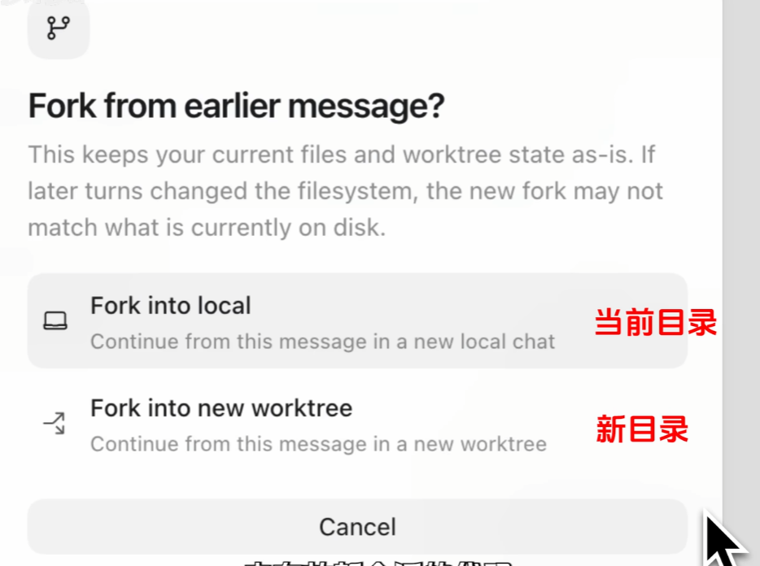
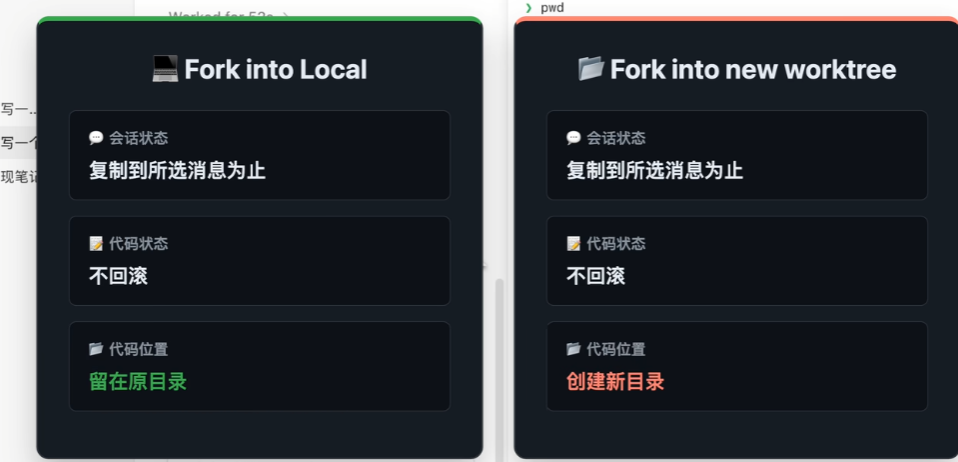
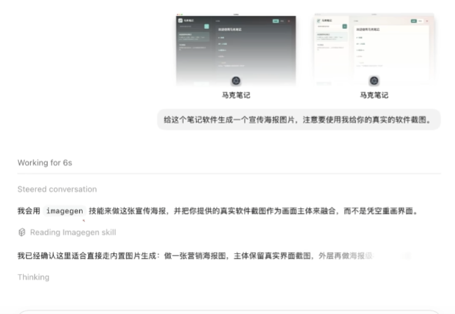

https://www.bilibili.com/video/BV1c9EK6KEW4

- plan + superpowers
- annotate
- 修改最后一条信息，不占用模型上下文；如果要修改之前的某条信息，用/fork 会话回滚
  

  不会滚代码
  

- archive
- AGENTS.md
- /侧边
- 厉害的plugin：computer use 与 chrome
- Skill：ImageGen
  

---

https://www.bilibili.com/video/BV18ZJV6zEFy

- 配置 Agent 这件事，也可以交给 Agent
