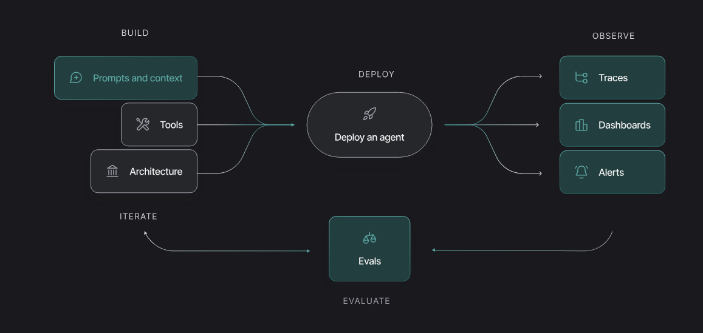

# LLM observability, evaluation, and deployment


`类似字节的 fornax 平台。`
LangSmith 是一个用于构建、调试、测试和监控基于 LLM（大型语言模型）应用程序的统一 DevOps 平台。它由 LangChain 团队开发，旨在解决 LLM 应用从原型到生产环境中的可观测性和质量控制问题。

以下是对 LangSmith 的深入分析和讲解：

### 1. 核心功能架构

LangSmith 的功能主要围绕 LLM 应用开发的生命周期展开：

- **Tracing (追踪与调试):**

  - **全链路可视化:** 记录每一次 LLM 调用、Chain 执行、Agent 动作以及工具使用的输入输出。
  - **延迟与 Token 统计:** 详细展示每一步的耗时和 Token 消耗，帮助优化成本和性能。
  - **嵌套视图:** 清晰展示复杂的 Chain 或 Agent 的内部逻辑结构。

- **Evaluation (评估与测试):**

  - **数据集管理:** 允许创建、上传和管理测试数据集（输入/输出对）。
  - **自动化评估:** 可以在数据集上运行你的应用，并使用评估器（可以是基于 LLM 的评估器或启发式规则）来打分（如准确性、相关性）。
  - **回归测试:** 对比不同版本的 Prompt 或模型在同一数据集上的表现。

- **Monitoring (监控与生产):**

  - **实时指标:** 监控生产环境中的错误率、延迟分布和 Token 使用量。
  - **反馈循环:** 收集用户反馈（如点赞/点踩），并将这些数据关联到具体的 Trace 中，用于后续微调或改进。

- **Prompt Hub (提示词管理):**
  - 虽然是独立功能，但与 LangSmith 紧密集成，用于版本化管理 Prompt，并在 LangSmith 中直接测试不同版本的 Prompt。

### 2. 工作原理 (Tracing 机制)

LangSmith 通过在代码中注入回调（Callback）或包装器来工作。

- **LangChain 集成:** 如果你使用 LangChain，只需设置环境变量，LangSmith 会自动捕获所有运行数据。
- **非 LangChain 集成:** 对于直接使用 OpenAI SDK 或其他库的情况，可以使用 LangSmith SDK 手动包装函数进行追踪。

### 3. 配置与使用示例

#### 步骤 1: 环境配置

在终端或 `.env` 文件中设置 API Key 和启用追踪：

```bash
# Windows PowerShell
$env:LANGCHAIN_TRACING_V2="true"
$env:LANGCHAIN_ENDPOINT="https://api.smith.langchain.com"
$env:LANGCHAIN_API_KEY="<your-api-key>"
$env:LANGCHAIN_PROJECT="my-project-name" # 可选，指定项目名称
```

#### 步骤 2: 代码集成 (Python 示例)

**场景 A: 使用 LangChain (自动追踪)**

```python
from langchain_openai import ChatOpenAI
from langchain_core.prompts import ChatPromptTemplate
from langchain_core.output_parsers import StrOutputParser

# 只要环境变量设置正确，以下代码会自动记录到 LangSmith
llm = ChatOpenAI(model="gpt-3.5-turbo")
prompt = ChatPromptTemplate.from_template("给我讲一个关于{topic}的笑话")
chain = prompt | llm | StrOutputParser()

chain.invoke({"topic": "程序员"})
```

**场景 B: 不使用 LangChain (使用装饰器)**

```python
from langsmith import traceable
from openai import Client

client = Client()

# 使用 @traceable 装饰器标记需要追踪的函数
@traceable
def format_prompt(topic):
    return [{"role": "user", "content": f"给我讲一个关于{topic}的笑话"}]

@traceable(run_type="llm")
def call_openai(messages):
    completion = client.chat.completions.create(
        model="gpt-3.5-turbo",
        messages=messages
    )
    return completion.choices[0].message.content

@traceable
def run_pipeline(topic):
    messages = format_prompt(topic)
    return call_openai(messages)

run_pipeline("测试")
```

### 4. 关键应用场景分析

1.  **调试 Agent 循环:** 当 Agent 进入死循环或工具调用参数错误时，通过 Trace 视图可以精确看到是哪一步的 LLM 输出导致了错误的工具参数。
2.  **Prompt 优化:** 通过对比同一 Prompt 在不同输入下的表现，或者使用 Evaluation 功能批量测试 Prompt 修改后的效果，`确保修改不会导致旧功能的退化（Regression）。`
3.  **Few-Shot 样本挖掘:** `在生产环境中发现表现极好的（或极差的）Trace，`可以直接将其添加到数据集中，作为未来 Few-Shot Prompting 的示例。

### 5. 总结

LangSmith 解决了 LLM 开发中的“黑盒”问题。它不仅仅是一个日志工具，更是一个以数据为中心的开发平台，帮助开发者从凭感觉调整 Prompt 转向`基于数据和指标的工程化迭代。`

---

结合您提供的最新文档（关于设置工作区和组织），我们需要将之前的架构理论落实到具体的**操作和管理层面**。

以下是对 LangSmith **组织（Organization）与工作区（Workspace）设置、用户管理及配置流程**的深入实战分析：

### 1. 核心层级与创建流程

LangSmith 的账户体系建立在“组织”与“工作区”的双层结构之上。

#### A. 组织 (Organization) - 计费与协作的顶层容器

- **个人组织 (Personal Organization):**
  - **创建:** 首次登录时自动创建。
  - **限制:** 仅限 1 个工作区，无法邀请成员，仅适用于 Developer 计划。
- **共享组织 (Shared Organization):**
  - **创建:** 点击左下角头像 -> Organizations -> `+ New`。
  - **门槛:** **必须绑定信用卡**（设置计费）才能创建。
  - **用途:** 团队协作、多工作区管理、企业级功能。

#### B. 工作区 (Workspace) - 资源与权限的物理隔离

- **定位:** 以前称为 Tenant。这是实际存放 Trace、Dataset、Prompt 的地方。
- **创建路径:** Settings (设置) -> Workspaces 选项卡 -> `Add Workspace`。
- **导航:** 通过左上角的下拉菜单在不同工作区之间切换。
- **删除:** **不可逆操作**。删除工作区将永久清除其下所有数据（Trace, Dataset 等）。仅 Workspace Admin 可操作。

### 2. 用户管理与权限配置 (User Management)

用户管理分为两个步骤：先进入组织，再分配到具体工作区。

#### 步骤 1: 邀请进组织 (Organization Level)

- **位置:** Settings -> Members and roles。
- **操作:** 邀请新成员，并分配**组织角色**。
  - `Organization Admin`: 管理计费、创建工作区、管理所有用户。
  - `Organization User`: 只读组织信息，但可以被分配到工作区进行具体工作。

#### 步骤 2: 分配到工作区 (Workspace Level)

- **位置:** Settings -> Workspaces -> 选择具体工作区 -> Workspace members。
- **操作:** 将组织内的成员添加到该工作区，并分配**工作区角色**。
  - `Workspace Admin`: 拥有该工作区的所有权限（包括删除工作区）。
  - `Workspace Editor`: 可以读写资源（Trace, Dataset），但不能管理用户。
  - `Workspace Viewer`: 只读权限。

### 3. 关键配置：API 密钥与环境隔离

这是设置过程中最容易出错的技术环节。

#### A. API 密钥策略 (API Keys)

在工作区设置页面 (`Settings -> Workspaces -> [Workspace Name] -> API Keys`) 进行配置。

1.  **Personal Access Tokens (PATs):**
    - **场景:** 个人开发、本地调试。
    - **特点:** 权限跟随用户。如果用户被移除，Key 失效。
2.  **Service Keys (服务密钥):**

    - **场景:** **生产环境**、CI/CD 流水线、LangGraph Agent。
    - **特点:** 绑定到服务账户，不依赖具体员工。
    - **关键技术点:** 使用 Service Key 时，**必须**在请求头中包含 `X-Tenant-Id`，否则 API 会报 403 错误。

    ```python
    # 伪代码示例：使用 Service Key 时的注意事项
    headers = {
        "x-api-key": "lsv2_sk_...",  # Service Key
        "x-tenant-id": "<your-workspace-id>" # 必须指定工作区ID
    }
    ```

#### B. 环境隔离策略 (最佳实践)

文档再次强调了这一点：

- **错误做法:** 为 Dev、Staging、Prod 创建三个不同的 **Workspace**。
  - _后果:_ 无法跨工作区移动 Prompt 或 Dataset，导致发布流程断裂。
- **正确做法:** 使用 **Resource Tags**。
  - 在同一个 Workspace 内，给资源打上 `Environment: prod` 或 `Environment: dev` 的标签。
  - 利用标签在 UI 中进行筛选和管理。

### 4. 其他工作区设置

在工作区设置面板中，除了 API Key 和成员管理，还可以配置：

- **Secrets:** 存储 LLM API Key（如 OpenAI Key），供 LangSmith 内部的 Playground 或评估器使用。
- **Models:** 配置自定义模型端点。
- **Shared URLs:** 管理已公开分享的 Trace 或 Dataset 链接。

### 总结：管理员的 Setup Checklist

如果您是团队的 Tech Lead，在初始化 LangSmith 时应遵循以下清单：

1.  [ ] 创建一个 **Shared Organization** 并绑定支付方式。
2.  [ ] 根据**业务线**（而非环境）创建 **Workspace**（例如：`Search-Team`, `Chatbot-Team`）。
3.  [ ] 邀请成员加入组织，并将其分配到对应的 Workspace。
4.  [ ] 为生产环境应用创建 **Service Key**，并记录对应的 `Tenant ID`。
5.  [ ] 制定团队规范：强制要求使用 **Resource Tags** 来区分开发和生产环境资源。

---

基于您提供的最新文档，我们需要从**管理与架构**的角度深入分析 LangSmith。这部分内容主要关注如何在企业或团队环境中组织资源、控制权限以及管理成本。

以下是对 LangSmith **资源架构、用户管理、计费模型及最佳实践**的深度解析：

### 1. 资源层级架构 (Resource Hierarchy)

LangSmith 采用典型的两层架构来管理资源：

- **Organization (组织):**
  - **定位:** 最高层级的逻辑分组，通常对应一家公司。
  - **功能:** 负责计费（Billing）和最高层级的用户管理。
  - **类型:** 分为“个人组织”（Personal，仅限开发者计划，无法协作）和“共享组织”（Shared，支持多用户协作和高级计划）。
- **Workspace (工作区):**
  - **定位:** 组织内部的逻辑分组，以前称为 "Tenants" (租户)。
  - **功能:** 它是**资源隔离**和**权限控制**的边界。所有的 Tracing 项目、数据集、Prompt 和标注队列都属于特定的工作区。
  - **建议:** 为组织内的不同**团队**创建不同的工作区。

### 2. 关键概念：环境隔离与标签 (Tags)

文档中提出了一个非常重要的**最佳实践**，这与许多其他 DevOps 工具不同：

- **不要使用工作区来区分环境:** 不要为 Dev、Staging、Prod 创建不同的工作区。
  - _原因:_ 资源（如 Prompt）无法跨工作区共享。如果你将 Prompt 开发在 Dev 工作区，你无法直接将其“晋升”到 Prod 工作区。
- **使用资源标签 (Resource Tags):**
  - **做法:** 在同一个工作区内，使用标签（如 `Environment: prod`）来区分资源。
  - **区分:**
    - **Resource Tags:** 用于在 UI 中筛选和组织资源（如项目、数据集）。
    - **Commit Tags:** 用于代码中控制版本（如 `client.pull_prompt("prompt-name:prod")`），决定代码拉取 Prompt 的哪个具体版本。

### 3. 安全与访问控制 (Security & RBAC)

LangSmith 的鉴权体系发生了重大变化，旧版 API Key (`ls__`) 已被废弃。

#### 新版鉴权机制

1.  **Personal Access Tokens (PATs):**
    - **前缀:** `lsv2_pt_`
    - **用途:** 绑定到具体用户，权限与该用户一致。适用于个人脚本或临时工具。
2.  **Service Keys (服务密钥):**
    - **前缀:** `lsv2_sk_`
    - **用途:** 绑定到服务账户。适用于生产环境的应用程序或 LangGraph Agent。
    - **注意:** 使用服务密钥时，必须在请求头中包含 `X-Tenant-Id` 来指定目标工作区，否则会报错 403。

#### 角色权限 (RBAC)

- **组织级角色:**
  - **Admin:** 完全控制，包括计费和所有工作区。
  - **User:** 只读组织信息，但可以创建自己的 PAT。
  - **Viewer:** 只读，且**无法**创建 PAT（安全性更高）。
- **工作区级角色 (企业版功能):**
  - **Admin:** 工作区内全权。
  - **Editor:** 可以编辑资源，但不能管理用户。
  - **Viewer:** 只读。
  - _自定义角色:_ 企业版允许创建细粒度的自定义角色。

### 4. 计费与数据保留 (Billing & Retention)

LangSmith 的计费模型设计得非常精细，旨在平衡成本与数据价值。

- **两种 Trace 类型:**

  1.  **Base (基础):** 保留 14 天，价格便宜 ($0.50 / 1k traces)。
  2.  **Extended (扩展):** 保留 400 天，价格昂贵 ($5.00 / 1k traces)。

- **自动升级机制 (Auto-upgrades):**
  这是计费的核心逻辑。一个 Trace 最初可能是 Base 类型，但如果发生以下交互，它会自动升级为 Extended（并产生额外费用）：

  - 被添加了**反馈 (Feedback)**（如点赞/点踩）。
  - 进入了**标注队列 (Annotation Queue)**。
  - 匹配了**自动化规则 (Automation Rules)**。

  _分析:_ 这种设计的逻辑是，如果有人工或规则对某个 Trace 进行了交互，说明该数据具有高价值，因此值得长期保存并收取更高费用。

### 5. 速率限制 (Rate Limits)

为了系统稳定性，LangSmith 设有多种层级的限制，触发时返回 HTTP 429：

1.  **负载均衡限制 (1 分钟):** 针对短时间突发流量。例如 `POST /runs` 限制为 5000 次/分钟。
2.  **每小时事件限制:** 限制 Trace 的创建/更新次数（不同套餐额度不同，如 Startup 计划为 50 万次/小时）。
3.  **每小时数据量限制:** 限制上传的数据体积（如 Startup 计划为 5GB/小时）。
4.  **使用量限制 (Usage Limits):** 用户可以自行配置每月的 Trace 总量上限，以防止意外的高额账单。
    - _副作用:_ 当达到“扩展保留限制”时，系统将禁止添加反馈或运行规则，以防止产生新的自动升级费用。

### 总结建议

如果您正在为团队配置 LangSmith：

1.  **架构:** 创建一个组织，为每个业务团队创建一个工作区。
2.  **环境:** 在工作区内使用 Tags 区分 Dev/Prod，不要分割工作区。
3.  **安全:** 生产环境代码务必使用 **Service Keys**，并正确设置 `X-Tenant-Id`。
4.  **成本:** 密切关注**自动升级**逻辑。如果您的应用会自动对大量 Trace 进行打分或反馈，可能会导致成本激增（因为它们都变成了 Extended Trace）。

---

基于您提供的关于“设置资源标签 (Set up resource tags)”的文档，我们需要深入理解这一功能，因为它是 LangSmith 中**组织资源**和**实施环境隔离**的核心机制。

以下是对 LangSmith **资源标签 (Resource Tags)** 的深度解析与实战指南：

### 1. 核心定位：解决“单工作区”的混乱

在之前的分析中，我们提到 LangSmith 推荐**不要**使用不同的工作区（Workspace）来区分环境（Dev/Prod）。那么，当所有资源都堆在一个工作区时，如何避免混乱？答案就是 **资源标签**。

- **适用范围:** 仅限 **Plus** 和 **Enterprise** 计划。
- **本质:** 它是附加在资源上的键值对（Key-Value Pair）。
- **作用对象:** 所有的工作区级资源，包括：
  - Tracing Projects (追踪项目)
  - Datasets (数据集)
  - Prompts (提示词)
  - Annotation Queues (标注队列)
  - Deployments & Experiments (部署与实验)

### 2. 关键辨析：Resource Tags vs. Commit Tags

这是文档中强调的最容易混淆的概念，必须严格区分：

| 特性       | Resource Tags (资源标签)                    | Commit Tags (提交标签)                                                  |
| :--------- | :------------------------------------------ | :---------------------------------------------------------------------- |
| **作用域** | **管理层面** (UI 组织)                      | **代码层面** (版本控制)                                                 |
| **用途**   | 用于在 LangSmith 界面中**分类和筛选**资源。 | 用于在代码中**指定**要拉取 Prompt 的具体版本。                          |
| **示例**   | `Environment: prod`, `Application: chatbot` | `prod`, `v1.0`, `latest`                                                |
| **场景**   | "我想看所有属于生产环境的项目。"            | "代码里 `pull_prompt` 时，请给我这个 Prompt 标记为 `prod` 的那个版本。" |

**总结:** Resource Tags 决定了你在后台**看到了什么**；Commit Tags 决定了你的代码**运行了什么**。

### 3. 管理与操作流程

#### A. 创建与定义 (Taxonomy)

- **位置:** Workspace Settings -> Resource Tags。
- **默认键:** 系统预置了 `Application` (应用) 和 `Environment` (环境) 两个 Key，这暗示了官方推荐的分类维度。
- **级联删除警告:** 如果你删除了一个 Key（例如 `Department`），那么所有该 Key 下的 Value（如 `HR`, `Sales`）以及它们与资源的关联都会被**永久删除**。

#### B. 分配 (Assignment)

有两种方式给资源打标签：

1.  **批量分配:** 在标签设置面板中，搜索资源并批量勾选。
2.  **个别分配:** 进入具体资源（如某个 Dataset）的详情页，点击 "Resource tags" 按钮进行添加。

### 4. 核心价值：全局筛选 (Global Filtering)

这是资源标签最强大的功能。

- **操作:** 在左侧导航栏点击“标签图标”。
- **效果:** 一旦你选择了某个标签（例如 `Environment: prod`），**整个 LangSmith 的 UI 都会发生变化**。
  - 首页的统计数据只会显示 Prod 环境的数据。
  - 项目列表只会显示 Prod 的项目。
  - 数据集只会显示 Prod 的数据集。
- **意义:** 这模拟了“独立工作区”的体验，但保留了资源共享的能力（例如，你可以随时取消筛选，把 Dev 环境的 Prompt 复制到 Prod 环境）。

### 5. 最佳实践策略

结合之前的文档，以下是实施资源标签的标准流程：

1.  **定义标准 Key:**

    - 使用 `Environment` 区分 `dev`, `staging`, `prod`。
    - 使用 `Application` 区分具体的业务应用（如 `customer-support`, `internal-search`）。
    - 使用 `Owner` 或 `Team` 区分归属（如 `data-science`, `backend`）。

2.  **强制打标:**

    - 团队内部应达成共识：任何新建的 Project 或 Dataset **必须**第一时间打上 `Environment` 标签。

3.  **日常使用:**
    - 开发人员在日常调试时，应在左侧栏常驻开启 `Environment: dev` 筛选器，以免误操作生产环境数据。
    - 产品经理在验收时，可以切换到 `Environment: staging` 查看测试结果。

通过这种方式，LangSmith 在保持资源统一存储（便于复用和晋升）的同时，实现了清晰的`视图隔离`。
