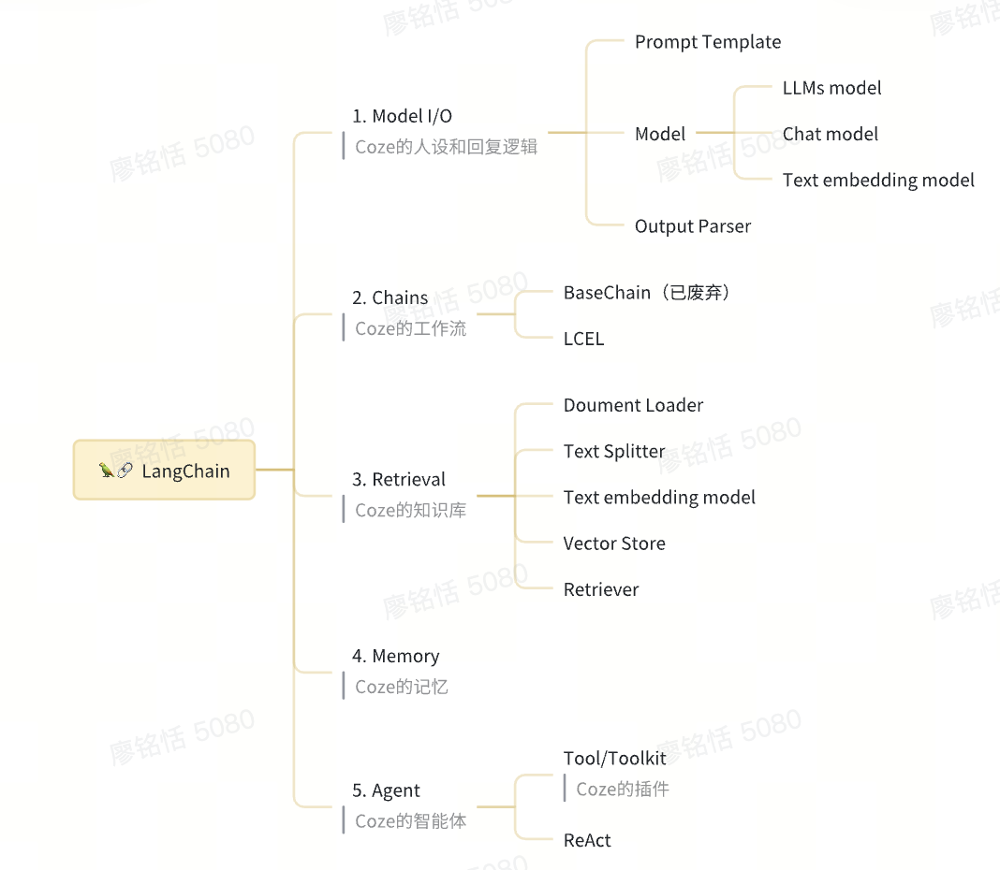

- LangChain 作为一个大语言模型应用开发框架，解决了现在开发人工智能应用开发的很多痛点和限制，并且还具备更多强大的功能，它可以将 LLM 模型、向量数据库、交互层 Prompt、外部知识、外部工具`整合`到一起，进而可以自由构建 LLM 应用，比如订票系统、电商分析平台、特定领域的学习机器人、编程工具等等
- Coze 其实是一个低代码版的 LangChain ，两者的关系其实可以简单类比为橙子建站和 React 的关系。

- 

- 1. Model I/O（模型 输入/输出）
     Model I/O 是一个 LLM 应用最基本的模块，我们可以把对模型的使用过程拆解成三块，分别是提示词模板（Prompt Template）、模型（Model）和输出解析（Output Parser）。这三块形成了一个整体，因此在 LangChain 中这个过程被统称为 Model I/O。

     ```ts
     // 构建提示模板（Prompt Template）
     const genJokePrompt = ChatPromptTemplate.fromTemplate('请告诉我一个关于{topic}的笑话, 只告诉我一个就可以');
     // 模型调用 & 输出解析
     const genJokeChain = genJokePrompt.pipe(this.model).pipe(new StringOutputParser());
     console.log(await genJokeChain.invoke({ topic: '蚂蚁' }));

     输出：
     小蚂蚁迷路找不到蚁窝，可着急了，恰好看到它的朋友经过，于是冲过去大喊一声：“哥们儿！你…你都如何回蚁窝（回忆我）？”那朋友一愣，然后反问道：“带……带……带着笑或是很沉默？”
     ```

- 2. Chains
     LangChain 中目前有两套"链"的实现方式「传统 Chain」和「LCEL」，目前只推荐使用 **LCEL** ，传统 Chain 简单了解即可，无需深入探索。
- 3. Retrieval（检索）
     为了方便开发者实现 RAG 功能，因此 LangChain 封装了一套专门的开发组件，组件主要包括：
     - DocumentLoaders（文档加载器）
     - TextSplitters（文本分割器）
     - VectorStores（向量存储器）
     - Retrievers（检索器）
     - 以及我们 Model 部分没有展开讲的 Text Embedding Model（文本嵌入模型）
- 4. Memory（记忆）
     本质上 chat history 就是一个管理 Message 对象数组的一个对象，提供一系列工具方便外界调用。
- 5. Agent（智能代理）

  ```ts
  // 创建RAG工具（查询关于《球状闪电》相关内容）
  const queryQiuTool = tool(this.queryQiu, {
    name: 'queryQiu',
    description: '查询关于《球状闪电》的相关问题',
    schema: z.object({
      q: z.string().describe('关于《球状闪电》的问题'),
    }),
  });

  // 创建英文翻译工具
  const translateToEnglishTool = tool(this.translateToEnglish, {
    name: 'translateToEnglish',
    description: '将原文翻译为英文',
    schema: z.object({
      originStr: z.string().describe('待翻译的原文'),
    }),
  });

  // 创建ReAct Agent
  const agent = createReactAgent({
    llm: this.model,
    tools: [translateToEnglishTool, queryQiuTool],
    // 增加对话历史(类似上面介绍的ChatHistory)
    checkpointer: ToolController.memory,
  });

  // 发送消息
  return await agent.invoke(
    {
      messages: [new HumanMessage('球状闪电是三体前传嘛，请用英文告诉我答案')],
    },
    {
      configurable: {
        thread_id: 'test-thread',
      },
    });
  }

  ```
