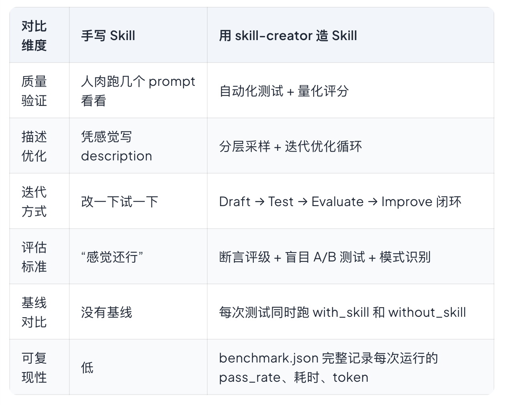

https://blog.riba2534.cn/archive/

- [抛弃 MCP, CLI 才是 Agent 的母语](https://blog.riba2534.cn/blog/2026/%E6%8A%9B%E5%BC%83mcp-cli%E6%89%8D%E6%98%AFagent%E7%9A%84%E6%AF%8D%E8%AF%AD/)
  - CLI 更快、更省 token、Agent 用起来更顺
  - 微软的 Playwright 就是典型：先做了 MCP Server，后来又专门出了一个 CLI 版本给 Agent 用。这种"先 MCP 后 CLI"的路径不是个案，Anthropic 自己也走了一遍。
  - MCP 在 2024-2025 年享受了一波"新协议红利"——新东西出来总会被追捧一阵。但当大量开发者在生产环境中真正用起来之后，问题暴露了。**而且这些是设计层面的结构性缺陷，不是修几个 bug 就能解决的。**
  - MCP 把浏览器的当前状态（DOM 快照、截图描述、可交互元素列表）内联返回到 Agent 的上下文窗口里，CLI 的做法完全不同——它把浏览器状态写到磁盘上的 YAML 文件里，Agent 需要的时候按需读取
  - LLM 的训练数据里，CLI 是母语
  - MCP 的**安全**模型——假装问题不存在；CLI 的安全模型。Unix 进程模型经过了 50 年的实战验证
  - CLI 做执行层，MCP 做连接层
  - Skills 的本质就是 CLI 命令的上下文包装
  - 最好的 Agent 工具协议是人和机器都能自然使用的东西
  - 所谓"Agent 友好"就是：
    - 输出格式对 LLM 阅读友好（结构化文本而非 GUI 输出）
    - 命令设计符合 Agent 的调用习惯（原子操作、幂等性、明确的退出码）
    - 错误信息足够具体让 Agent 能自主修正。

- [拆解 Anthropic 的 skill-creator：AI Agent 的技能工厂是怎么运转的](https://blog.riba2534.cn/blog/2026/%E6%8B%86%E8%A7%A3anthropic%E7%9A%84skill-creator-ai-agent%E7%9A%84%E6%8A%80%E8%83%BD%E5%B7%A5%E5%8E%82%E6%98%AF%E6%80%8E%E4%B9%88%E8%BF%90%E8%BD%AC%E7%9A%84/)
  - "能用"和"好用"之间差着十万八千里 -> 怎么算"好用"？触发精不精准？
  - [skill-creator](https://github.com/anthropics/skills/tree/main/skills/skill-creator) —— 一个用来批量制造和迭代改进 Skill 的 Skill
  - 它从一个简单的模板生成器变成了一套完整的方法论和工具链：有结构化的创造流程，有三个专职评估 Agent，有量化的基准测试框架，有自动化的描述优化循环，甚至还有一个交互式的 HTML 仪表板让你审查每次运行的结果
    
  - skill-creator 在这个生态里的角色是质量基础设施。有了 skill-creator，至少每个 Skill 可以带一份 benchmark.json，用数据说话
    对 AI 的产出质量不要凭感觉，要用数据量化
  - Draft-Test-Evaluate-Improve

- [比 OpenClaw 更优雅的个人 AI Agent -- NanoClaw](https://blog.riba2534.cn/blog/2026/%E6%AF%94openclaw%E6%9B%B4%E4%BC%98%E9%9B%85%E7%9A%84%E4%B8%AA%E4%BA%BAai-agent-nanoclaw/)
  - 本地个人 Agent 的核心竞争力，是 Agent 本身的推理能力 —— 而不是外面包了多少层框架
  - OpenClaw 自己造了一整套 Agent 框架。NanoClaw 选择直接站在 Claude Code 的肩膀上；你不需要自己实现 AI 能力，Claude Code 已经是最强的 Agent harness，你只需要把它接上消息通道就行了
  - 能力的核心逻辑（搜索、推理、代码编写、任务编排）全部来自容器里的 Claude Code，NanoClaw 自己只负责`"接收消息 → 传给 Claude Code → 把结果发回来"这条管道`
  - OpenClaw 的安全模型`默认是应用级`的：在代码里写白名单、配对码、权限检查。Agent 和宿主机跑在同一个进程里，共享内存；NanoClaw 做了一个更根本的选择：把 Agent 扔进容器里

- [网络代理工具编年史](https://blog.riba2534.cn/blog/2026/%E7%BD%91%E7%BB%9C%E4%BB%A3%E7%90%86%E5%B7%A5%E5%85%B7%E7%BC%96%E5%B9%B4%E5%8F%B2/)
  - 从早期的传统 VPN/代理，到 Shadowsocks 开创的自研加密时代，再到 V2Ray、Clash 等复杂生态的兴起
