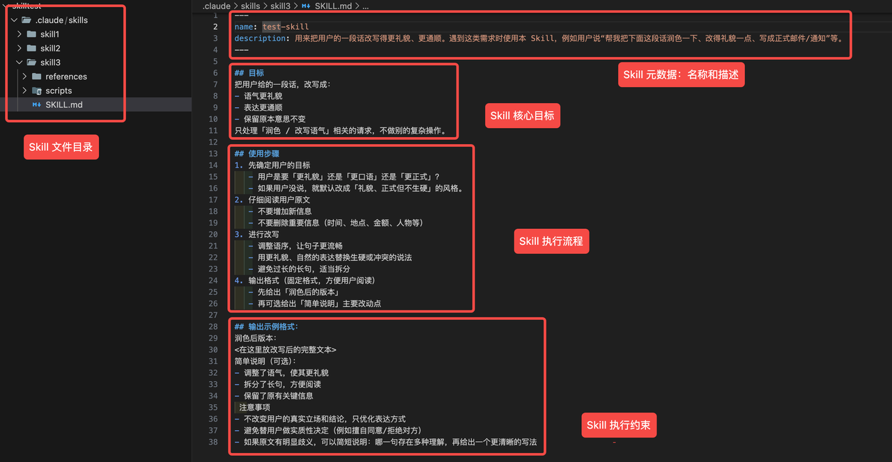
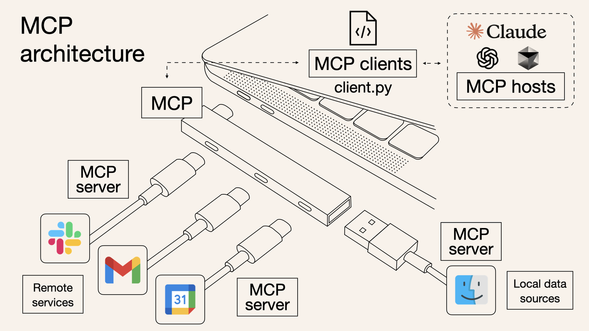
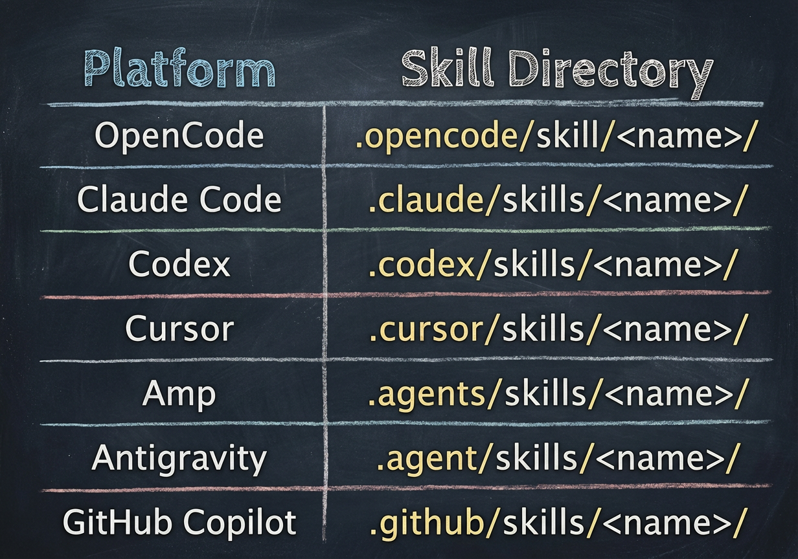
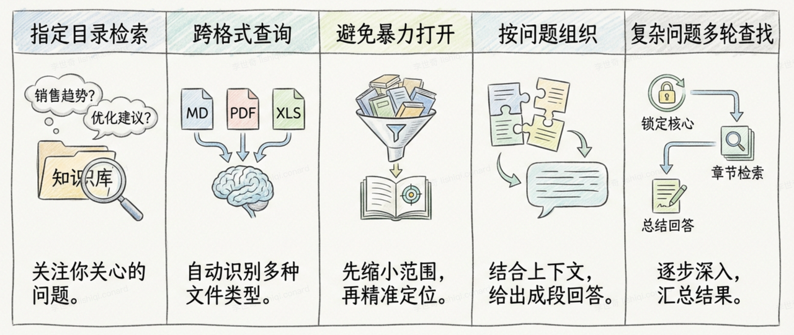

# Agent Skills 全面解析：从入门理解到实战指南

这是一篇关于 **Agent Skills** 的深度解析文章。Skills 正在成为继 MCP（Model Context Protocol）之后，扩展 AI Agent 能力的新行业标准。

以下是对这篇文章的深度逻辑分析与讲解，分为五个核心部分：

### 1. Skills 入门：什么是“AI 的外接工具箱”？

**核心概念**：
传统的 AI 交互依赖于“模型本身知识 + 临时提示词”，这就像教一个实习生，每次都要重头教。而 **Agent Skills 是模块化的能力插件**，相当于给 AI 大脑安装了一个包含“工具 + 说明书”的外接工具箱。

**工作原理（File-system based）**：
Skills 基于文件系统设计，这点非常关键。它不像 API 需要复杂的服务器交互，而是直接利用本地文件目录。

- **结构**：一个 Skill 就是一个文件夹，通常包含：
  - `SKILL.md`（指令/SOP）：告诉 AI 怎么做。
  - scripts（脚本）：实际干活的代码（如 Python/Node.js）。
  - `reference`（参考）：详细文档。
  - assets（资源）：图片、模版等可能使用到的资源（可选）。
- **触发**：只要把这个文件夹放在 AI Agent（如 Claude Code/Opencode）的运行目录下，AI 就能自动识别并按需调用。

**核心机制：渐进式披露（Progressive Disclosure）**
这是 Skills 的精髓，解决了“一次性塞入太多工具导致 Token 爆炸和 AI 分心”的问题。

- **第一层（启动时）**：只加载 Skills 的名字和简介（目录）。
- **第二层（意图识别后）**：当用户下达特定指令时，加载对应的 `SKILL.md`（手册）。
- **第三层（执行时）**：真正干活时，才读取具体的参考文档或调用脚本（动手）。
  > **优势**：极大地节省了 Token，让 AI 每次只专注于相关的上下文。

---

### 2. Skills vs MCP：互补而非替代

**MCP 的痛点**：
MCP 本质是“连接标准”，用于标准化 AI 与外部世界的交互。但它有一个致命弱点——**连接即消耗**。

- **Token 昂贵**：连接一个包含 30 个工具的 MCP Server，即使不调用，仅注入工具定义就需要消耗大量 Token。
- **注意力分散**：工具过多会导致 LLM 甚至不知道该选哪个，准确率下降（Claude Opus 在 300+ 工具不仅只有 62% 准确率）。

**Skills 的优势**：

- **漏斗式引导**：通过渐进式加载，极大降低了 Context Window 的压力，提升了调用的准确性。
- **低门槛打包**：非常适合封装重复性的**标准工作流**（如代码 Review、文章润色）。

**未来格局（MCP 不会死）**：

- **MCP**：负责底层连接（数据库、SaaS API）。
- **Skills**：负责业务逻辑封装（教 AI 怎么用 MCP，怎么处理本地文件）。

---

### 3. 初步尝试：低门槛的“开箱即用”

**获取 Skills**：
目前社区生态爆发式增长（如 `skillsmp`）。Skills 的编写门槛极低，只要会写提示词就能创建。

**使用流程**：

1.  **下载**：从社区下载 Skill 压缩包（如 Excalidraw 绘图 Skill）。
2.  **放置**：解压放入指定目录（如 `.opencode/skills`）。
    
3.  **对话**：直接用自然语言告诉 Agent 你的需求，Agent 自动检测并调用。

**创建 Skills**：
可以使用 **Skill Creator**（一个专门生成 Skill 的 Skill）。

- **操作**：告诉 AI “帮我做一个获取系统时间的 Skill，用 Node.js”。
- **结果**：AI 自动生成文件夹、`SKILL.md` 和 `script.js`，立即可用。

---

### 4. 实战进阶：本地知识库（RAG 的新解法）

作者在这个章节提出了一个非常有洞见的观点：**传统的 Chunk + Embedding 模式 RAG 并不是唯一解**。

RAG / 检索本身没死，
但死的是固定 Chunk + Embedding 那套模式。
如果 Agent 可以动态地扩展文件周围的上下文，
那么过度考虑数据块大小就没有意义了。

**Skills 实现的“Agentic RAG”**：
利用 Skills 构建一个本地知识检索工具，模拟人类查资料的过程：

1.  **定位领域**：先看文件名/目录，缩小范围。
2.  **定位文件**：使用 `grep` 等工具筛选相关文件。
3.  **定位内容**：根据文件类型（PDF/Excel/Markdown）调用不同脚本提取内容。

**案例演示**：

- **金融数据**：从 PDF 财报中提取三一重工股东信息（自动转 PDF 为 txt -> 关键词匹配 -> 上下文扩充）。
- **电商数据**：跨 Excel 表查询（先查顾客表 ID -> 再查订单表），实现了 SQL Join 的逻辑。

**核心优势**：

- **无预建索引**：不需要向量数据库，直接扔文件进去就能查。
- **更智能**：AI 参与检索策略的调整，而不是死板的向量匹配。

我们可以把这套方案可以理解为「不预建向量库的、本地目录级、渐进式检索 RAG」，和传统 RAG 的优势主要在于：

- 不需要预建索引 / 向量数据库，更轻量简单，适合快速搭建本地个人知识库的场景；
- 检索更智能，传统的 RAG 主要靠向量匹配内容，大模型只做总结，而在这个过程里，大模型可以参与分词、上下文匹配的决策，并且可以进行智能调整，有点像目前 Agentic RAG 的工作模式。

---

### 5. 安全分析：便利背后的隐患

虽然 Skills 极大地扩展了能力，但也引入了显著风险：

- **漏洞普遍**：26.1% 的 Skills 包含漏洞。
- **高危操作**：部分 Skills 包含代码混淆或密钥窃取行为。
- **脚本风险**：带可执行脚本（scripts）的 Skill 风险是纯文本 Skill 的 2 倍以上（权限提升、数据泄露）。

### 总结

这篇文章清晰地指出了 Agent 发展的下一个阶段：**从单纯的 Prompt Engineering 转向标准化的能力封装（Skills）**。Skills 通过基于文件系统的轻量级设计和渐进式披露机制，解决了 Token 消耗和上下文污染的难题，让 Agent 变得更聪明、更专注，且具备了处理复杂本地工作流的能力。

---

- Agent Skills 的官方文档中强调了一个核心关键词：File-system based（基于文件系统）。
- https://skillsmp.com/zh
- https://mcpmarket.com/en/tools/skills
