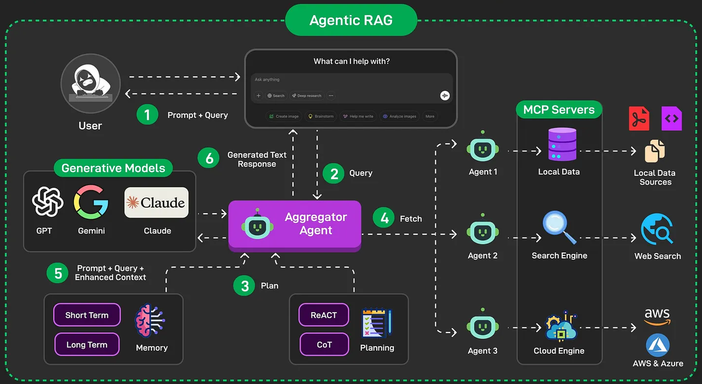

- 知识库的优势在于可以通过语义粗筛+模型精排的方式缩小给到大模型的知识范围，所以可以存储“无限”的知识，并在 rag 流程中选择有效的知识给大模型，而不是把全部上下文都塞给大模型。​ 因为单个知识片段长度往往不大，所以通过 rag 流程检索出来的知识一般不会超过大模型上下文限制。

---

- V1：智能取数的可行性验证

  - Workflow 架构：把传统分析链路提炼成可被 AI 执行的流程 -> Workflow 局限：规则驱动，智能上限低
  - 知识基础：私域知识 + 通用取数链路 -> 私域知识局限：覆盖度有限、维护成本高

- V2：智能链路的全面强化
  知识对了 → 找表找对 → DDL 找全 → 结合用户输入 → SQL 才能写对
  知识的录入质量 + 召回准确度，决定了 NL2SQL 的最终上限
  这就是为什么 V2 必须从知识体系化入手，并构建可靠的知识召回链路

  知识库平台化，我们需要对外开放知识库平台化能力，来让用户自己完成相关知识的补充，提高对应场景问答准确率

  如何确保知识召回足够且可用？
  
  相比通用 RAG 方案，我们采用 Agentic RAG 的方案，结合 LLM 赋予知识召回“智能”，执行流程为“Workflow+ReAct”的方式，以 Workflow 形式实现优先级（个人->官方），以 ReAct 实现工具的渐进式调用（精准匹配链路->通用查数链路）。

  这也自然引出了我们后续的架构升级：
  从单纯的 Workflow，演进到具备推理反思能力的 ReAct 架构。

  - V2 阶段局限
    单 Agent 职责过重：一个模型背负了太多任务，错误率必然上升
    上下文管理弱：长链路、大数据场景容易 token 超限

- V3：系统能力上限的全面升级

  - 如何让每个步骤都能更“专注”地推理？
  - 如何让复杂任务分解成多个可控环节？
  - 如何让不同类型的任务由不同 Agent 专业处理？
  - 如何避免 token 塞爆上下文？
  - 如何保证链路逻辑可控、可信、可评测？

  多 Agent 协作 + 大数据处理能力 + 可信可控的工程化体系
  控制与计算分离(类似 GFS)

  - 主 Agent：负责整体规划与调度
    - 将用户的问题拆成“可执行计划”（类似 TODO list）
    - 分配给不同子 Agent 按步骤执行
    - 管理多个上下文：全局上下文 + 子 Agent 上下文
    - 控制链路流转（新增、清除、更新）
  - 子 Agent：专注单一职责，降低复杂度
    - 数据获取 Agent（查表/查字段/SQL 执行）
    - 脚本分析 Agent（Python 数据处理）
    - 报告撰写 Agent（内容表达）
    - 网页生成 Agent（可视化/结构化渲染）
  - 价值：
    - 上下文更干净：公共部分放全局，其余只放在对应子 Agent 的本地上下文
    - 不会像 V2 那样把所有内容揉进一个巨大上下文
    - 减少 token 压力
    - 降低链路干扰（写 SQL 与写脚本不再相互污染）
    - 稳定性大幅提升
