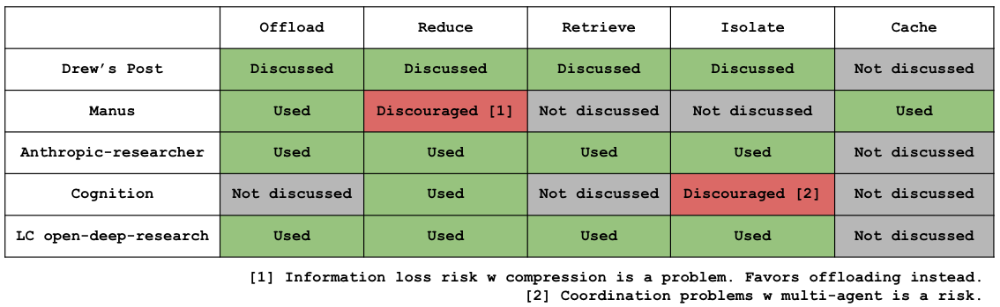

# 大模型工程实践中的常见问题与解决方法

1. 大模型应用现状

- [【人工智能】人们是怎么用 ChatGPT 的 | OpenAI 内部报告 | 7 亿周活跃用户 | 每日 25 亿消息 | 非工作消息占比上升 | 用户意图分析 | 性别差异 | 年龄分布 | 教育背景和职业差异](https://www.youtube.com/watch?v=dxVItEMFKqk&t=664s)
- 应用情况
  - 应用场景
  - 使用模型
  - 工程框架
    workflow -> langgraph
  - 是否有合作算法
  - 是否微调

2. 实践中的技术问题
   - Multi Agent vs. Single Agent
   - RAG 知识库的构建与召回：GraphRAG 是否有效、CodeRAG
   - 高质量的上下文构建：上下文长度对模型输出的影响有多少、如何构建高质量的上下文
     
     - 多 agent：主子 agents 的 context 共享与隔离、内容传递、管理优化
     - 单 agent：tools 设计(三层 tool call，减少给到 agent 的 tools)、context 长度管理(压缩、摘要、存储，类似 lsmtree?)、注意力管理(复述 todolist)
   - Human in Loop

---

好的，我们来详细解读这份关于 AI Agent 工程实践的技术文档。

这份文档深入探讨了在构建 AI Agent（智能代理）时遇到的核心工程问题，并结合具体场景（如前端代码生成、数据分析）给出了解决方案和思考。

### 核心摘要

文档主要分为三个部分：

1.  **RAG 知识库构建 (2.2):** 重点讨论了如何为代码（特别是大型单体仓库 Monorepo）构建一个高效的知识库。结论是传统的文本分片 RAG 效果不佳，而构建**代码图谱 (CodeGraph)** 是一个更优的解决方案。
2.  **高质量上下文构建 (2.3):** 探讨了如何管理和优化 Agent 的上下文（Context），以避免超出长度限制和模型“注意力涣散”的问题。介绍了两种主流架构：**主-子 Agent 架构**（通过隔离和压缩管理上下文）和**单体 Agent 架构**（通过压缩、摘要和卸载管理上下文）。
3.  **人机协同 (Human-in-the-loop) (2.4):** 分析了为什么需要人类介入，并展示了如何通过结构化的界面（如表单）而非纯聊天来引导用户、收集需求，从而将复杂任务分解，提高 Agent 的任务成功率。

---

### 2. 实践中的技术问题

#### 2.2 RAG 知识库的构建与召回 (以代码为例)

这部分的核心是解决“如何让 Agent 精准地理解和查找代码”的问题。

- **面临的挑战 (Monorepo 架构):**

  1.  **大海捞针：** 代码仓库文件太多，用传统的文件搜索（grep）效率极低。
  2.  **语义混淆：** 不同项目间存在大量功能相似的代码，即使使用语义搜索，也很容易找错（高错召回率）。

- **解决方案：构建 CodeGraph (代码图谱)**

  - **是什么：** 这不是简单地把代码当成文本，而是通过静态分析工具（如 `typescript-estree`）将代码解析成一个**知识图谱**。
    - **节点 (Node):** 页面、组件、函数、Hooks、类型定义等代码实体。
    - **边 (Edge):** 它们之间的引用、调用关系。
  - **构建流程：** 离线地对整个代码库进行分析，生成描述代码结构和关系的图谱数据。
  - **应用方式：**
    1.  **生成代码 Wiki：** 基于图谱自动生成项目、页面的结构文档。
    2.  **精准召回：** 当用户提出需求时，Agent 不再是盲目搜索，而是在图谱上进行查询，找到最相关的代码入口和影响范围。
    3.  **结构化问答：** 可以回答“哪些组件依赖了 axios？”这类结构性问题。

- **效果对比：**

  - **Before (无 CodeGraph):** 模型会“幻想”出不存在的文件路径，给出的代码修改建议无法执行。
  - **After (有 CodeGraph):** 模型能准确地定位到需要修改的真实文件，大大提高了代码生成 Agent 的准确性和可用性。

- **关键启示 (Learning):**
  - **GraphRAG vs. 分片 RAG:** 对于代码这类结构化信息，GraphRAG 相比传统的文本分片 RAG，**召回结果更少但更精准**，并且能为 LLM 提供完整的语义路径，可解释性更强。
  - **挑战：** 需要解决图谱、Wiki 与代码的**数据一致性**问题，未来需要自动化构建流程。

#### 2.3 高质量的上下文构建

这部分探讨了如何解决大语言模型（LLM）的“记忆”问题，即上下文管理。

- **核心问题：**

  1.  **上下文长度影响性能：** 实验表明，即使是强大的模型，当输入上下文变得很长时，其性能也会下降（称为 Context Rot）。
  2.  **如何在有限长度内提供最有效的信息？**

- **解决方案 1：主-子 Agent 架构 (以 Sqless 为例)**

  - **架构：** 一个主 Agent 负责任务规划，动态创建多个功能单一的子 Agent（如数据查询 Agent、脚本分析 Agent）来执行具体步骤。
  - **上下文管理：**
    - **隔离 (Isolate):** 每个子 Agent 拥有自己独立的、较短的上下文，只处理自己的任务，避免信息干扰。
    - **压缩 (Reduce):** 子 Agent 完成任务后，将结果进行**压缩或总结**，然后才汇报给主 Agent。
    - **卸载 (Offload):** 对于大的数据块（如 SQL 查询结果），不直接放入上下文，而是存为文件（如 CSV），在 Agent 间通过文件路径传递。
  - **优点：** 通过“分而治之”有效控制了每个 Agent 的上下文长度，保证了整体任务的稳定执行。

- **解决方案 2：单体 Agent 架构 (以 Manus/Cursor 为例)**

  - **架构：** 只有一个全能的 Agent，管理所有的工具和执行流程。
  - **面临的挑战：** 上下文极易超长；执行链条长，模型容易“忘记”最初的目标。
  - **上下文管理：**
    - **压缩 (Compaction/Summarization):** 对历史对话进行压缩或生成摘要，优先处理最旧的内容。**关键点：**做摘要时要基于原始的完整信息，而不是基于已压缩的信息，以减少信息损失。
    - **卸载 (Offload):** 与子 Agent 架构类似，将大数据存入文件。
  - **注意力管理：**
    - **使用 TodoList：** 在执行过程中，不断让模型回顾和更新任务清单（TodoList），以此来“拉回”模型的注意力，确保它没有偏离主线任务。

- **各家观点对比图：**
  这张图（在原文中）总结了不同研究/产品（如 Drew's Post, Manus, Anthropic 等）对卸载、压缩、检索、隔离、缓存这五种技术的采纳情况，直观展示了不同技术路线的权衡。

#### 2.4 Human-in-the-loop (人机协同)

这部分探讨了如何设计交互，让用户能有效地引导和干预 Agent，以完成复杂任务。

- **核心问题：**

  - 模型的成功率与任务复杂度强相关。对于需要人类数小时完成的复杂任务，模型的成功率很低。
  - 纯自然语言交互（聊天框）对于复杂任务来说，效率低且用户难以提供精确指令。

- **解决方案：结构化交互 + Agent**

  - **思路：** 不要让用户从一个空白的聊天框开始，而是提供一个**结构化的界面（如表单 WebForm）**，引导用户分步骤提供必要信息。
  - **案例 (前端工厂生码):**
    1.  **人类负责输入 (Human-in-the-loop):** 用户通过表单填写产品需求、设计文档、技术上下文等。
    2.  **Agent 负责执行:** Agent 在获取了这些结构化的、高质量的信息后，再去执行代码生成、修改等任务。
  - **本质：** 这个过程实际上是将一个模糊的、开放性的任务，通过人机协作，**转化为一个定义清晰、信息完备的 SOP (标准作业程序)**。Agent 在这个 SOP 中扮演的是一个高效的执行者。

- **不同产品的对比：**
  文档通过对比“工厂生码”、“选品 Agent”、“SQLess” 等多个产品，展示了它们如何通过不同的 UI（WebForm, Chat）和信息点（Accessible Files, UnAccessible Files）来定义人与 Agent 的协作边界，以达到不同的任务完成度目标（100% 或 70%）。

---

### 3. 附录

这部分提供了一个非常实用的**大模型选型参考表**，根据不同目标对市面上的主流模型进行了分类：

- **速度优先 (⚡):** 适用于意图识别等简单、高并发场景。例如 `Gemini-2.5-Flash`。
- **质量优先 (🧠):** 适用于代码生成、复杂 Agent 等高质量要求场景。例如 `Claude-4.5-sonnet`, `GPT-5-pro`。
- **成本优先 (💰):** 适用于知识问答、批量处理等对成本敏感的场景，通常选择开源模型。例如 `Qwen3` 系列。
- **平衡型 (⚖️):** 在成本、速度和质量之间取得平衡。例如 `doubao-seed-1.6`, `kimi-k2`。

表格还列出了每个模型的上下文长度、价格、是否支持 Function Call 和多模态等关键信息，为技术选型提供了直接依据。
