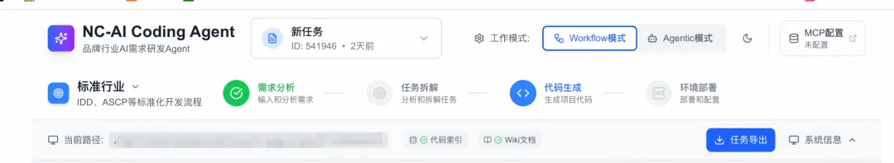
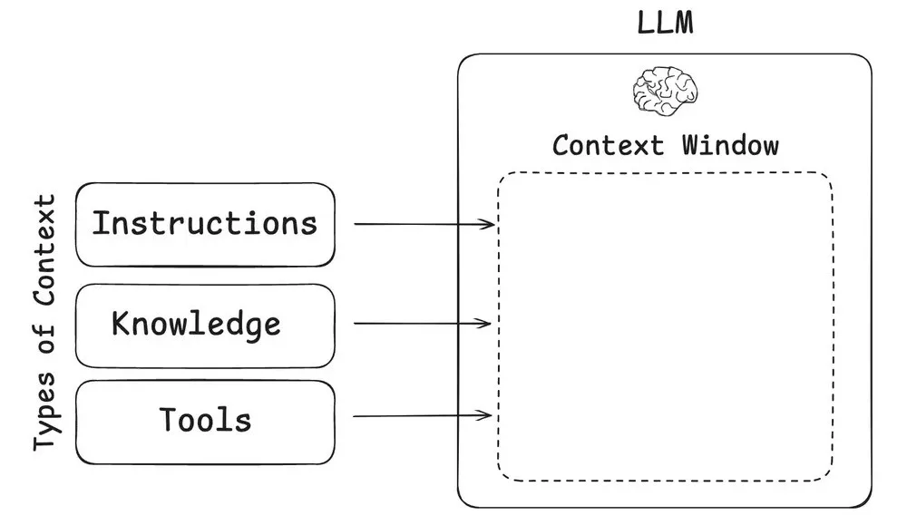
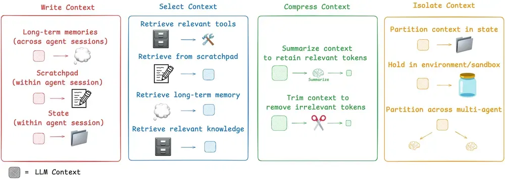

# 天猫行业中后台前端研发 Agent 设计

https://mp.weixin.qq.com/s/GwNnkuDvbDDLjp0MHtypQw

- 随着大模型技术的快速发展，前端页面开发的成本已大幅降低。现在只需要明确三个关键要素：`业务需求逻辑、交互设计和服务端接口定义`，就能快速完成页面开发。
- 不是怎么去提升写代码的效率，而是如何把程序员从大量“CRUD 类业务需求”的中解放出来，让 Agent 从 PRD 阶段就开始介入，实现从 PRD 到代码交付的完整需求研发流程。让开发同学能更专注于复杂的架构设计、技术选型和业务创新等更具创造性的工作。
- 
- ReAct 模式和 Human in the Loop：智能协作的核心机制
- 上下文工程（Context Engineering）的本质可以通过与提示词工程的对比来理解：如果说提示词工程更像是在定义模型的角色和身份，那么上下文工程则是为模型提供完成任务所需的具体信息和背景知识。
  
  
