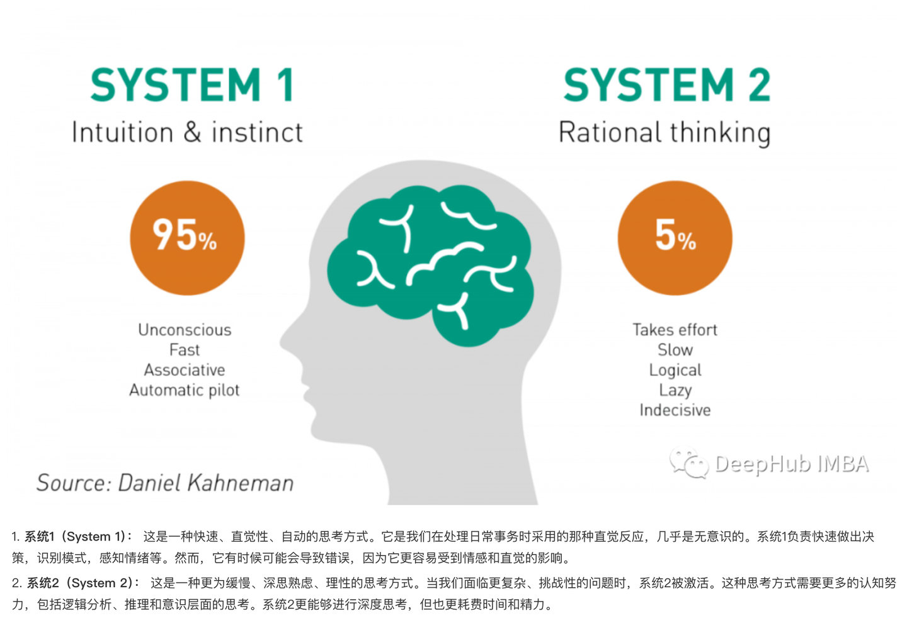
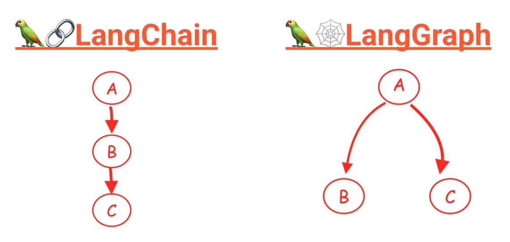
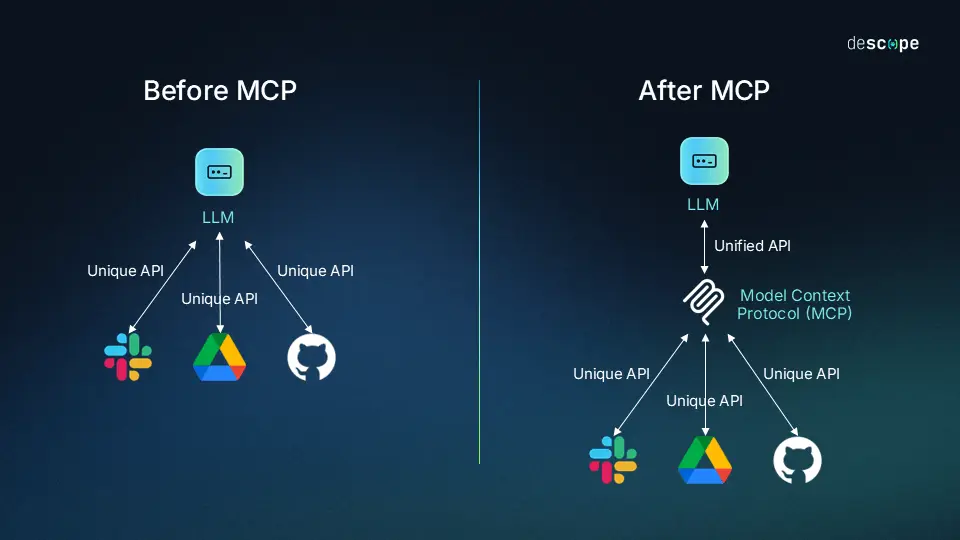

# [年终总结：2025 年 AI 产品及架构演进深度研究报告](https://blog.zihanjian.com/article/2b69db82-fa86-80f4-abc2-f6a70258f7ad)

## 产品和业务的角度

随着 2025 年落下帷幕，AIAgent 领域已经完成了从玩具阶段到工具阶段的蜕变。用户对于 AI 能说话这件事逐渐感到稀松平常，我们会开始依赖 AI 去工作。

### 第一章：量化市场与应用的格局

2025 年 AIAgent 部署量突然爆发、人们从抗拒到接受，其背后的影响因素

- 部署量的拐点：从 Copilot 到 Agent
  人类交互需要的是下达任务 → 监控关键节点 → 接收结果，而不是持续地对话与不停地干预。
- 用户抵触情绪的反转
  `Human-in-the-loop` 设计，以及我在教它，而不是被它评估的主观感受，让员工重新获得了对工作的掌控感，也让曾经的恐惧转化为对新工具的好奇与认可。
- ROI 视角的回归
  到了 Q4，在经济下行和预算收紧的压力下，评价体系迅速回归商业本质：`任务完成率`和`单位产出成本`重新成为衡量成败的锚点。
  从 Usage-Based 向 Outcome-Based 的指标迁移，标志着 AIAgent 正式告别玩具的定位。

### 第二章：AgenticDesign 的全面进化

AI 交互从问答式转向执行式，有些什么需关注的进化方向？

- 以内容创作为中心的生成式 AI，转向以工作流执行和目标达成为中心的代理式 AI
  真正的代理式系统，会维护长期状态，`以目标和事件为驱动`，而不是依赖用户一条条提示来手动推进流程。
- 从 Chatbot 到 HeadlessAgents
  用户不再希望和 Agent 闲聊，而是需要一个看板，随时看清楚这个长期运行的系统正在做什么、为什么这么做以及带来了什么业务结果。
- Multi-AgentSystems（MAS）的崛起
- 计算机使用（ComputerUse）能力的整合
  Q4，基于视觉‑语言‑动作模型（VLA）的 Agent 已经可以像人类一样读懂屏幕、移动鼠标、点击按钮，甚至处理较复杂的 GUI 交互。

### 第三章：产品设计与 UX 趋势

AI 产品设计需要注意的新特性：持久记忆的提升、可观测性、动态 UI 以及交互模式

- Memory 的演化
- AgentOps：AI 时代的 DevOps
  为大规模部署的智能体提供可观测性、可靠性与合规性保障，使其能够在复杂业务环境中以可控的方式持续演进和优化。
- 生成式 UI（GenerativeUI/GenUI）
  界面不再是事先画好的固定容器，而是在具体意图触发时，由模型即时合成的交互空间。
- 人在回路（HITL）的交互模式
  从产品视角看，HITL 并不是单一功能点，而是一套围绕控制权与责任边界展开的系统设计方法。
  - 授权行为（PermissiontoAct）强调将人类嵌入到关键动作之前的决策环节：Agent 负责目标分解、信息收集与方案生成，人类则对`关键执行步骤进行显式授权`。
  - 可驾驭性（Steerability）关注的是过程层面的控制权：用户不仅能事前授权，还应当能够在任务执行过程中随时介入、重定方向。
    底层系统需要`将任务拆解为细粒度、可中断的子步骤`，并具备在中途引入新目标或约束时的快速重规划能力，从而让用户对 Agent 行为形成随时可偏转的心理预期。
  - 信任校准（TrustCalibration）的目标不是简单提升用户对 Agent 的信任度，而是让用户信任水平与系统真实能力和当前不确定性相匹配，俗称管理用户预期。

### 第四章：账号制商业模式的削弱

以 AI 为核心的商业形态和定价演进方向

- 账号制在 Agent 时代的内在矛盾
- 消耗型定价（Token-Based）
  从按人转向按行为/按消耗计费，将价格锚定在可度量的工作量上，而非组织结构中的人头数量。
- 结果型定价（Outcome-Based）
- Agent 即服务（Agent-as-a-Service,AaaS）
  将 Agent 明确包装为虚拟员工，以月薪式订阅的形式进入企业的预算科目，而非传统的软件预算。

## 技术和架构的角度

技术和架构视角可以揭示：为什么发生？有没有什么大的要来了？
到了 2025 年底，面向 LLM 的架构范式已发生了天翻地覆的改变。首先是市场重心已从单体智能体（Agent）果断转向构建可组合、分布式的多智能体系统（Multi-AgentSystems,MAS）。而系统 II（System2）思维架构又成为了新的黄金标准，强调在推理阶段引入显式的验证循环（ValidationLoop）和计算扩展（Test-TimeCompute）。紧接着碎片化的编排工具被图（Graph-based）及事件（Event-Driven）驱动架构所整合，如 MicrosoftAgentFramework 和 LangGraph 的大面积普及，使得多智能体系统的状态管理和错误恢复成为可能。此外，包含 Agent2Agent(A2A)和 MCP 在内的各种协议的诞生，试图打破智能体之间的孤岛，确立机器间协作的早期通用语言并向着群体智能（SwarmIntelligence）而迈进。而在记忆层面，基于时序知识图谱（TemporalKnowledgeGraphs）的动态存储和混合式召回策略取代了朴素的向量检索（NaiveRAG），解决了上下文污染和时序错乱的难题。更激进的前沿进展是递归自改进（RecursiveSelf-Improvement），如 GödelAgent 等系统展示了智能体如何通过代码自我重写来动态优化其逻辑，试图将 AI 从单纯的工具迈向具有一定自主进化能力的实体。

### 第一章：内核重构

架构从快思考转向分层验证的慢思考，为什么、以及如何转变？


- ReAct 范式的局限性与全面衰退
  以一个通用大语言模型（LLM）为核心大脑，外层叠加提示工程（PromptEngineering）、向量数据库（RAG）以及若干硬编码的 API 工具。这种看似全能型（Do‑Everything）的单体 Agent，在企业落地进入深水区之后，迅速暴露出严重的不可扩展性。
- Thinker 架构与双系统理论的工程化
  高级 Agent 不再把推理当作一次性前向计算，而是把人类认知中的直觉（System1）与深思熟虑（System2）拆成两套可编排的计算流程，并通过一个元控制器在二者之间按需切换。
- 推理时计算（Test-TimeCompute）的规模化应用
  多花时间思考，往往比单纯增加参数量获得更高的边际收益，而且更容易工程化地融入 Agent 系统。
  在工程实践中，被普遍接受的一种架构范式，是将这些额外思考拆解为清晰的角色：`规划器（Planner）、执行器（Executor）和验证器（Verifier）。`

### 第二章：编排系统的分野与整合

Workflow 是怎样从百花齐放走向 Graph 与 Event 驱动的大一统的

- 编排模式的分野：层级控制与群体智能(中心化/去中心化)
- 编排生态系统的整合
  
  将 Agent 建模为状态机（StateMachine），其中节点是操作，边是状态转换。
  图的本质是 orchestrator 层，节点逻辑可以继续用 LangChain/自写脚本。

### 第三章：协议层的标准化与统一

MCP 和 A2A 等协议推动接口协议标准化

- 模型上下文协议（MCP）
  由 Anthropic 发起并得到 OpenAI、Google、Microsoft 等巨头广泛支持的 ModelContextProtocol(MCP)，正在成为连接 AI 系统与数据源的事实标准。
  
- Agent2Agent(A2A)协议
  这一协议目前还比较鸡肋

### 第四章：记忆与上下文管理

记忆系统有哪些变化关注点，如何有效减少召回过程中的上下文污染

在 2025 年初，多数 Agent 的记忆系统还停留在`朴素 RAG`（检索增强生成）阶段：把对话历史和外部文档机械地切成片段，统一丢进向量数据库，靠语义相似度检索来找回记忆。这类方案在早期简单问答里尚且可用，但一旦涉及长期多轮对话和复杂任务，就暴露出严重短板。
这一代方案的核心问题被概括为上下文污染（ContextPollution）：检索只关注局部语义相似度，没有时间维度的约束，也缺乏对实体的一致性检查和冲突消解机制。

到 2025 年底，主流实践开始从向量库记忆全面转向`时序`知识图谱（TemporalKnowledgeGraphs）。
新的架构不再把记忆当作无结构的文本碎片，而是显式建模谁（实体）在什么时候（时间）对谁/什么（其他实体）做了什么（关系与事件），并在查询阶段结合时间约束、因果链路和实体一致性来筛选证据。

- 从向量检索到图谱记忆
  图谱记忆（Graph-BasedMemory）是在 RAG 之后，为解决长周期、多任务 Agent 的上下文管理和推理瓶颈而出现的一代新记忆基础设施：它把记忆组织成知识图谱，使检索从找相似文本升级为在关系网中行走和推理，同时在成本和延迟上显著优于简单的全上下文或纯向量检索方案。图谱化记忆本质上是：`把记忆存成知识图谱，而不是一堆孤立的向量或文本，使得智能体可以像在关系网中走路一样去检索和推理。`

### 第五章：递归自我改进与进化智能体

理想主义的探索——智能体通过自我修改代码、进化算法实现自主进化。

---

可以清晰看到一条从随机性走向确定性、从脚本化走向认知化的演进路线。年初的 AIAgent 还只是装上工具的聊天机器人，而在年底，它们已经演进为具备严谨思维结构、标准化通信协议和动态记忆能力的工业化（初级）软件系统。
AI 战略的重心除了模型微调之外，也有架构工程和产品设计。

---

你好！这是一篇极具前瞻性和深度的行业洞察报告，名为《年终总结：2025 年 AI 产品及架构演进深度研究报告》。这篇文章不仅总结了 2025 年 AI 行业的现状，更像是一份“未来史”，勾勒出了从“AI 玩伴”到“AI 同事”转型的关键路径。

以下是对这篇文章富有洞见的解构与深度分析：

---

### **核心论点：从“生成内容”到“执行任务”的工业化跃迁**

如果用一句话概括全文的核心思想，那就是：**AI 正在经历从“快思考”的聊天机器人（Chatbot）向“慢思考”的智能体系统（Agentic Systems）的范式转移，即 AI 的工业化进程正式开启。**

这篇文章清晰地将其拆解为两条主线：

1.  **产品/商业视角**：关注市场接受度、ROI（投资回报率）、交互体验和商业模式的重构。
2.  **技术/架构视角**：关注内核推理机制、编排系统、协议标准和记忆管理的技术演进。

---

### **深度解构：四大关键维度的变革**

#### **1. 交互与形态的重构：从 Copilot 到 "Silent" Agent**

- **现象**：2024 年的 AI 是 Copilot（副驾驶），你需要不停地用 Prompt（提示词）去“戳”它；2025 年的 AI 是 Agent（代理人），它是一个无头（Headless）的后台进程。
- **洞见**：
  - **“去聊天化”趋势**：未来的 AI 不需要你一定要和它“说话”。最好的 AI 应该是隐形的（Invisible），它在后台监控业务流（供应链、日志、邮件），只在需要决策时浮出水面。
  - **影子公司（Shadow Mode）**：为了消除人类的恐惧，文章提到了“影子模式”。AI 像实习生一样在后台模拟操作，经人类确认才执行。这解决了一个核心心理学问题——**掌控感**。只有当人觉得自己在“教”AI，而不是被 AI“替代”时，企业落地的阻力才会消失。
  - **人机关系重定义**：从 `User <-> Tool`（用户与工具）变成了 `Manager <-> Worker`（经理与员工）。界面设计从“输入框”变成了“监控看板”和“授权按钮”。

#### **2. 认知架构的深化：引入“慢思考” (System 2)**

- **痛点**：传统的 ReAct（推理+行动）模式是线性的、冲动的。一步错，步步错（错误级联效应）。
- **演进**：文章借用了卡尼曼的《思考，快与慢》理论：
  - **System 1 (快)**：直觉反应，现在的 Chatbot。
  - **System 2 (慢)**：分层验证的慢思考。这在架构上体现为 `Planner`（规划） -> `Executor`（执行） -> `Verifier`（验证） 的循环。
- **架构启示**：
  - **Test-Time Compute（推理时计算）**：这是技术圈的一个暴论，但也是真理——**让模型“多想一会儿”，比把模型“做得更大”性价比更高及更有效。** 通过熵驱动采样和多路径搜索，用时间换智能。
  - **图驱动编排 (Graph-based)**：LangGraph 等图结构的统治地位确立，意味着 AI 的思维过程不再是黑盒的“流”，而是可回溯、可循环、可调试的状态机。

#### **3. 记忆系统的质变：从“模糊检索”到“确切图谱”**

- **痛点**：朴素 RAG（Naive RAG） 是 2024 年的玩具。它最大的问题是**时空错乱**（Context Pollution）。把 1 月份的“延期”和 2 月份的“已交付”混在一起检索，AI 就会胡说八道。
- **演进**：**时序知识图谱 (Temporal Knowledge Graphs)**。
- **洞见**：
  - **记忆是有“有效期”的**：引入双时序（Valid Time vs. Transaction Time）是一个数据库级别的深刻洞见。AI 需要知道“这件事实际上什么时候发生的”以及“我什么时候知道这件事的”。
  - **混合检索的必然性**：向量（模糊语义）+ 关键词（精确匹配）+ 图谱（关系推理）+ 时序（新鲜度） = 一个具有连贯人格和世界观的 AI。

#### **4. 商业模式的崩塌与重建**

- **矛盾**：传统的 SaaS 是卖账号（Seat-based）。如果 AI 真的好用，原本需要 10 个人干的活，现在只需要 1 个人加 AI。那么，卖账号的软件公司是在“自杀”。
- **演进**：**Outcome-Based Pricing (按结果付费)**。
- **洞见**：这是一场勇敢者的游戏。如果你敢按“成功解决的工单数”收费，说明你的 AI 真的能干活。未来的商业模式将不再是卖工具，而是**卖劳动力**（Digital Labor）。这会导致 AI 厂商与客户的利益高度绑定——AI 越强，客户越省钱，厂商越赚钱。

---

### **总结与反思：我们正处在什么节点？**

这篇文章描述的 2025 年，实际上是 **AI 从“Demo 演示”走向“生产环境”的阵痛期结束后的景象**。

1.  **祛魅完成**：人们不再为一个能写诗的 AI 感到兴奋，而是冷静地计算多少 Token 能换这行代码的自动化。
2.  **工程化胜利**：单纯拼大模型参数的时代过去了，竞争转移到了**Agent 架构、记忆管理系统、编排协议（MCP/A2A）**等中间层基础设施。
3.  **信任经济**：谁能建立最完善的可观测性（Observability）和“人在回路”（HITL）机制，谁就能赢得企业客户的信任。

**对于开发者的启示：**
如果你正在构建 AI 应用，请停止纠结于换哪个更强的 LLM 基座，转而思考：

- 我的系统有状态机吗？
- 我的记忆系统能处理冲突和时间吗？
- 我有为用户提供“后悔药”（回滚/干预机制）吗？
- 我的 AI 能像同事一样，通过标准协议（如 MCP）与其他工具协作吗？

这就这篇文章带给我们的最大价值：**它是一份从 Toy（玩具）迈向 Tool（工具）再迈向 Teammate（队友）的工程蓝图。**

---

# 深度解析：2025 年 AI Agent 产品与架构演进报告

这是一篇非常系统性的年度总结，作者 Zylan 从**产品/业务**和**技术/架构**双视角，对 2025 年 AI Agent 领域的演进进行了全面梳理。让我从几个核心维度进行深入分析和解构。

---

## 一、文章的核心洞见与框架

### 1. 双视角分析框架

作者采用了一个非常清晰的分析框架：

| 视角          | 关注点                     | 核心问题                       |
| ------------- | -------------------------- | ------------------------------ |
| **产品/业务** | 已经发生了什么，为什么发生 | 市场采纳、用户接受度、商业模式 |
| **技术/架构** | 为什么发生，有什么大的要来 | 内核重构、编排系统、协议标准化 |

这种双视角的分析方法非常有价值——它避免了纯技术文章容易陷入的"技术自嗨"，也避免了纯商业分析的"隔靴搔痒"。

### 2. 年度主题总结

文章的核心论点可以归纳为一句话：

> **2025 年是 AI 从"能说话"到"能干活"的转折年。**

具体表现为三个层面的转变：

```
Chatbot → Agent（交互形态）
Demo → Production（落地深度）
Usage-Based → Outcome-Based（价值衡量）
```

---

## 二、产品与业务层面的关键洞见

### 1. "Pilot Purgatory"困境的突破

作者指出 2025 年初企业普遍陷入"试点炼狱"——大量 Copilot 上线但真正嵌入业务的很少。到 Q3/Q4 这一僵局被打破，关键因素是：

**产品定位的根本转变**：从"助手(Assistant)"到"代理(Agent)"

| 特征     | 2025 年初(Copilot 模式) | 2025 年底(Agent 模式)      |
| -------- | ----------------------- | -------------------------- |
| 交互模式 | 持续输入 Prompt         | 下达目标 → 监控 → 接收结果 |
| 人的角色 | 流程管理者              | 关键节点决策者             |
| 价值主张 | 协助完成任务            | 代为完成任务               |

**这是一个非常重要的产品哲学转变**：用户不为需要额外管理成本的工具买单，而是为可以被托管的生产力买单。

### 2. 用户抵触情绪反转的机制

从 47%抵触降到 21%，作者揭示了背后的设计策略：

- **Agent Shadowing（影子模式）**：Agent 以旁观、记录、建议的方式嵌入
- **Co-Worker 设计**：将 Agent 定位为"初级员工/实习生"而非"全知全能的上帝"
- **Human-in-the-loop 强化**："我在教它"而非"被它评估"的主观感受

**洞见**：技术能力的进步反而需要用"降格"的产品设计来获取用户信任。这是反直觉的，但符合变革管理的基本规律。

### 3. 商业模式的结构性重构

这是文章中最具前瞻性的部分之一。作者指出传统 SaaS 按人头计费(Seat-Based)面临的**结构性悖论**：

> 当单个 Agent 能力足以覆盖 3-5 个账号时，产品越成功，传统收入越被侵蚀。

三种新定价模式的演进：

```
消耗型(Token-Based) → 按可量化工作单元计费
结果型(Outcome-Based) → 按业务KPI计费
AaaS(Agent-as-a-Service) → 按"虚拟员工"月薪计费
```

**深层洞见**：定价不再是上市前的尾部决策，而是与产品形态、目标岗位、技术路线一起被纳入早期架构设计的联合约束。

---

## 三、技术与架构层面的关键洞见

### 1. 从 System 1 到 System 2 的认知架构转变

这是文章技术部分最核心的论点。作者借用认知心理学的双系统理论来描述架构演进：

| 特征     | System 1 (快思考) | System 2 (慢思考)          |
| -------- | ----------------- | -------------------------- |
| 处理方式 | 直觉、自动化      | 审慎、显式推理             |
| 适用场景 | 熟悉、低风险      | 复杂、高不确定性           |
| 架构对应 | 单轮 CoT          | 验证循环+Test-Time Compute |

**Thinker 架构的四阶段循环**是这一思想的具体工程化：

1. 快速思考 → 启发式答案
2. 验证 → 逻辑审查和事实核对
3. 慢思考 → 多路径搜索(MCTS 等)
4. 总结 → 压缩为简洁输出

**核心洞见**：不是所有 Token 都是平等的。动态分配推理时计算资源(Test-Time Compute)是区分高级 Agent 与简单 Chatbot 的关键。

### 2. ReAct 范式的结构性局限

作者对 ReAct 范式的批判非常精准：

**错误级联效应**：10 步任务链，每步 95%准确率，整体只有约 60%成功率

**浅推理与冲动执行**：缺乏"先想后做"的规划阶段和"做后反思"的校正机制

这解释了为什么单体 Agent 在长链任务中"必然撞墙"——这不是 prompt 工程能解决的问题，而是架构层面的根本缺陷。

### 3. 编排系统的收敛

从混乱的框架生态到 Graph+Event 驱动的统一：

```
2025年初: LangChain(链) vs AutoGen(对话) vs SemanticKernel(企业)
2025年底: Microsoft Agent Framework(统一) + LangGraph(图状态机)
```

**为什么是图而不是链**：

- 线性 Chain 难以表达循环与反馈
- 循环在 System 2 型架构中至关重要（生成 → 评估 → 失败 → 重试）
- 图结构天然适合描述迭代式思考流程

### 4. 记忆系统的范式转变

从**朴素 RAG**到**时序知识图谱**的演进，解决的核心问题是**上下文污染**：

| 问题     | 朴素 RAG     | 时序知识图谱                          |
| -------- | ------------ | ------------------------------------- |
| 时间感知 | 无           | 双时序(ValidTime + TransactionTime)   |
| 冲突处理 | 简单并存     | 边失效(Edge Invalidation)             |
| 检索方式 | 纯语义相似度 | 混合检索(语义+关键词+图遍历+时序过滤) |

**Graphiti/Zep 的双时序模型**特别值得关注——它区分了"事实发生时间"和"系统得知时间"，使 Agent 既能回答当前状态，也能回答历史问题。

---

## 四、文章的方法论价值

### 1. 技术演进的规律性认识

作者隐含地揭示了一个技术演进规律：

```
单体 → 分布式
同步 → 异步
静态 → 动态
隐式 → 显式
```

这在 Agent 领域具体表现为：

- 单体 Agent → Multi-Agent Systems
- 同步对话 → 事件驱动异步
- 静态 Prompt → 动态记忆图谱
- 隐式推理 → 显式验证循环

### 2. 产品设计的反直觉洞见

文章中有几个非常反直觉但极具价值的观察：

1. **能力越强，姿态越低**：高能力 Agent 需要用"实习生"定位来获取信任
2. **越成功越亏钱**：传统 SaaS 定价在 Agent 时代面临结构性矛盾
3. **越智能越需要可观测**：从功能发布转向 Shadow/Trace/AgentOps

### 3. 未来方向的暗示

文章最后一章关于"递归自我改进"的内容，虽然篇幅不长，但暗示了一个重要方向：

> Agent 不再主要依赖一次性的人类设计，而是在长期运行中通过递归自我改进与群体进化，逐步将自己的能力边界推向更高层次。

**GödelAgent**的"代码即自身"理念——Agent 可以读写自己的源码——这是一个值得深思的方向。

---

## 五、批判性思考

### 1. 可能的过度乐观

文章对 2025 年底的描述可能过于乐观：

- 42%的 Agent 部署率数据需要审慎看待（部署 ≠ 有效运行）
- Multi-Agent Systems 在生产环境的成熟度可能被高估
- 协议标准化(MCP/A2A)的实际采用率可能不如描述的那么普遍

### 2. 缺失的讨论

文章相对较少涉及：

- **安全与对齐**问题——Agent 能力增强带来的风险
- **成本问题**——Test-Time Compute 的规模化成本
- **监管合规**——特别是在高风险场景(医疗、金融)的实际落地挑战

### 3. 技术债务的隐忧

从 ReAct 到 Multi-Agent 的转型，必然带来大量的技术债务迁移成本。文章对这一点的讨论相对薄弱。

---

## 六、总结

这是一篇非常有价值的年度总结文章，其核心贡献在于：

1. **框架清晰**：产品/技术双视角的分析框架具有很强的参考价值
2. **洞见深刻**：特别是对商业模式变革、认知架构转变的分析
3. **技术严谨**：对具体架构(Thinker、LangGraph、时序图谱等)的描述准确详实
4. **前瞻性强**：对自我进化 Agent 的讨论具有启发性

对于 AI 从业者来说，这篇文章提供了一个很好的"2025 年全景图"，可以作为理解行业演进和规划未来方向的重要参考。
