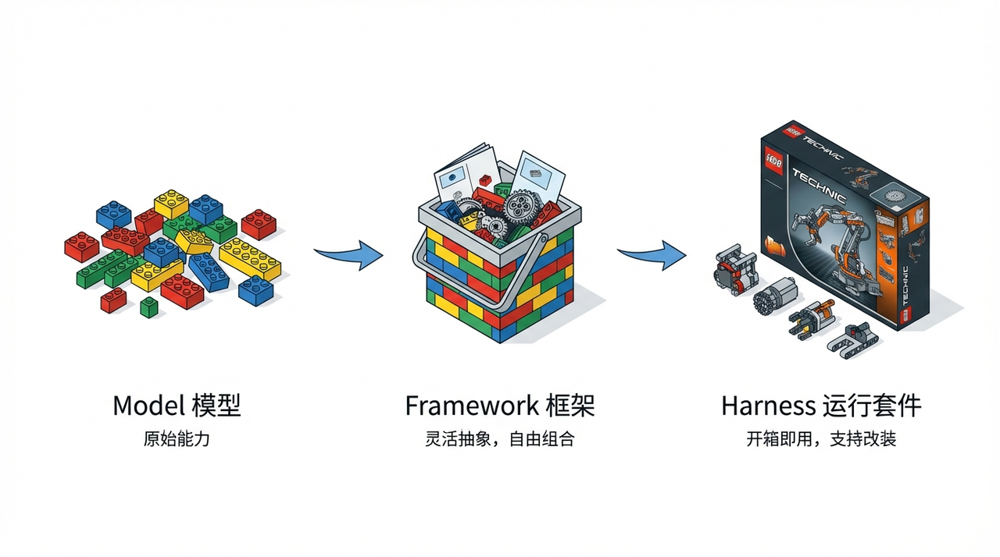

## 从 Chatbot 到 Long-horizon Agent(长程Agent)

LangChain 的作者 + 联合创始人 Harrison Chase 在红杉资本的播客里深入讨论了 Long-horizon 以及 Harness 的概念演进

这是一份关于 LangChain 创始人 Harrison Chase 在播客中关于 **“长周期智能体 (Long-Horizon Agents)”** 和 **“智能体约束套件 (Agent Harnesses)”** 深度对话的全面扫描与剖析。

1. **Agent 的三级火箭：Model -> Framework -> Harness**
2. **"Context Engineering" 时代的到来**
3. **软件工程的范式转移：Traces 取代 Code 成为 Truth Source**
4. **Sleep-time compute 与长期记忆的构建**

### 1. 核心概念演进：从 Framework 到 Harness

> "LangGraph 是 runtime，LangChain 是 abstraction，Deep Agents 是 harness。它们是 batteries included——内置了 planning、memory、subagents、file systems 和 starter prompts——所以你可以直接开始构建。"

文本深刻探讨了构建 Agent 工具的层级演进：

- **Model (模型)**：底层的 LLM（如 GPT-4、Claude 3.5），负责输入输出和基础推理。
- **Framework (框架/LangChain)**：非特定的抽象层。它提供切换模型、添加工具、向量库和记忆的通用组件，本身不对“如何完成任务”抱有强烈的预设立场（Un-opinionated）。
- **Harness (预设约束套件/Deep Agents)**：**这是目前的最新趋势。** Harness 是“开箱即用”且“带有强烈主张的（Opinionated）”。它不仅提供工具，还直接规定了 Agent 该如何运行。例如，内置规划工具 (Planning tool)、内置长文本记忆压缩机制 (Compaction)、以及默认提供文件系统/BASH 交互能力。**Claude Code 被认为是目前极其优秀的 Harness 代表。**

Framework层是工具、向量数据库、Memory 的抽象，类似ORM对数据库的抽象；​Harness是类似Spring开发框架，提供的是一套最佳实践

### 2. 为什么是现在？Long-Horizon Agent 的爆发点

早期的 AutoGPT 提出了让 LLM 在循环中无限运行的设想，但当时失败了。Harrison 指出，现在长周期 Agent 终于开始 Work 的原因在于**模型能力与 Harness 的共同进化**：

- **最佳落地场景**：
  - **代码编写 (Coding)**：例如 Claude Code。
  - **AI 网站可靠性工程师 (AI SRE)**：如 Traversal 等公司，排查长时间段的日志。
  - **深度研究与报告生成 (Research)**：针对金融、信息检索等。
- **长周期 Agent 的本质定位**：现阶段的 Agent 达不到 99.999% 的绝对可靠性。因此它的“杀手级应用场景”是**生成“第一稿 (First Draft)”**。类似于开发者提交的 PR，它做大量的繁杂工作，最后由人类来 Review 和批准。

### 3. "Context Engineering" (上下文工程) 将取代 Prompt Engineering

在单次调用的 LLM 应用中，开发者明确知道输入是什么。但在循环执行 10 次的长周期 Agent 中，**“你根本不知道第 14 步的上下文里会包含什么”**，因为前 13 步可能会拉取任意的外部信息。

- 所有复杂 Harness 的本质其实都是在做 **Context Engineering**。
- 如何处理不断膨胀的上下文？需要做 **Compaction（上下文压缩）**。聪明的策略不是简单总结，而是将超大步骤的结果写入系统文件，只让 LLM 知道“文件存在那里”，等它需要时再去查看。

### 4. 软件工程的范式转移：开发 Agent vs. 开发传统软件

这是全文中最具洞见的部分之一。Harrison 指出，开发 Agent 和开发 SaaS 软件有着本质区别：

- **Truth Source（逻辑真相的来源）变了**：传统软件的逻辑全在代码里，看源码就知道系统怎么跑。Agent 的逻辑不仅在代码里，很大一部分由“黑盒”模型决定。
- **Traces (链路追踪) 成为新时代的断点测试**：在 Agent 开发中，你必须看 Trace（如 LangSmith 的追踪记录）才能知道系统里到底发生了什么，Trace 成了排查 Bug 和团队协作的核心媒介。
- **无法预测的迭代**：开发传统软件，你发布前就知道它能干什么。开发 Agent，**“在你实际运行并放入真实世界的输入之前，你根本不知道它会怎么做。”** 这导致基于线上真实 Traces 进行评估（Evals）变得前所未有的重要。
- **评估方式**：传统的自动化单元测试不再完全适用，因为 Agent 做的是“类人”的工作。目前的趋势是：人类标注者打分 (Human evaluation) + 用调优过的大模型作为裁判 (LLM-as-a-judge)。

### 5. 关于未来的预测：Memory、UI 与文件系统

- **Sleep-time compute (睡眠期计算/内隐记忆)**：未来的自我进化。Agent 可以在夜间离线分析一整天的 Traces 运行记录，自主发现错误，并**修改自己的 Harness 提示词文件**，实现真正的系统迭代。
- **长周期 Agent 的 UI 形态 (Sync vs Async)**：
  - 对于运行长达一天的任务，用户需要**异步 (Async) 管理**，类似于 Kanban、后台工单或邮件（Agent Inbox 发消息通知你）。
  - 但关键节点需要**同步 (Sync) 沟通**，用户切回聊天界面实时纠正 Agent 的方向。
  - **状态的可见性非常重要**，用户必须能实时看到 Agent 修改了什么（类似 IDE 里的目录或共享的 Google Drive 状态）。
- **File system pilled (文件系统至上)**：目前给 Agent 分配独立的代码沙盒和文件系统（而不是只给浏览器使用权）被证明是最高效的进展路径，赋予了 Agent 长臂管辖自身上下文的能力。

---

Coding Agent 可能是通用 Agent 的终极形态。因为：

- 文件系统操作、脚本执行、数据处理——这些都需要代码能力
- **代码是与计算机交互的最强大方式**
- 模型本身也在大量 coding 数据上训练

虽然今天的 Coding Agent 主要针对软件开发任务优化，但未来的通用 Agent 很可能也具备强大的 coding 能力。

---

## DeerFlow 2.0

不再把自己定位为一个 Deep Research 框架，而是一个 Super Agent Harness——一个开箱即用、完全可扩展的超级**智能体运行时**。它基于 LangGraph 构建，本质是一个支持 Skills、Memory 的 Coding Agent——是的，一个编程智能体，出厂即包含一个 Agent 完成复杂 long-horizon 任务所需的一切：

- 可插拔的 Skill 体系：随着 OpenClaw 的火爆，大家已经熟知了 Skill，在 DeerFlow 2.0 里，Research 只是其中一个 Skill，你可以添加任何 Skill
- 沙箱化的执行环境与文件系统：Agent 拥有自己的计算机
- 子 Agent 调度（Sub-agent）：复杂任务自动分解，多个子 Agent 并行执行
- 长期记忆：跨会话记住你的偏好、风格和知识
- 上下文工程：隔离、摘要、压缩，让 Agent 在长任务中始终保持专注
  如果 1.0 是一个专注于深度研究的 Multi-Agent 团队，那 2.0 就是一个什么都能干的 Super Agent，而深度研究不过是它的技能之一。

DeerFlow 2.0 以及 LangChain 的 DeepAgents 都属于 Harness 的概念，而 LangChain 和 LangGraph 则属于 Framework，即框架。

---

- Skill：DeerFlow 通过 `frontend-design Skill` 设计了一个美妆品牌（CAREN）的官方网站，不仅自己完成了浅玫瑰色 + 称线字体的品牌调性，充满了格调和暧昧气氛，而且所有美妆产品的图片、背景图片全部由 `image-generation Skill` 设计 Prompt 并通过 AIGC 生成。
- 沙箱：每个任务运行在一个隔离的沙箱环境中，拥有完整的文件系统和 Bash 执行能力。Agent 可以读写文件、执行命令、运行 Python 脚本、安装依赖包——就像你在终端里操作一样，只不过一切都在沙箱里，会话之间零污染。
  沙箱支持三种运行模式：
  - Local：直接在宿主机上执行，适合开发调试
  - Docker（推荐）：每个任务运行在独立容器中，完全隔离，使用了字节跳动开源的 AIO Sandbox
  - Kubernetes：通过 Provisioner 服务在 K8s Pod 中执行，适合生产环境
- SubAgent
- Context Engineering
- 长期记忆

- v1 vs v2

  | 维度           | 1.0 (基础版)                              | 2.0 (演进版)                                             |
  | :------------- | :---------------------------------------- | :------------------------------------------------------- |
  | **架构模式**   | Multi-Agent StateGraph（Supervisor 模式） | Single Lead Agent + Middleware + Sub-agent (带有 Skills) |
  | **Agent 数量** | 5 个固定角色                              | 1 个 Lead Agent + N 个动态 Sub-agent                     |
  | **能力扩展**   | 需要更改图拓扑或增加节点                  | 仅需增加 Skill 或 Tool，无需修改基础架构                 |
  | **上下文管理** | 全局共享 State                            | Sub-agent 上下文隔离 + 摘要压缩技术                      |
  | **执行环境**   | 仅 Coder 拥有 Python REPL                 | 完整沙箱环境（所有 Agent 共享）                          |
  | **记忆系统**   | 无                                        | 支持跨会话长期记忆                                       |
  | **并发模型**   | 基于图节点的顺序/并行执行                 | 双线程池 + 异步调度机制                                  |
  | **服务架构**   | 单体应用                                  | LangGraph Server + Gateway API + Frontend + Nginx        |
