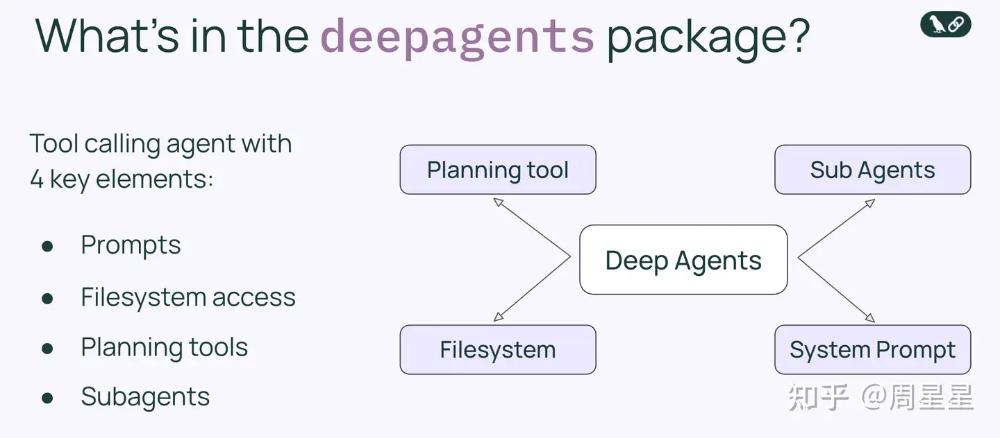

https://www.zhihu.com/question/1959742114519844109/answer/1983526566437880277

1. 2025 年 10 月份后，我认为已经收敛，收敛到以 Claude Agent SDK 和 Deep Agent 为代表的架构。
   2025 年 9 月，官方发布博文《Building agents with the Claude Agent SDK》，正式将 “Claude Code SDK” 更名为 “Claude Agent SDK”。

   简单来说，行业已经从“探索各种奇形怪状的 Agent 架构”收敛为一种**以“主从架构（Main-Sub）”为骨架，以“文件系统”为记忆，以“技能（Skills）”为能力的通用型架构**。

   以下是详细的技术拆解：

   ### 1. 核心架构形态：Main Agent - Sub Agent (主从架构)

   架构之争最终收敛于 **Supervisor (Main Agent) + Workers (Sub Agents)** 的模式。

   - **Main Agent (大脑):** 负责规划（Planning）、任务拆分、进度追踪。它不直接干脏活累活，而是调度资源。
   - **Sub Agents (手脚):** 负责具体执行。
     - **上下文隔离:** 子 Agent 执行完任务后，只返回最终结果给主 Agent，中间过程的繁杂 Context 被丢弃。这极大地节省了 Token，并防止了主 Agent 的上下文被污染。
     - **并行执行:** 多个子 Agent 可以同时工作。

   ### 2. 四大技术支柱 (The 4 Pillars)

   为了支持 Agent 进行 **Long-running (长时间运行)** 和 **Deep (深度业务)** 的任务，架构必须包含以下四个组件：

   #### A. Planning (规划能力)

   Agent 不再是简单的“React”（行动-观察-行动），而是具备了**状态保持**。

   - **机制:** 使用如 `write_todos` 等工具，将复杂任务分解为离散步骤。
   - **作用:** 防止 Agent 在长链路任务中“迷路”，确保它知道当前在做哪一步，下一步该做什么。

   #### B. File System (文件系统作为外部记忆)

   这是架构收敛中非常关键的一点。Agent 不再试图把所有信息都记在 Context Window（大脑内存）里，而是使用文件系统（硬盘）。

   - **上下文卸载:** 运行日志、中间数据、搜索结果全部写入文件。
   - **共享工作区:** 主 Agent 和 子 Agent 通过读写同一个文件目录来交换信息。
   - **持久化:** 即使 Agent 崩溃或重启，文件系统中的 `SKILL.md` 或 `todo.txt` 依然存在。

   #### C. Agent Skills (渐进式披露的知识库)

   这是 Anthropic 提出的核心概念，解决了“如何把海量业务 SOP 塞给 Agent”的问题。

   - **原理:** 类似操作系统的文件加载机制。
     1. **Level 1 (启动时):** 只加载技能的 `name` 和 `description` (元数据)。
     2. **Level 2 (需要时):** Agent 决定使用某技能，读取 `SKILL.md`。
     3. **Level 3 (深挖时):** 读取技能文件夹下的具体脚本或辅助文档。
   - **优势:** 彻底告别了把几万字文档一次性塞入 System Prompt 的暴力做法，实现了 **Load on Demand (按需加载)**。

   #### D. System Prompt (精细化的系统指令)

   Prompt 工程并没有消失，而是变得更“底层化”。

   - **内容:** 定义何时规划、何时调用子 Agent、文件命名规范、工具使用协议。
   - **本质:** System Prompt 成为了 Agent 的“操作系统内核代码”。

   ### 3. 工具调用的分层 (Layered Tooling)

   为了解决给模型提供太多工具导致的“上下文混淆 (Context Confusion)”，架构收敛为三层工具设计：

   1. **原子层 (Atomic):** 基础 OS 操作 (`read_file`, `ls`, `bash`)。
   2. **沙箱工具层 (Sandbox / Bash):** **去工具化**。不再为每个 API (如 ffmpeg) 写具体的 Function Call 定义，而是给 Agent 一个 `bash` 终端，让它像程序员一样自己写命令行代码调用工具。
   3. **代码层 (Code/Packages):** 针对复杂逻辑，让 Agent 编写并运行 Python 脚本，而不是进行几十轮的对话交互。

   ### 4. 总结：如何构建符合“收敛架构”的 Agent？

   如果您现在要开发一个垂直领域的 Agent（如招聘、营销），不应再纠结于复杂的图编排，而应遵循以下路径：

   4. **业务 SOP 化:** 将业务专家的知识提炼为标准流程。
   5. **SOP 技能化 (Skills):** 将流程写成 `SKILL.md`，放入 Agent 的文件系统。
   6. **API 协议化 (MCP):** 将企业内部接口封装为 MCP Server，供 Agent 按需连接。
   7. **Prompt 极度细节化:** 编写详细的 System Prompt 来约束 Main Agent 的调度逻辑。

   **结论：** 架构之争的结束，意味着开发者可以将精力从“设计 Agent 路由图”转移到“上下文工程 (Context Engineering)”和“业务逻辑抽象”上来。

---

Deep Agent:

- 够“垂”（行业性），假如你的 Agent 输出与通用型工具（如 Manus）一样，那就是不合格的。所谓的行业性，是指 Agent 的知识和能力必须源于该行业的深度实践和共识.包括但不限于：业务定义的理想态：如高级招聘专家定义的标准流程、评分标准或成功方法论。过往案例积累： 行业内成功的或失败的关键案例（如一次成功的招聘、一次失败的市场活动）。行业潜规则/默契： 仅在特定圈子（如猎头行业）流传的专业共识、价格默契、资源倾向或风险偏好。
- Long-running（稳定性）
  Agent 必须能够长时间持续运行而不崩溃
  Agent 必须能连续、保质保量地执行多步骤任务，涉及到大量调用工具（Tools）和外部服务（APIs）。
- Agent：An LLM agent runs tools in a loop to achieve a goal.

Workflow 将错综复杂的业务逻辑显式地构建为“有向图”；而 Agent 则将这些逻辑抽象为自然语言。在我们将架构简化为“Prompt + Tool”的同时，并没有消除复杂度，仅仅是将复杂度从“流程编排”转移到了“Prompt 设计”之中。

---

如何构建 Deep Agent？

- 维度一：把业务知识丝滑地融入到 Agent
  目前的常见做法融入 Prompt：绞尽脑汁地编写 prompt，试图把业务逻辑“翻译”成模型能懂的口吻。这种方式往往僵化且死板，难以灵活应对复杂场景。企业知识库 (RAG)：虽然能解决知识体量问题。但需要定义 Index、处理向量化、精心切分文档……整个过程笨重。这些做法都不够“丝滑”。**直到 Anthropic 在 2025 年 10 月提出了 Agent Skills，我看到了一种优雅的解法。**
  Skill 本质上是一个多层级的文件系统。
- 维度二：怎么 Long-Running
  
  langgraph 提出来 4 种方法，让你的 agent 在长时间运行不崩溃
  - Planning
  - Sub-Agents
  - File System
  - SyStem Prompt
    这四大支柱并非孤立存在，它们相辅相成，共同构成了 Deep Agent 的核心运作机制。而将这一切串联起来的底层技术，正是“上下文工程”。

---
