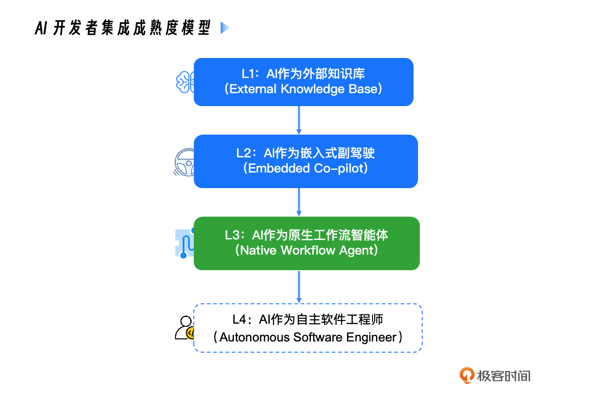
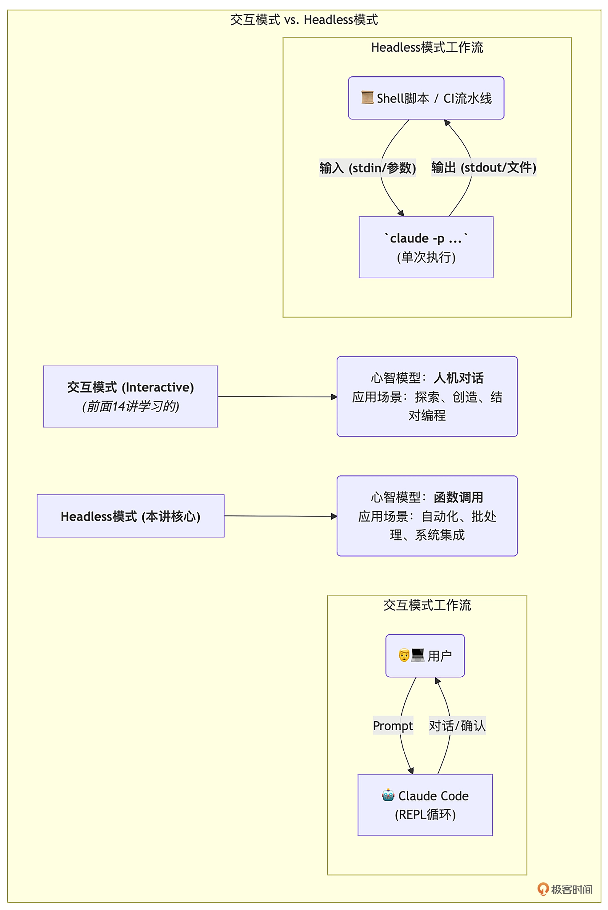

# AI 原生开发工作流实战

`不推荐，大部分AI写的`

> https://time.geekbang.org/column/article/944630

---

## 目录

- [前沿技术速递](#前沿技术速递)
- [开篇词](#开篇词ai工作流革命重新定义软件工程师的每一天)
- [概念篇：建立AI原生世界观](#概念篇建立ai原生世界观)
- [基础篇：掌握与AI伙伴协作的通用语言](#基础篇掌握与ai伙伴协作的通用语言)
- [进阶篇：将AI锻造成你的专属能力](#进阶篇将ai锻造成你的专属能力)
- [实战篇：在真实项目中重塑工程实践](#实战篇在真实项目中重塑工程实践)
- [结束语](#结束语未来已来欢迎来到人机共生的软件工程新纪元)

---

# 前沿技术速递

## 前沿技术速递｜Agent Teams：打造你的第一支"虚拟研发团队"

### 核心概念

**Agent Teams** 是指多个 AI Agent 组成的协作团队，可以并行处理复杂任务，模拟真实研发团队的分工协作模式。

### Sub-agents vs Agent Teams

| 维度         | Sub-agents（智能分身）     | Agent Teams（虚拟团队）         |
| ------------ | -------------------------- | ------------------------------- |
| **执行方式** | 串行，同一会话中切换角色   | 并行，多个独立 Agent 同时工作   |
| **角色切换** | 通过加载不同 System Prompt | 每个 Agent 有独立的上下文和角色 |
| **适用场景** | 单一任务链的分步执行       | 大规模、可分解的复杂项目        |
| **协作机制** | 会话内传递结果             | 基于 Git 仓库/共享文件进行同步  |

### 经典案例：16 个 Claude 重写 C 编译器

- **规模**：启动了 16 个 Claude Code Agent 并行工作
- **协作模式**：基于 Git 仓库进行同步。每个 Agent 领取任务后，在本地修改、测试，然后推送到上游，解决合并冲突
- **精细分工**：
  - 有的负责实现具体功能（如"实现 if 语句解析"）
  - 有的负责"代码去重"
  - 有的负责性能优化
  - 甚至有的专门负责扮演"Rust 专家"来对代码架构进行批评和指正
- **启示**：AI 不仅可以写代码，还可以分饰多角色形成**自洽的审查闭环**

### Agent Teams 构建要点

1. **任务拆分**：将大任务分解为可独立执行的子任务
2. **角色定义**：为每个 Agent 明确角色（开发者、测试者、审查者等）
3. **同步机制**：通过 Git/文件系统实现 Agent 之间的协作
4. **冲突解决**：设计合并策略，处理并行开发的代码冲突

---

## 前沿技术速递｜告别"方言"：全面解析 Agent Skills 行业标准与高阶编写心法

### 背景：为什么需要标准化？

当前各个 AI Agent 平台（Claude Code、Cursor、GitHub Copilot 等）都有自己的"方言"——不同的指令格式、不同的上下文注入方式、不同的工具调用协议。这导致：

- 同一份 Skill/Prompt 无法跨平台复用
- 开发者需要为每个平台重复编写配置
- 社区生态碎片化

### Agent Skills 的行业标准方向

1. **统一的 Skill 描述格式**：标准化 Skill 的元数据（名称、描述、触发条件、输入输出）
2. **可移植性**：一次编写，多平台运行
3. **版本管理**：Skill 可以像 npm 包一样版本化管理
4. **组合能力**：Skill 之间可以互相引用和组合

### 高阶编写心法

1. **明确触发边界**：精确定义 Skill 何时应该被调用，避免误触发
2. **上下文最小化**：只注入必要的上下文，减少 Token 消耗
3. **输出结构化**：Skill 的输出格式要明确、可解析
4. **防御性设计**：处理 AI 可能的误解和幻觉
5. **测试驱动**：为 Skill 编写测试用例验证其行为

---

# 开篇词｜AI工作流革命：重新定义软件工程师的每一天

### 核心主张

软件工程师的工作方式正在经历一次根本性变革：**从人工编码转向人机协作，再到 AI 原生开发**。

### 三个关键转变

1. **编码方式**：从手写代码 → Copilot 补全 → AI Agent 自主编码
2. **工程师角色**：从代码生产者 → 意图表达者 + AI 监督者
3. **工作流程**：从线性瀑布式/敏捷 → AI 驱动的自动化流水线

### 课程目标

- 帮助开发者掌握 AI 原生开发的核心方法论
- 以 Claude Code 为核心工具，建立完整的 AI 驱动开发工作流
- 从概念理解到实战落地，形成可复用的最佳实践

### 什么是"AI原生开发"？

不是简单地在现有工作流中"加点 AI"，而是**以 AI 为中心重新设计整个开发流程**：

- 需求分析由 AI 辅助结构化
- 架构设计由 AI 参与评审
- 编码实现由 AI 驱动完成
- 测试部署由 AI 自动化执行
- 代码审查由 AI 协同进行

---

# 概念篇：建立AI原生世界观

## 01｜范式演进：从"人机协作"到"AI原生"，你的角色变了吗？



### 三个范式阶段

#### 阶段一：AI 辅助开发（AI-Assisted）

- **代表工具**：GitHub Copilot 自动补全、ChatGPT 问答
- **特征**：AI 是"工具"，人是主角。AI 提供建议，人做决策
- **类比**：AI 是你的"实习生"，你指导它写代码

#### 阶段二：AI 增强开发（AI-Augmented）

- **代表工具**：Cursor、Windsurf 等 AI IDE
- **特征**：AI 参与更多环节（理解上下文、多文件编辑、Chat 对话），但人仍然驾驶
- **类比**：AI 是你的"初级工程师"，可以独立完成部分任务

#### 阶段三：AI 原生开发（AI-Native）

- **代表工具**：Claude Code、Devin 等 Agent
- **特征**：AI 是核心执行者，人变成"架构师 + 监督者"。AI 可以自主规划、执行、测试
- **类比**：AI 是你的"高级工程师/团队"，你负责方向和审查

### 工程师角色的转变

| 传统角色   | AI 原生角色                   |
| ---------- | ----------------------------- |
| 代码编写者 | 意图表达者（Prompt Engineer） |
| Bug 修复者 | AI 输出审查者                 |
| 架构设计者 | 规范制定者（Spec Writer）     |
| 测试编写者 | 测试策略制定者                |
| 文档维护者 | 知识库管理者                  |

### 核心观点

> 不是"AI 会取代程序员"，而是"会用 AI 的程序员会取代不会用的程序员"。

---

## 02｜核心引擎：AI原生开发第一性原理——规范驱动开发

### 第一性原理：规范驱动开发（Spec-Driven Development）

**核心思想**：AI Agent 的输出质量，完全取决于你给它的"规范"的质量。

> "Garbage In, Garbage Out" → "Good Spec In, Good Code Out"

### 什么是"规范"？

规范（Specification）是人与 AI 之间的"合同"，包括：

1. **项目规范（Project Spec）**：项目的整体架构、技术栈、约束条件
2. **需求规范（Requirement Spec）**：功能需求的精确描述
3. **设计规范（Design Spec）**：接口设计、数据模型、交互流程
4. **编码规范（Coding Spec）**：代码风格、命名约定、错误处理策略
5. **测试规范（Test Spec）**：测试策略、覆盖率要求、验收标准

### 规范的层次结构

```
项目级规范 (CLAUDE.md / constitution.md)
  ├── 模块级规范 (各目录的 CLAUDE.md)
  │     ├── 任务级规范 (spec.md / plan.md / tasks.md)
  │     └── 代码级规范 (lint / format 配置)
  └── 跨项目规范 (~/.claude/CLAUDE.md)
```

### 为什么规范如此重要？

1. **一致性**：确保 AI 的输出风格统一
2. **可重复性**：相同的规范 → 相似的输出质量
3. **可审查性**：有规范作为基准，可以客观评估 AI 的输出
4. **可传承性**：规范是团队知识的结晶，新人/新AI都能快速上手

### 规范驱动 vs Prompt 工程

| 维度   | 一次性 Prompt    | 规范驱动             |
| ------ | ---------------- | -------------------- |
| 持久性 | 用完即丢         | 版本化管理，持续演进 |
| 一致性 | 每次表述可能不同 | 统一标准             |
| 协作性 | 个人所有         | 团队共享             |
| 可审计 | 难以追溯         | Git 历史可追溯       |

---

## 03｜群雄并起：扫描命令行AI Agent生态，我们为何聚焦Claude Code？

### 主流命令行 AI Agent 对比

| Agent            | 核心模型           | 特点                         | 适用场景           |
| ---------------- | ------------------ | ---------------------------- | ------------------ |
| **Claude Code**  | Claude Sonnet/Opus | 多工具、Sub-agent、MCP 集成  | 全栈开发、复杂工程 |
| **Aider**        | 多模型支持         | 轻量、Git 友好、编辑模式丰富 | 快速编码迭代       |
| **Codex CLI**    | OpenAI 模型        | OpenAI 官方出品              | OpenAI 生态用户    |
| **Cline**        | 多模型支持         | VS Code 插件、可视化         | IDE 集成偏好者     |
| **Cursor Agent** | 多模型支持         | IDE 深度集成                 | Cursor IDE 用户    |

### 为什么选择 Claude Code？

1. **最完整的 Agent 能力**：支持 Sub-agent、Hooks、MCP、Headless 模式等完整工具链
2. **最强的上下文管理**：CLAUDE.md 层级体系、constitution.md 宪法机制
3. **最灵活的扩展性**：Slash Commands 自定义命令、Agent Skills 专家能力
4. **安全机制完善**：权限控制、沙箱(sandbox)、Checkpointing 时光倒流
5. **可编程化**：Headless 模式支持脚本化和 CI/CD 集成
6. **生态丰富**：MCP 协议连接内外部系统

### Claude Code 架构概览

```
用户输入 (自然语言/命令)
    ↓
Claude Code CLI
    ├── System Prompt (内置)
    ├── 上下文层 (CLAUDE.md 层级)
    ├── 工具层 (文件读写、Shell执行、搜索等)
    ├── 扩展层 (MCP Server、Slash Commands)
    └── 安全层 (权限、沙箱、Checkpoint)
    ↓
大模型 API (Claude Sonnet/Opus)
    ↓
执行结果 → 反馈循环
```

---

# 基础篇：掌握与AI伙伴协作的通用语言

## 04｜环境搭建：为Claude Code接入国产大模型

### Claude Code 安装

```bash
# 通过 npm 安装
npm install -g @anthropic-ai/claude-code

# 或通过 Homebrew
brew install claude-code
```

### 接入国产大模型（API 代理方案）

由于 Claude API 在国内访问受限，可通过以下方式接入：

1. **API 代理**：配置 `ANTHROPIC_BASE_URL` 环境变量指向代理服务
2. **兼容层**：使用 OpenAI 兼容接口的国产大模型（如 DeepSeek、Qwen）
3. **One API / New API**：开源 API 管理与分发系统，统一管理多个模型的 API Key

### 环境变量配置

```bash
# 方式一：直接配置 Anthropic API
export ANTHROPIC_API_KEY="your-api-key"

# 方式二：通过代理访问
export ANTHROPIC_BASE_URL="https://your-proxy.com/v1"
export ANTHROPIC_API_KEY="your-api-key"

# 方式三：使用 OpenAI 兼容接口（需要适配层）
export OPENAI_API_KEY="your-api-key"
export OPENAI_BASE_URL="https://api.deepseek.com/v1"
```

### 验证安装

```bash
claude --version
claude  # 启动交互式会话
```

---

## 05｜核心交互模型：所有Agent的通用语言——上下文注入与Shell执行

### AI Agent 的两大核心能力

所有 AI Agent（无论是 Claude Code、Cursor 还是 Aider）的底层都依赖两个核心能力：

#### 1. 上下文注入（Context Injection）

将相关信息"喂"给 AI，让它理解当前任务的背景：

```
System Prompt（系统级指令）
    + CLAUDE.md（项目级规范）
    + 当前文件内容
    + 搜索结果
    + 用户指令
    = AI 的完整上下文
```

**上下文窗口管理**：

- LLM 有 Token 上限（如 Claude 200K tokens）
- 上下文过多 → 信息稀释，AI "迷失"
- 上下文过少 → `AI 缺乏必要信息，幻觉增多`
- **黄金法则**：只注入与当前任务相关的最小必要上下文

#### 2. Shell 执行（Shell Execution）

AI Agent 通过执行 Shell 命令来与真实世界交互：

- **文件操作**：读写文件、创建目录
- **代码执行**：运行测试、编译代码
- **版本控制**：Git 操作
- **环境管理**：安装依赖、配置环境

### Claude Code 的交互循环

```
用户输入
  → AI 分析意图
  → AI 决定使用哪些工具
  → 执行工具（读文件/Shell命令/搜索）
  → 获取结果
  → AI 基于结果继续推理或回复
  → (循环直到任务完成)
```

### Agentic Loop（代理循环）

Claude Code 的核心是一个**自主代理循环**：

1. **感知**：读取上下文、理解任务
2. **规划**：制定执行计划
3. **行动**：调用工具执行
4. **观察**：分析执行结果
5. **反思**：判断是否需要调整
6. **循环**：直到任务完成或需要人类干预

---

## 06｜上下文的艺术（上）：详解CLAUDE.md与AGENTS.md

### CLAUDE.md：项目的"基因组"

CLAUDE.md 是 Claude Code 的核心配置文件，**类似于项目的 README，但专门面向 AI Agent。**

#### CLAUDE.md 的层级体系

```
~/.claude/CLAUDE.md                    # 用户级（全局偏好）
  ├── /project/CLAUDE.md               # 项目根级（项目规范）
  │     ├── /project/src/CLAUDE.md     # 目录级（模块规范）
  │     └── /project/tests/CLAUDE.md   # 目录级（测试规范）
  └── /project/.claude/CLAUDE.local.md # 本地级（个人偏好，不提交）
```

#### 加载规则

- **自动加载**：当前工作目录的 CLAUDE.md 自动注入上下文
- **层级合并**：从用户级到目录级，逐层合并，子级优先
- **条件加载**：通过 `#` 标签或目录结构控制何时加载

#### CLAUDE.md 的最佳实践

```markdown
# CLAUDE.md

## 项目概述

这是一个基于 Go 的微服务项目，使用 gRPC 进行服务间通信。

## 技术栈

- 语言：Go 1.22
- 框架：Gin + gRPC
- 数据库：PostgreSQL + Redis
- 部署：Docker + K8s

## 编码规范

- 错误处理：总是检查错误，不要忽略
- 命名：遵循 Go 官方命名规范
- 测试：每个函数至少一个单元测试

## 项目结构

/cmd - 入口点
/internal - 内部实现
/pkg - 可导出的库
/api - API 定义 (protobuf)

## 常用命令

- 运行测试：go test ./...
- 构建：make build
- 代码检查：golangci-lint run
```

### AGENTS.md：AI 团队的"组织架构图"

AGENTS.md 定义了多个 **AI Agent 的角色和职责**，用于 Sub-agent 的角色切换。

```markdown
# AGENTS.md

## code-reviewer

你是一个严格的代码审查专家。审查标准：

- 检查是否有安全漏洞
- 检查是否遵循编码规范
- 检查测试覆盖率

## test-writer

你是一个测试专家。编写策略：

- 优先编写边界条件测试
- 使用表驱动测试风格
- Mock 外部依赖

## doc-writer

你是一个技术文档专家。文档标准：

- API 文档使用 OpenAPI 3.0 格式
- 每个公开函数都有 godoc 注释
```

### CLAUDE.md vs AGENTS.md

| 维度     | CLAUDE.md        | AGENTS.md        |
| -------- | ---------------- | ---------------- |
| 作用     | 项目规范、上下文 | Agent 角色定义   |
| 影响范围 | 所有交互         | Sub-agent 调用时 |
| 类比     | 项目手册         | 团队通讯录       |

---

## 07｜上下文的艺术（下）：用 constitution.md 为AI注入项目"宪法"

### constitution.md：不可违背的最高准则

如果 CLAUDE.md 是"项目手册"，那 constitution.md 就是"宪法"——AI 在任何情况下都不能违背的原则。

#### 与 CLAUDE.md 的区别

| 维度   | CLAUDE.md      | constitution.md    |
| ------ | -------------- | ------------------ |
| 性质   | 建议性指导     | 强制性约束         |
| 优先级 | 可被覆盖       | 最高优先级         |
| 内容   | 项目规范、偏好 | 安全红线、合规要求 |
| 类比   | 员工手册       | 公司宪法           |

#### constitution.md 示例

```markdown
# constitution.md

## 安全准则

- 永远不要在代码中硬编码密钥、密码或 Token
- 所有用户输入必须进行验证和转义
- 数据库操作必须使用参数化查询，禁止字符串拼接 SQL
- 禁止使用 eval() 或类似的动态代码执行

## 架构准则

- 禁止引入新的外部依赖，除非获得明确批准
- 不修改 /core 目录下的基础架构代码
- 所有 API 变更必须向后兼容

## 合规准则

- 用户数据处理必须符合 GDPR
- 日志中禁止记录个人身份信息（PII）
- 所有第三方库必须通过安全审计
```

#### 应用场景

- **企业安全合规**：确保 AI 不会生成违反安全策略的代码
- **架构保护**：防止 AI 随意修改核心模块
- **团队协作**：统一所有人的 AI 行为底线

---

## 08｜自定义指令：精通Slash Commands，打造你的私人命令集

### Slash Commands 概述

Slash Commands 是 Claude Code 的自定义命令机制，通过 `/命令名` 触发预定义的操作流程。

### 内置 Slash Commands

| 命令       | 功能                          |
| ---------- | ----------------------------- |
| `/help`    | 显示帮助信息                  |
| `/clear`   | 清除当前对话上下文            |
| `/compact` | 压缩对话历史，释放 Token 空间 |
| `/review`  | 代码审查                      |
| `/init`    | 初始化 CLAUDE.md              |
| `/cost`    | 显示当前会话的 API 消耗       |
| `/model`   | 切换模型                      |

### 自定义 Slash Commands

在项目的 `.claude/commands/` 目录下创建 `.md` 文件即可定义自定义命令：

```
.claude/
  commands/
    review.md      # /project:review
    test.md        # /project:test
    deploy.md      # /project:deploy
    refactor.md    # /project:refactor
```

#### 示例：创建 /project:review 命令

```markdown
<!-- .claude/commands/review.md -->

请对以下代码进行全面审查：

## 审查维度

1. **安全性**：检查 OWASP Top 10 问题
2. **性能**：识别潜在的性能瓶颈
3. **可读性**：变量命名、函数长度、注释质量
4. **测试覆盖**：是否有必要的测试用例

## 输出格式

按严重程度分类：🔴 严重 🟡 警告 🟢 建议

请审查：$ARGUMENTS
```

#### 参数传递

- `$ARGUMENTS`：用户在命令后输入的所有文本
- 可以在 Prompt 中引用，实现参数化命令

### 个人级 Slash Commands

放在 `~/.claude/commands/` 下，所有项目通用：

```
~/.claude/
  commands/
    explain.md     # /user:explain
    daily.md       # /user:daily
    standup.md     # /user:standup
```

---

# 进阶篇：将AI锻造成你的专属能力

## 09｜安全基石（上）：用权限控制与沙箱为AI戴上"安全镣铐"

### 为什么安全如此重要？

AI Agent 拥有执行 Shell 命令的能力，这意味着它理论上可以：

- 删除文件（`rm -rf /`）
- 读取敏感信息（`cat ~/.ssh/id_rsa`）
- 发送网络请求（数据泄露）
- 安装恶意软件

### Claude Code 的权限模型

#### 三级权限控制

1. **允许列表（Allow List）**：不需要确认即可执行的操作
2. **确认列表（Ask List）**：需要用户确认后才能执行
3. **拒绝列表（Deny List）**：完全禁止执行的操作

#### 配置方式

```json
// .claude/settings.json
{
  "permissions": {
    "allow": [
      "Read", // 读取文件
      "Grep", // 搜索
      "Glob", // 文件匹配
      "LS" // 列目录
    ],
    "deny": [
      "Bash(rm -rf *)", // 禁止危险删除
      "Bash(curl *)", // 禁止网络请求
      "Bash(wget *)"
    ]
  }
}
```

### 沙箱机制（Sandbox）

沙箱为 AI Agent 创建一个隔离的执行环境：

- **文件系统隔离**：限制 AI 只能访问项目目录
- **网络隔离**：控制 AI 的网络访问权限
- **进程隔离**：限制 AI 能启动的进程类型

#### macOS 沙箱配置

```bash
# Claude Code 启用沙箱模式
claude --sandbox
```

### 最佳实践

1. **最小权限原则**：只授予 AI 完成任务所需的最小权限
2. **逐步放权**：先严格限制，验证安全后再逐步开放
3. **审计日志**：开启操作日志，记录 AI 的所有行为
4. **敏感文件保护**：将 `.env`、密钥文件等加入拒绝列表

---

## 10｜安全基石（下）：Checkpointing，获得让AI"时光倒流"的超能力

### Checkpointing 是什么？

Checkpointing 是 Claude Code 的"版本快照"机制，基于 Git 实现——在 AI 执行操作前自动创建 Git commit，让你可以随时"时光倒流"回到任何安全状态。

### 工作原理

```
操作前状态 → [自动 Checkpoint] → AI 执行修改 → [自动 Checkpoint] → ...
     ↑                                                      │
     └─────────── 一键回滚（git reset） ←──────────────────┘
```

### 核心能力

1. **自动快照**：每次 AI 修改文件前自动创建 checkpoint
2. **一键回滚**：通过 `/undo` 或 `Ctrl+Z` 回到上一个 checkpoint
3. **选择性回滚**：可以回滚到任意历史 checkpoint
4. **零成本**：基于 Git 实现，不额外占用存储

### 使用场景

- **AI 改坏代码**：一键恢复到修改前的状态
- **方案对比**：尝试多种实现方案，选择最优后回滚其他
- **安全网**：大胆让 AI 尝试重构，不满意随时回退

### 注意事项

- Checkpoint 基于 Git，项目必须是 Git 仓库
- Checkpoint 创建的是真实 Git commit，会出现在 git log 中
- 建议在 AI 大规模修改前手动创建一个有意义的 commit
- /rewind 三种不同回退模式（只回退代码、只回退对话、全部回退）

---

## 11｜事件驱动：详解Hooks机制，让AI在关键节点自动触发

### Hooks 概述

Hooks 是 Claude Code 的**事件驱动机制**——在 AI 工作流的关键节点自动执行预定义的脚本或操作。

### 支持的 Hook 事件

| Hook 名称      | 触发时机          | 典型用途           |
| -------------- | ----------------- | ------------------ |
| `PreToolUse`   | 工具调用前        | 参数验证、权限检查 |
| `PostToolUse`  | 工具调用后        | 结果验证、日志记录 |
| `Notification` | AI 发送通知时     | 自定义通知渠道     |
| `Stop`         | AI 完成任务停止时 | 自动测试、格式化   |

### 配置方式

```json
// .claude/settings.json
{
  "hooks": {
    "PostToolUse": [
      {
        "matcher": "Write|Edit",
        "command": "npx prettier --write $CLAUDE_FILE_PATH"
      }
    ],
    "Stop": [
      {
        "command": "npm test"
      }
    ],
    "PreToolUse": [
      {
        "matcher": "Bash",
        "command": "echo '即将执行命令: $CLAUDE_TOOL_INPUT'"
      }
    ]
  }
}
```

### 环境变量

Hooks 脚本中可以使用的环境变量：

- `$CLAUDE_FILE_PATH`：当前操作的文件路径
- `$CLAUDE_TOOL_NAME`：当前工具名称
- `$CLAUDE_TOOL_INPUT`：工具输入参数

### 实战示例

#### 自动格式化 + Lint

```json
{
  "hooks": {
    "PostToolUse": [
      {
        "matcher": "Write|Edit",
        "command": "npx eslint --fix $CLAUDE_FILE_PATH && npx prettier --write $CLAUDE_FILE_PATH"
      }
    ]
  }
}
```

#### AI 完成后自动运行测试

```json
{
  "hooks": {
    "Stop": [
      {
        "command": "npm test 2>&1 | tail -20"
      }
    ]
  }
}
```

---

## 12｜终极扩展：深入MCP服务器，将AI连接到任何内外部系统

### MCP（Model Context Protocol）概述

MCP 是 Anthropic 推出的开放协议，让 AI Agent 能够连接到**任何外部系统**——数据库、API、内部工具等。

### MCP 的三层架构

```
AI Agent (Claude Code)
    ↕ MCP 协议 (JSON-RPC)
MCP Server (中间层)
    ↕ 原生 API
外部系统 (GitHub, Jira, 数据库, etc.)
```

### MCP 的核心概念

主机（Claude Code）接收到 AI 模型的 Tool Call 意图后，通过其内部为特定服务器创建的客户端实例，将这个意图封装成一个标准的 MCP 协议请求，并发送给该服务器。服务器执行内部逻辑后，通过同一条专线连接，将结果返回给客户端，最终由主机呈现给用户或再次提交给 AI 模型。

| 概念          | 说明                                               |
| ------------- | -------------------------------------------------- |
| **Tools**     | Agent 可以调用的操作（如 create_issue, query_db）  |
| **Resources** | Agent 可以读取的数据源（如 database, file system） |
| **Prompts**   | 预定义的提示模板                                   |

### 配置 MCP Server

```json
// .claude/settings.json
{
  "mcpServers": {
    "github": {
      "command": "npx",
      "args": ["-y", "@modelcontextprotocol/server-github"],
      "env": {
        "GITHUB_TOKEN": "your-token"
      }
    },
    "postgres": {
      "command": "npx",
      "args": ["-y", "@modelcontextprotocol/server-postgres"],
      "env": {
        "DATABASE_URL": "postgresql://localhost:5432/mydb"
      }
    },
    "filesystem": {
      "command": "npx",
      "args": ["-y", "@modelcontextprotocol/server-filesystem", "/allowed/path"]
    }
  }
}
```

### 常用 MCP Server

| Server                | 功能                            |
| --------------------- | ------------------------------- |
| `server-github`       | GitHub 操作（Issues、PR、搜索） |
| `server-postgres`     | PostgreSQL 数据库查询           |
| `server-filesystem`   | 文件系统操作                    |
| `server-fetch`        | HTTP 请求                       |
| `server-memory`       | 持久化记忆存储                  |
| `server-brave-search` | Brave 搜索引擎                  |
| `server-puppeteer`    | 浏览器自动化                    |

### MCP 的价值

1. **打破信息孤岛**：AI 可以直接查询数据库、读取文档、操作项目管理工具
2. **减少上下文切换**：不需要手动复制粘贴信息
3. **自动化工作流**：AI 可以跨系统串联操作
4. **安全控制**：通过 MCP Server 中间层控制权限

---

## 13｜智能涌现的基石：精通Agent Skills，为AI植入专家能力

### Agent Skills 概念

Agent Skills 是一种**模块化的专家能力包**，可以按需加载到 AI Agent 中，让它在特定领域获得"专家级"能力。

### Skill 的结构

```
.claude/skills/
  code-review/
    SKILL.md          # Skill 的描述、触发条件、详细指令
  database-migration/
    SKILL.md
  api-design/
    SKILL.md
```

#### SKILL.md 示例

```markdown
---
name: code-review
description: 专业代码审查，覆盖安全、性能、可读性三个维度
triggers:
  - 审查代码
  - code review
  - 检查代码质量
---

# 代码审查专家 Skill

## 审查流程

1. 首先理解代码的功能意图
2. 按以下维度逐一检查：

### 安全性

- SQL 注入
- XSS 跨站脚本
- 敏感信息泄露
  ...

### 性能

- 复杂度分析
- 内存泄漏
- N+1 查询问题
  ...

### 可读性

- 命名规范
- 函数长度（不超过 50 行）
- 注释充分性
  ...
```

### Skill 的加载方式

1. **自动加载**：基于触发条件匹配
2. **手动加载**：通过 `/skill:name` 命令加载
3. **代码引用**：指令文件中通过 `read_file` 引用 SKILL.md

### 设计 Skill 的原则

1. **单一职责**：每个 Skill 只负责一个领域
2. **自包含**：Skill 包含所有必要的上下文和指令
3. **可组合**：多个 Skill 可以协同工作
4. **可测试**：Skill 的输出是可预期、可验证的

---

## 14｜智能分身：精通Subagent，为复杂任务创建专家AI

### Sub-agent 概念

Sub-agent 是 Claude Code 中的"智能分身"——在**同一个会话**中，通过加载不同的 System Prompt 创建具有不同专业能力的 AI 角色。

### Sub-agent vs 主 Agent

| 维度   | 主 Agent     | Sub-agent        |
| ------ | ------------ | ---------------- |
| 上下文 | 完整会话历史 | 独立的精简上下文 |
| 权限   | 完整权限     | 可限制权限       |
| 角色   | 通用助手     | 专业角色         |
| 输出   | 直接返回用户 | 返回主 Agent     |

### Sub-agent 的使用方式

在 AGENTS.md 中定义角色，然后在交互中通过提示触发：

```markdown
# AGENTS.md

## security-auditor

你是一个安全审计专家。

- 只关注安全问题
- 使用 OWASP Top 10 作为检查清单
- 对每个发现标注严重等级

## performance-optimizer

你是一个性能优化专家。

- 分析时间复杂度和空间复杂度
- 识别不必要的内存分配
- 建议缓存策略
```

### Sub-agent 的执行模式

```
主 Agent
  ├── 接收用户任务
  ├── 分析需要哪些专家
  ├── 调用 Sub-agent A（安全审计）
  │     └── 返回安全审计报告
  ├── 调用 Sub-agent B（性能优化）
  │     └── 返回性能优化建议
  └── 综合所有 Sub-agent 结果，给出最终回复
```

### 注意事项

- Sub-agent 是**串行**执行的，一次只能运行一个
- Sub-agent 的上下文不会"污染"主 Agent 的上下文
- Sub-agent `适合"结果导向"的任务`（审查、分析、生成）
- 复杂任务应该拆分为多个 Sub-agent 依次执行

---

## 15｜编程接口：驾驭Headless模式，将AI能力集成到脚本与CI



### Headless 模式概述

Headless 模式允许 Claude Code 以**非交互式**方式运行——通过命令行参数传入指令，自动执行后返回结果，无需人工介入。

### 基本用法

```bash
# 基本 Headless 调用
claude -p "请为 src/utils.go 添加单元测试"

# 指定输出格式
claude -p "分析这段代码的复杂度" --output-format json

# 从标准输入读取
echo "重构这段代码" | claude -p --stdin

# 管道组合
git diff HEAD~1 | claude -p "请审查这些代码变更"
```

### CI/CD 集成

#### GitHub Actions 示例

```yaml
name: AI Code Review
on: [pull_request]

jobs:
  review:
    runs-on: ubuntu-latest
    steps:
      - uses: actions/checkout@v4
      - name: Install Claude Code
        run: npm install -g @anthropic-ai/claude-code
      - name: AI Review
        env:
          ANTHROPIC_API_KEY: ${{ secrets.ANTHROPIC_API_KEY }}
        run: |
          git diff origin/main | claude -p "请审查这些代码变更，输出 Markdown 格式的审查报告"
```

#### 自动化脚本示例

```bash
#!/bin/bash
# 每日代码质量报告

for file in $(git diff --name-only HEAD~1); do
  echo "=== 审查: $file ==="
  claude -p "请审查 $file 文件的代码质量" --output-format json
done
```

### Headless 模式的应用场景

1. **CI/CD 流水线中的自动代码审查**
2. **自动生成 Changelog**
3. **批量代码迁移/重构**
4. **自动化测试生成**
5. **文档自动更新**

---

# 实战篇：在真实项目中重塑工程实践

## 16｜顶层设计：构建你的AI原生开发"驾驶舱"

### "驾驶舱"框架

AI 原生开发需要一套系统化的工程框架，而不是零散地使用 AI 工具。这个框架就是你的"驾驶舱"。

### 框架的目录结构

```
project/
├── .claude/
│   ├── CLAUDE.md              # 项目级 AI 规范
│   ├── constitution.md        # 项目宪法
│   ├── settings.json          # 权限与 Hook 配置
│   ├── commands/              # 自定义 Slash Commands
│   │   ├── review.md
│   │   ├── test.md
│   │   ├── plan.md
│   │   └── deploy.md
│   └── skills/                # Agent Skills
│       ├── code-review/
│       ├── tdd/
│       └── refactor/
├── AGENTS.md                  # Sub-agent 角色定义
├── docs/
│   ├── spec.md                # 需求规范
│   ├── plan.md                # 执行计划
│   └── tasks.md               # 任务清单
├── src/                       # 源代码
└── tests/                     # 测试代码
```

### 驾驶舱的六大支柱

| 支柱 | 对应文件        | 作用                     |
| ---- | --------------- | ------------------------ |
| 规范 | CLAUDE.md       | 定义项目规则和AI行为准则 |
| 约束 | constitution.md | 设定不可逾越的红线       |
| 安全 | settings.json   | 权限控制、Hook 配置      |
| 命令 | commands/\*.md  | 标准化操作流程           |
| 能力 | skills/\*.md    | 专业领域知识注入         |
| 协作 | AGENTS.md       | 多 Agent 角色分工        |

### 建议的初始化流程

1. `claude /init` → 生成基础 CLAUDE.md
2. 编写 constitution.md → 定义安全红线
3. 配置 settings.json → 设定权限
4. 创建常用 Slash Commands
5. 根据项目需要添加 Skills
6. 定义 AGENTS.md 中的角色

---

## 17｜需求与设计：在框架中演练，从模糊想法到清晰的spec.md

### spec.md：需求的精确表达

spec.md 是需求规范文档——将模糊的想法转化为 AI 可以准确理解和执行的精确描述。

### spec.md 的结构模板

```markdown
# Feature: [功能名称]

## 背景

为什么需要这个功能？解决什么问题？

## 用户故事

作为[角色]，我希望[功能]，以便[价值]。

## 功能需求

### FR-1: [需求1名称]

- 描述：...
- 输入：...
- 输出：...
- 验收标准：...

### FR-2: [需求2名称]

...

## 非功能需求

- 性能：响应时间 < 200ms
- 安全：所有输入需验证
- 兼容性：支持 Chrome, Firefox, Safari

## 技术约束

- 必须与现有 API v2 兼容
- 不引入新依赖

## 边界条件

- 空输入如何处理？
- 并发访问如何处理？
- 数据量超限如何处理？

## 验收标准

- [ ] 所有单元测试通过
- [ ] 代码审查通过
- [ ] 性能测试达标
```

### 用 AI 辅助生成 spec.md

```
> 我想做一个用户评论系统，帮我生成 spec.md

AI 会通过对话式提问，逐步澄清需求细节，最终生成结构化的 spec.md
```

### 关键原则

1. **精确优于模糊**：每个需求都有明确的验收标准
2. **边界优于正常**：重点描述异常和边界情况
3. **约束优于自由**：明确告诉 AI "不能做什么"
4. **示例优于描述**：给出输入输出的具体示例

---

## 18｜计划与任务：将规范"编译"为plan.md与tasks.md

### 从 spec.md 到 plan.md

plan.md 是执行计划——将需求规范"编译"为具体的技术实现方案。

```markdown
# Implementation Plan

## 架构决策

- 采用分层架构：Controller → Service → Repository
- 使用 PostgreSQL 存储评论数据
- Redis 做缓存

## 实现步骤

### Phase 1: 基础设施

1. 创建数据库表 `comments`
2. 创建 Repository 层
3. 编写数据库迁移脚本

### Phase 2: 核心逻辑

4. 实现 CommentService
5. 实现 CRUD 操作
6. 添加输入验证

### Phase 3: API 层

7. 实现 REST API 端点
8. 添加认证中间件
9. 编写 API 文档

### Phase 4: 测试与优化

10. 编写单元测试
11. 编写集成测试
12. 性能优化

## 依赖关系

Phase 1 → Phase 2 → Phase 3 → Phase 4（线性依赖）

## 风险评估

- 风险：高并发写入冲突
  缓解：使用乐观锁 + 重试机制
```

### tasks.md：可执行的任务清单

tasks.md 将 plan 进一步分解为**原子化的任务**，每个任务都可以独立交给 AI 执行。

```markdown
# Tasks

## Phase 1: 基础设施

- [x] Task 1.1: 创建 comments 表的 migration 文件
- [x] Task 1.2: 实现 CommentRepository 接口
- [ ] Task 1.3: 实现 PostgreSQL 版本的 Repository

## Phase 2: 核心逻辑

- [ ] Task 2.1: 实现 CreateComment 方法
- [ ] Task 2.2: 实现 GetCommentsByPost 方法
- [ ] Task 2.3: 实现输入验证逻辑
      ...
```

### 工作流：spec → plan → tasks → code

```
spec.md (需求)
    ↓ AI 分析
plan.md (方案)
    ↓ AI 拆解
tasks.md (任务)
    ↓ AI 逐一执行
代码实现
    ↓ AI 验证
测试通过 ✓
```

### 关键技巧

- **任务粒度**：每个任务应在 15-30 分钟内（AI 执行）可完成
- **依赖声明**：明确标注任务之间的前置依赖
- **验证标准**：每个任务都有"Done"的定义
- **检查点标记**：使用 checkbox，AI 完成后自动勾选

---

## 19｜编码与测试：AI驱动的TDD与框架能力的协同作战

### AI 驱动的 TDD（测试驱动开发）

传统 TDD：人写测试 → 人写代码 → 人重构
AI 原生 TDD：**人写规范 → AI 写测试 → AI 写代码 → AI 重构 → 人审查**

### TDD 工作流

```
Step 1: 基于 spec.md 让 AI 生成测试用例
   "根据 spec.md 中的 FR-1，为 CreateComment 方法编写测试"

Step 2: 运行测试 → 失败（Red）
   AI 确认测试逻辑正确，但实现不存在

Step 3: AI 编写最小可通过的实现
   "实现 CreateComment 方法，使所有测试通过"

Step 4: 运行测试 → 通过（Green）

Step 5: AI 重构代码
   "在不改变行为的前提下，重构 CreateComment 的实现"

Step 6: 运行测试 → 仍然通过（Refactor）
```

### Hooks 与 TDD 的协同

```json
{
  "hooks": {
    "PostToolUse": [
      {
        "matcher": "Write|Edit",
        "command": "go test ./... 2>&1 | tail -5"
      }
    ]
  }
}
```

每次 AI 修改代码后，自动运行测试，AI 能立即看到结果并修正。

### 测试策略

| 层次     | 覆盖范围      | AI 执行难度                 |
| -------- | ------------- | --------------------------- |
| 单元测试 | 单个函数/方法 | ⭐ 易，AI 擅长              |
| 集成测试 | 模块间协作    | ⭐⭐ 中等                   |
| E2E 测试 | 完整用户流程  | ⭐⭐⭐ 较难，需要更多上下文 |

### 最佳实践

1. **测试先行**：先让 AI 写测试，再写实现
2. **小步迭代**：每次只实现一个测试用例
3. **及时反馈**：通过 Hooks 实现自动测试
4. **人工审查**：重点审查测试用例的覆盖度和边界条件

---

## 20｜协同与审查：调用框架中的/review指令，实现标准化审查

### 标准化代码审查流程

通过自定义 Slash Command `/review`，建立统一的代码审查标准。

### /review 指令设计

```markdown
<!-- .claude/commands/review.md -->

# 标准化代码审查

请对当前变更进行全面审查，遵循以下标准：

## 1. 正确性

- 逻辑是否正确？
- 边界条件是否处理？
- 错误处理是否完善？

## 2. 安全性

- 是否有注入风险？
- 敏感数据是否保护？
- 权限控制是否到位？

## 3. 性能

- 时间复杂度是否合理？
- 是否有不必要的循环/查询？
- 内存使用是否合理？

## 4. 可维护性

- 命名是否清晰？
- 注释是否充足？
- 函数是否过长（>50行）？

## 5. 测试

- 是否有对应的测试？
- 测试覆盖率是否足够？
- 测试用例是否覆盖边界条件？

## 输出格式

对每个发现，输出：

- 🔴 **[Critical]** 必须修复
- 🟡 **[Warning]** 建议修复
- 🟢 **[Info]** 可选改进
- ✅ **[Good]** 值得肯定的做法

最后给出总评分（1-10）和总结。

请审查：$ARGUMENTS
```

### 多角色协同审查

利用 Sub-agent 实现多视角审查：

```
/review src/service/comment.go

主 Agent 分配任务：
  → Sub-agent "安全专家"：聚焦安全问题
  → Sub-agent "性能专家"：聚焦性能问题
  → Sub-agent "架构专家"：聚焦架构和设计问题

主 Agent 综合三方意见 → 输出统一审查报告
```

### 审查工作流集成

```
开发完成
  → git commit
  → 触发 /review
  → AI 生成审查报告
  → 人工确认
  → 修复问题（AI 辅助）
  → 再次 /review
  → 通过 → merge
```

---

## 21｜构建与交付：扩展框架能力，实现自动化构建与CI/CD

### AI 在 CI/CD 中的角色

传统 CI/CD 是"固定脚本"驱动的流水线，AI 原生 CI/CD 加入了**智能决策**环节。

### 自动化构建流程

```
代码提交
  → Headless 模式自动审查
  → AI 判断变更影响范围
  → 智能选择测试集（只跑受影响的测试）
  → 构建镜像
  → AI 检查构建产物
  → 部署
```

### 实现方式：Headless + CI

```yaml
# .github/workflows/ai-ci.yaml
name: AI-Enhanced CI

on: [push, pull_request]

jobs:
  ai-review:
    runs-on: ubuntu-latest
    steps:
      - uses: actions/checkout@v4
        with:
          fetch-depth: 0
      - run: npm install -g @anthropic-ai/claude-code
      - name: AI Impact Analysis
        run: |
          # 分析变更影响范围
          DIFF=$(git diff origin/main)
          echo "$DIFF" | claude -p "分析这些变更的影响范围，列出需要测试的模块"

      - name: AI Code Review
        run: |
          git diff origin/main | claude -p "按照 .claude/commands/review.md 的标准审查这些变更"

  build-and-test:
    needs: ai-review
    runs-on: ubuntu-latest
    steps:
      - uses: actions/checkout@v4
      - run: make build
      - run: make test
```

### 自定义构建命令

```markdown
<!-- .claude/commands/deploy.md -->

# 部署流程

1. 运行所有测试，确保通过
2. 构建 Docker 镜像
3. 推送到镜像仓库
4. 更新部署配置
5. 验证部署结果

请执行部署到 $ARGUMENTS 环境
```

---

## 22｜维护与重构：AI赋能的系统"体检"与"外科手术"

### AI 驱动的代码"体检"

定期让 AI 对代码库进行全面检查，识别潜在问题。

#### 体检清单

```markdown
<!-- .claude/commands/health-check.md -->

# 代码健康检查

请对项目进行全面体检：

## 1. 代码异味

- 重复代码（DRY 违反）
- 过长函数
- 过大类
- 魔法数字
- 深层嵌套

## 2. 依赖健康

- 过时的依赖
- 未使用的依赖
- 已知安全漏洞

## 3. 测试健康

- 测试覆盖率
- 失败/跳过的测试
- 测试运行时间

## 4. 文档健康

- 过时的注释
- 缺失的 API 文档
- README 与实际不符

输出一份健康报告，包含各维度的评分和改进建议。
```

### AI 驱动的"外科手术"式重构

对比传统重构和 AI 辅助重构：

| 步骤     | 传统方式     | AI 原生方式     |
| -------- | ------------ | --------------- |
| 识别问题 | 人工代码审查 | AI 自动扫描     |
| 评估影响 | 人工分析依赖 | AI 分析影响范围 |
| 编写测试 | 人工编写     | AI 生成回归测试 |
| 执行重构 | 人工修改     | AI 自动执行     |
| 验证结果 | 人工运行测试 | AI 自动验证     |

### 重构工作流

```
1. AI 体检 → 识别问题
2. AI 分析 → 评估影响范围和风险
3. AI 生成 → 为待重构代码补充测试(安全网)
4. Checkpoint → 创建安全快照
5. AI 执行 → 按计划重构
6. AI 验证 → 运行测试确认无回归
7. 人工审查 → 最终确认
```

### 常见重构场景

1. **提取函数/方法**：将大函数拆分为职责单一的小函数
2. **接口抽象**：为具体实现提取接口
3. **依赖注入**：消除硬编码依赖
4. **模式应用**：引入设计模式（策略、观察者等）
5. **技术债清理**：TODO/FIXME/HACK 的系统性清理

---

# 结束语｜未来已来，欢迎来到人机共生的软件工程新纪元

### 课程核心回顾

```
概念篇：理解 AI 原生开发范式
    → 基础篇：掌握 Claude Code 核心工具
    → 进阶篇：建立安全、扩展、自动化能力
    → 实战篇：端到端工程实践
```

### 关键思维转变

1. **从写代码到写规范**：你的核心产出从代码变成了规范文档
2. **从手动到自动**：通过 Hooks、Headless、CI 实现自动化
3. **从单兵到团队**：通过 Sub-agent、Agent Teams 实现AI团队协作
4. **从一次性到系统化**：从零散 Prompt 到结构化的框架体系

### 工程师能力模型的进化

```
传统工程师                     AI 原生工程师
├── 算法与数据结构             ├── 规范编写能力
├── 编程语言精通               ├── Prompt 工程
├── 框架与工具                 ├── AI 工具链掌握
├── 系统设计                   ├── AI 驱动的系统设计
├── 调试能力                   ├── AI 输出审查能力
└── 团队协作                   └── 人机协作能力
```

### 展望

- **短期**：AI 成为每个开发者的"结对编程伙伴"
- **中期**：AI Agent Teams 成为标准的开发模式
- **长期**：软件开发从"编写代码"转向"定义意图"

---

# 精彩答疑（一）｜概念篇：建立AI原生世界观

### Q1: AI 原生开发会取代程序员吗？

不会。AI 改变的是程序员的**工作内容**，而非消除程序员的**角色**。未来的程序员需要：

- 更强的**抽象思维**能力（定义问题比解决问题更重要）
- 更好的**沟通表达**能力（规范和 Prompt 本质是沟通）
- 更深的**领域知识**（AI 不了解你的业务上下文）
- 更高的**审美标准**（判断 AI 输出的好坏）

### Q2: 规范驱动开发适用于所有项目吗？

适合规模较大、需要长期维护的项目。对于一次性脚本或小型原型，直接与 AI 对话即可，无需完整的规范体系。关键是**根据项目规模选择合适的规范程度**。

### Q3: Claude Code 与 Cursor 怎么选？

- **Cursor**：适合喜欢 IDE 集成、可视化操作的开发者
- **Claude Code**：适合喜欢命令行、需要深度定制和自动化的开发者
- **最佳实践**：二者结合使用——Cursor 做日常编码，Claude Code 做复杂任务和 CI

### Q4: 如何评估 AI 输出的质量？

1. **测试**：AI 生成的代码必须通过测试
2. **审查**：关键代码必须人工审查
3. **规范对照**：对照 spec.md 逐条验收
4. **渐进信任**：从小任务开始，逐步赋予 AI 更多自主权

---

# 结课测试要点

1. AI 原生开发的第一性原理：**规范驱动开发**
2. CLAUDE.md 的层级体系：用户级 → 项目级 → 目录级 → 本地级
3. constitution.md 的作用：不可违背的最高准则
4. MCP 的核心价值：连接 AI 与外部系统
5. Sub-agent 的执行方式：串行，同一会话内切换角色
6. Headless 模式的用途：集成到脚本和 CI/CD
7. TDD 工作流：规范 → 测试 → 实现 → 重构
8. Checkpointing 的原理：基于 Git 的版本快照
9. Hooks 的四种事件：PreToolUse、PostToolUse、Notification、Stop
10. Agent Teams 与 Sub-agent 的区别：并行独立 vs 串行切换
