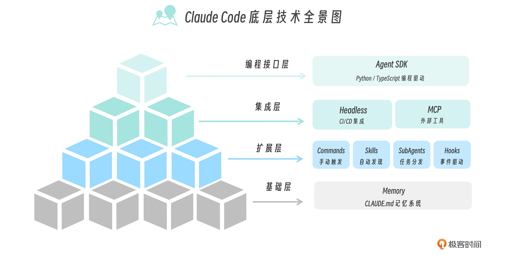
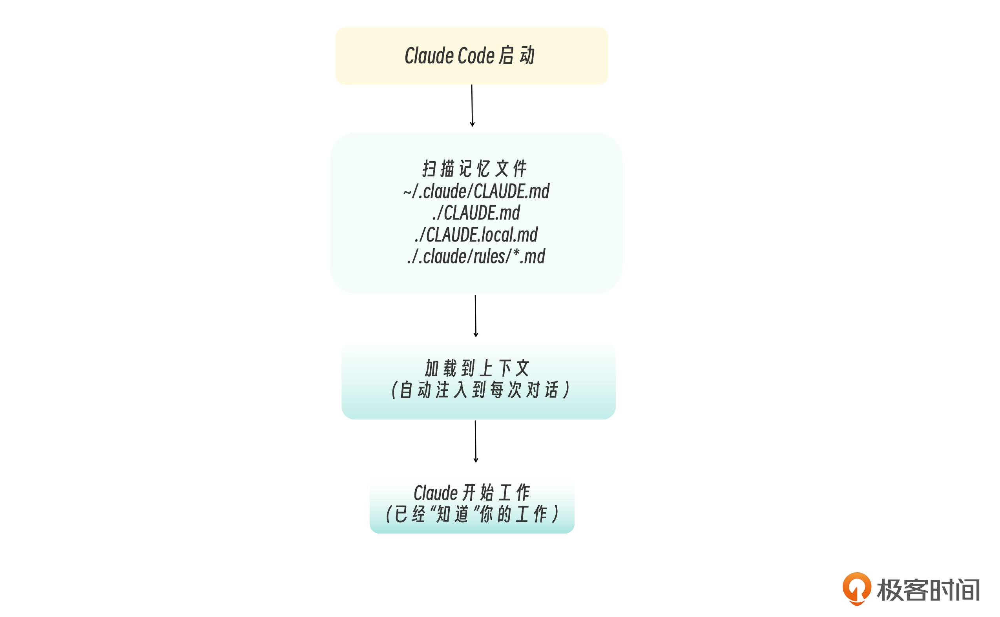
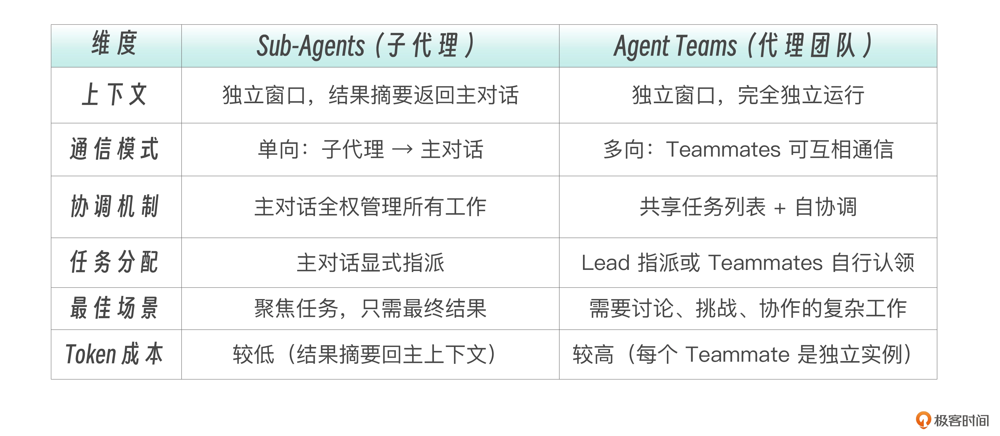

# Claude Code 工程化实战 — 详细笔记

> 课程地址：<https://github.com/huangjia2019/claude-code-engineering>
> 讲师：黄佳 · 新加坡科研局资深研发工程师

---

## 目录

- [开篇词](#开篇词)
- [基础篇](#基础篇)
- [子代理 Sub-Agents](#子代理-sub-agents)
- [Skills 技能系统](#skills-技能系统)
- [扩展机制](#扩展机制)
- [工程化进阶](#工程化进阶)
- [前沿热点](#前沿热点)

---

- 能力的天平正在从“执行力”向“创意力”和“组织力”倾斜。—— 而这些能力往往并不属于传统的“程序员”，而是程序员或开发者的加强版——也就是极客
- 极客精神的核心从来不是“会写代码”，而是“用技术解决问题”
- Claude Code 的真正身份是：`一个可编程、可扩展、可组合的 AI Agent 框架。`
- 技术全景图
  
  最底层是 Memory，让 Claude 记住你的项目；
  往上是扩展层，包括 Commands、Skills、SubAgents 和 Hooks 四大核心组件；
  再往上是集成层，Headless 让它融入 CI/CD，MCP 让它连接外部世界；
  最顶层是 Agent SDK，给你完全的编程控制能力。
- 
- 编写高效的 CLAUDE.md
  - less is more
  - 具体 -> 如果你不写，Claude 也大概率会做对，那就不要写
  - 事物三问
  - 渐进式披露
  ```bash
  /memory edit         # 编辑项目级 CLAUDE.md
  /memory edit user    # 编辑用户级记忆
  /memory edit local   # 编辑本地级记忆
  ```
- Claude Code 本身拥有自动记忆功能，随着项目的演进和对话的深入，会在 ~/.claude/projects//memory/ 目录下自动生成 Auto Memory，用于记录模型在项目中学习到的模式、调试经验与结构认知。
- Claude Code 的“记忆”并不是单一文件，而是一种多层叠加的上下文注入架构：有些是人为编写的长期规则，有些是组织级强制策略，还有一些是模型自动沉淀的经验笔记。CLAUDE.md 决定“系统被告知什么”，而 Auto Memory 决定“系统在实践中学到了什么”。记忆因此成为一种结构化的工程能力，而不是简单的对话缓存。
- 子代理的作用本质上就是三件事：隔离、约束、复用、并行
- 子代理不能再嵌套调用子代理

- 多 Agent 系统几种架构模式
  - Router
  - Handoffs
  - 主从
- 多 agnet 问题
  - cascading 放大
  - 同步瓶颈
- 架构选型永远是性能、成本和可控性的三角博弈。没有银弹。

- Agent Teams 要解决的问题——让代理之间能够直接交流、互相挑战、协作推进。
  “Agent Teams 模式”与“主会话 - 子代理模式”最本质的区别是，Teammates 可以互相发消息、共享发现、挑战彼此的结论

  > 中心化、去中心化(p2p)?

  

- Teammates 可以互相通信，而不只是向主对话汇报。其核心组件包括 Lead（协调者）， Teammates（执行者）， Task List（共享任务）， Mailbox（消息系统）。
