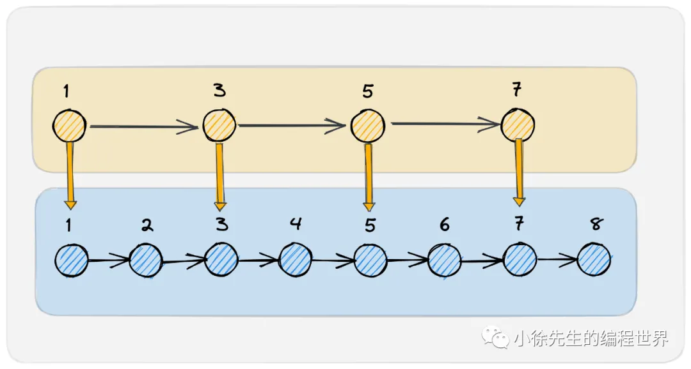
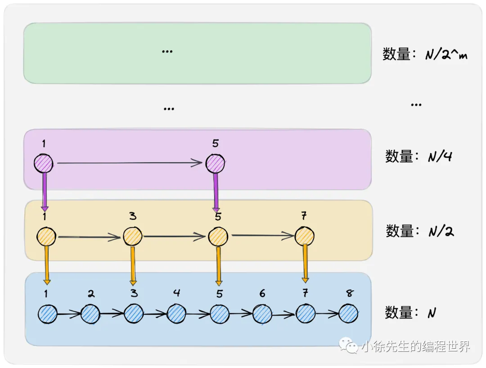

https://mp.weixin.qq.com/s?__biz=MzkxMjQzMjA0OQ==&mid=2247484204&idx=1&sn=54817591aa44359cde9b1b88d386b31b

• 上篇：从零到一推演一遍跳表的设计流程，最后基于 golang 直接手写实现一个跳表 skipList
• 下篇：考虑并发场景，设计出一个基于细粒度锁实现的并发安全的跳表 concurrentSkipList

## 2. 有序数据结构

1. 红黑树
   从任意节点出发，其左子树和右子树的高度相差不会超过一倍
2. 跳表

   - 跳表支持 range 操作而红黑树不支持
   - 红黑树是粗锁，而跳表可以支持细锁.
     红黑树由于其维护平衡性的手段涉及到节点旋转和节点染色，因此在并发操作时需要加全局锁，在基于全局数据结构互斥的情况下，串行化地执行数据的读写操作.
     与红黑树相对，跳表在并发读写时无须加持全局锁，而是可以基于更细粒度的锁，提高数据结构整体的并发性.

## 3. 跳表结构推演

1. 两层辅助索引
   
2. 多层辅助索引
   
3. 基于概率决定层数
