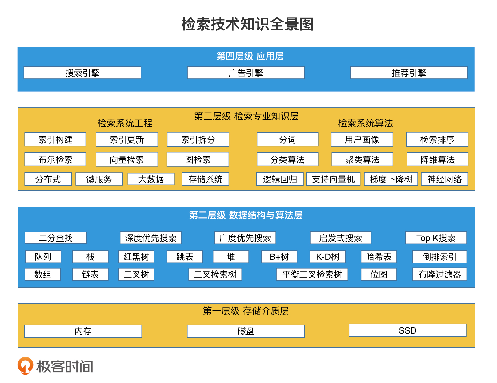

# 进阶实战

## 磁盘数据索引

- 关系型数据库:对于磁盘上数据的高效检索，我们有一个极其重要的原则：对磁盘的访问次数要尽可能的少！

- NoSQL 检索：为什么日志系统主要用 LSM 树而非 B+树？
  https://zhuanlan.zhihu.com/p/415799237
  LSM 树（Log Structured Merge Trees，日志结构合并树）。
  B+ 树的数据都存储在叶子节点中，而叶子节点一般都存储在磁盘中。因此，每次插入的新数据都需要随机写入磁盘，而随机写入的性能非常慢。如果是一个日志系统，每秒钟要写入上千条甚至上万条数据，这样的磁盘操作代价会使得系统性能急剧下降，甚至无法使用。

  **如何利用批量写入代替多次随机写入？**
  LSM 树就是根据这个思路设计了这样一个机制：当数据写入时，`延迟写磁盘，将数据先存放在内存中的树里，进行常规的存储和查询`。当内存中的树持续变大达到阈值时，再批量地以块为单位写入磁盘的树中。
  **如何保证批量写之前系统崩溃可以恢复？**
  为了保证内存中的数据在系统崩溃后能恢复，工业界会使用 WAL 技术（Write AheadLog，预写日志技术）将数据第一时间高效写入磁盘进行备份

## 工业级大数据索引

索引构建：搜索引擎如何为万亿级别网站生成索引？
索引更新：刚发布的文章就能被搜到，这是怎么做到的？
索引拆分：大规模检索系统如何使用分布式技术加速检索？

## 检索排序

- 精准 topK
  精准 Top K 检索：搜索结果是怎么进行打分排序的？
  TF-IDF 算法能很好地表示一个词在一个文档中的权重。TF-IDF 算法的公式是：相关性 = `TF*IDF`。
  其中，TF 是词频（Term Frequency），IDF 是逆文档频率（Inverse Document Frequency）。
- 非精准 topK
  尽可能地将计算放到离线环节，而不是在线环节

## 空间检索

- Geo Hash
  用 Geohash 实现“查找附近的人”功能
- 四叉树
  “查找最近的加油站”和“查找附近的人”有何不同？

## 最近邻检索

- 局部敏感哈希
- 乘积量化

## 设计理念

索引和数据分离、减少磁盘 IO、读写分离、分层处理

# 系统案例

## 存储系统

## 搜索引擎

## 广告系统

## 推荐系统
