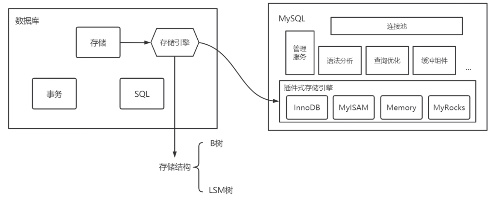
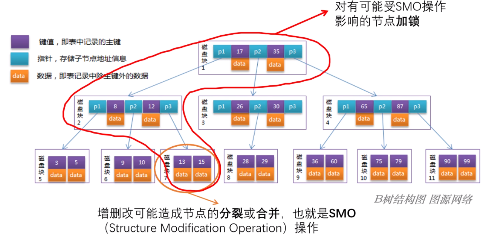
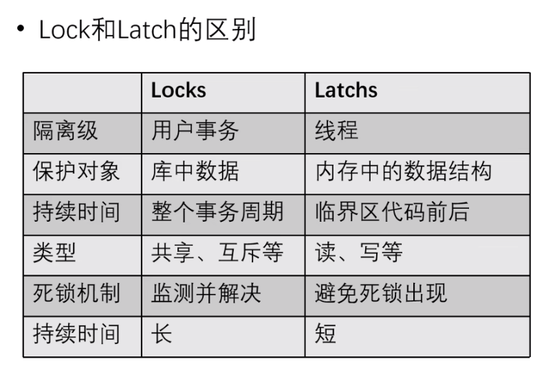
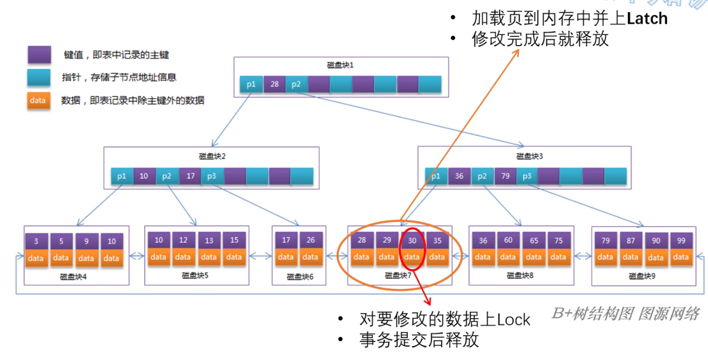
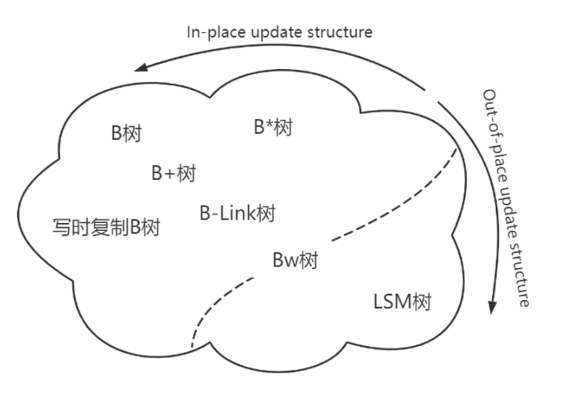
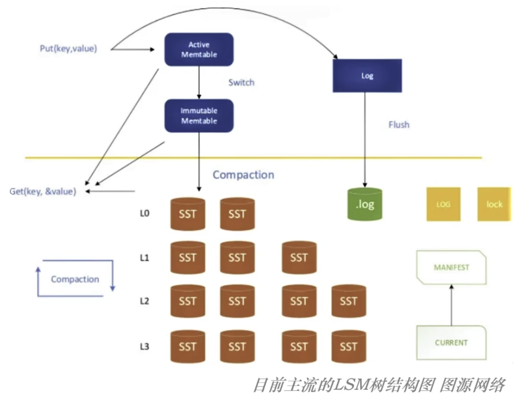

# BTree、B+Tree 和 LSM-Tree 常用存储引擎数据结构总结

https://jasonkayzk.github.io/2022/11/05/BTree%E3%80%81B-Tree%E5%92%8CLSM-Tree%E5%B8%B8%E7%94%A8%E5%AD%98%E5%82%A8%E5%BC%95%E6%93%8E%E6%95%B0%E6%8D%AE%E7%BB%93%E6%9E%84%E6%80%BB%E7%BB%93/

1. 数据库三大模块

   - 存储引擎
   - 查询处理器（SQL 解析器、查询优化器、查询执行器）
   - 事务管理器

   存储模块和其他模块耦合较少，因此可以将其抽象为一个专用的数据库组件，即：`存储引擎`
   

2. 由于存储引擎是基于文件系统的，因此存储引擎是将一条条数据转换为具体的文件进行存储；
   很多数据库的 /data 目录下就存储有数据文件；

   一般来说，存储引擎要存储：

   - 数据文件；
   - 索引文件；

   ` 通常情况下要重点关注的是索引文件的组织形式！`

   目前，BTree 和 LSM-Tree 这两类存储结构在存储引擎中被使用的最为广泛，他们也分别对应了：

   - In-place update（BTree、B+Tree）：就地更新结构，直接覆盖旧记录来存储更新内容；
     - 随机磁盘 IO
   - Out-of-place update（LSM-Tree）：异位更新结构，会将更新的内容存储到新的位置，而不是直接覆盖旧的条目；
     - 顺序磁盘 IO

3. 存储结构发展历程

   - 1970 年，Rudolf Bayer 教授在《Organization and Maintenance of Large Ordered Indices》一文中提出了 BTree，从他的基础上诞生了 B+Tree 等许多变种；
   - 1996 年，《The Log-Structured Merge-Tree（LSM-Tree）》论文发表，LSM-Tree 概念正式诞生；
   - 2003 年，《The Google File System（GFS）》发表，对追加的一致性保证强于改写，此后的分布式文件系统基本都更推荐使用追加写文件；
   - 2006 年，《Bigtable：A distributed strorage system for structured data》发表，相当于一个在 GFS 基础上搭建的不支持事务的分布式存储引擎，而其中的存储引擎采用的就是类似 LSM-Tree 的结构；
   - 2014 年左右，SSD 开始进入大规模商用，LSM-Tree 在 SSD 上读性能得到很大提升（随机读减少了普通硬盘的寻道时间），同时 `LSM-Tree 对 SSD 上的写更加友好（追加写提高了 SSD 的使用寿命），因此 LSM-Tree 进一步得到发展；`
     SSD 是基于闪存进行存储的，由于闪存不能直接进行覆盖写，而必须首先擦除闪存块之后才能写入；
     因此 `LSM-Tree 追加写的特性可以完美契合其特性`；

   总结一下：
   BTree 作为 In-place update 模式的存储结构，`在早期机械硬盘结构上表现的最好`，因此占据了主流；
   而随着`分布式（大数据）和 SSD 技术的发展，Out-of-place update 模式的优势逐渐凸显，因此 LSM Tree 应用的越来越广泛`；

4. **存储结构需要的特性**
   为什么 BTree 或 LSM-Tree 能够作为磁盘存储结构呢？

   1. **适合磁盘存储**：IO 尽量少且一次读取连续的区域
      例如：B+Tree 对 BTree 的优化
   2. **允许并发操作**：增删改对存储结构的影响尽量小
      latch：轻量级锁，用于保护数据结构的一致性

5. 以 BTree 为例的 In-place 存储结构

   - 适合磁盘存储、并发性能一般
     BTree 是一个以页为单位组织的；
     InnoDB 存储引擎中页的大小为 16k，一般可以指出几百上千个指针，因而具有**高扇出、低高度的特点，从而保证了 BTree 是连续 IO、并且 IO 次数极少，因此适合磁盘存储**；
     其次，BTree 要修改的单位也是页，因此并发控制的锁在页上，BTree 并发的程度也很高；
     `但是，但是 BTree 存在 SMO（Structure Modification Operation） 操作，即：在增删改操作可能会造成节点的分裂或者合并，此时需要操作多个磁盘块！`
     如果我们想要保证出现 SMO 操作时读写安全的话，就需要对有可能受到 SMO 操作影响的`一整条链上所有节点加锁`
     
     **虽然 BTree 有一定的并发能力，但是由于 SMO 的存在使得 BTree 的性能并不高，勉强满足并发要求，但是有很大的优化空间**

   - Lock 和 Latch 的区别（存储引擎并发操作和事务并发操作的不同）
     
     latch 是内存里的锁，是一种轻量级的锁，用于保护数据结构的一致性；
     lock 是磁盘上的锁，用于保护事务的一致性；
     

     虽然 Latch 锁掉整个页数据，而 Lock 仅仅锁掉单行数据；
     但是一旦完成了对这行数据的修改，那么 Latch 锁就可以释放，而 Lock 锁需要等到整个事务提交之后才能够释放！
     在数据修改完成到事务提交的这段时间，Lock 就可以发挥作用了！
     因此，在对数据库进行操作时，实际上是存在 Latch 和 Lock 两种锁共同生效的！但是对于用户而言，只能感觉到 Lock 锁（即，事务锁）；

6. 以 LSM-Tree 为例的 Out-of-place 存储结构

   - 并发能力强，磁盘存储一般
     正常插入到内存时，完全不会改变历史数据的结构，即：没有 SMO 过程
     但是读取 LSM-Tree 时读取的次数可能会非常多，在特性 1 上的表现并不好
     但是，可以优化 LSM-Tree 的特性 1，下面是几个常用的优化手段：

     - 依靠 Compaction 操作整理 LSM-Tree 的结构，减少读 IO 的次数；
     - 使用 Bloom Filter 对数据进行过滤；

     **实际上 Compaction 操作就可以看作为 LSM-Tree 的 SMO 操作！**
     在 Compaction 期间，不仅会占用大量资源，并且还会造成缓冲丢失、写停顿（write stall）等问题，减少并发能力；
     因此，`对 LSM-Tree 优化的关键点就落在 Compaction 操作上；`

7. In-place 和 Out-of-place update 方案差异

   - in-place update：需要把磁盘中的结构加载到内存中，再修改并写回至磁盘中，因此免不了要使用 Latch 机制来做并发控制
   - Out-of-place update：但是由于所有的写入都是追加操作，因此无需采用基于 Latch 的机制进行并发控制
     

8. BTree 及其变种
   如果要进行`全表扫描，则需要中序遍历整个 BTree，因此会产生大量的随机 IO，性能不佳`；所以基本上没有直接使用 BTree 实现存储结构的；

   - B+ Tree
     B+Tree 的结构解决了 BTree 中中序遍历扫描的痛点，在一定程度上也能降低层数；
   - B\*Tree
     B\*Tree 的思想主要是：将当前节点和兄弟节点相关联；
   - Cow BTree(写时复制 BTree)
     CoW BTree 采用 Copy-on-Write 技术来保证并发操作时的数据完整性，从而避免使用 Latch
     CoW BTree 在很大程度上具有 Out-of-place update 的特性，因为已经写入的页是不变的，所以 CoW BTree 可以像 LSM Tree 那样，完全不依赖 Latch 实现并发控制！
     但是，为了达成这一点，CoW BTree 付出的代价也是非常巨大的：为了修改一个小小的数据，就要重新复制多个页，带来巨大的写放大！

     `也正是因为上面的问题，因此 CoW BTree 也一直没能成为主流；`
     `但是 CoW BTree 的思路却很重要！后续的许多变种都对其进行了借鉴和改良；`

   ...
   挺多的，不列举了

9. LSM-Tree 及其变种
   

   - LSM Tree 的概念起源于 1996 年的论文《The Log Structure Merge Tree》，此后由 Google Bigtable 第一个商业化实现并于 2006 年发表论文《Bigtable：A distributed strorage system for structured data》；
     随后，Google 的两位专家基于 BigTable 的经验实现了 LevelDB，一个单机 LSM Tree 存储引擎，并开源；
     **Chrome 浏览器中的 IndexedDB 底层实现就是 LevelDB！**

   - 此后，FaceBook 基于 LevelDB 开发了 RocksDB（非常棒的 KV 数据库，非常值得学习！）！
     RocksDB 做了相当多的迭代演进，如：多线程、Column Family（类似于关系型数据库中表的概念）、Compaction 策略等；
     **目前，RocksDB 已经成为 LSM Tree 领域的一个事实标准！**

   - minor merge
     `当 Immutable Memtable 达到指定的数量后，将 Immutable Memtable 落盘到磁盘中的 L0 层`
     通常，对于 minor merge 的 Memtable 不做整理（无 Compaction 过程），直接刷入磁盘；
     `因此，L0 层可能会存在重复的数据；`

   - Major Merge
     当 L0 层的数据满了之后，就会触发 major merge，也就是关键的 Compaction 操作；
     将 L0 层的数据和 L1 层的数据进行合并，全部整理为 “**固定大小的、不可变的数据块**”，称为 SSTable（Sorted String Table），并放在 L1 层；
