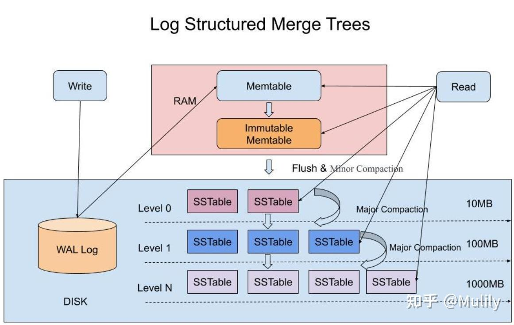
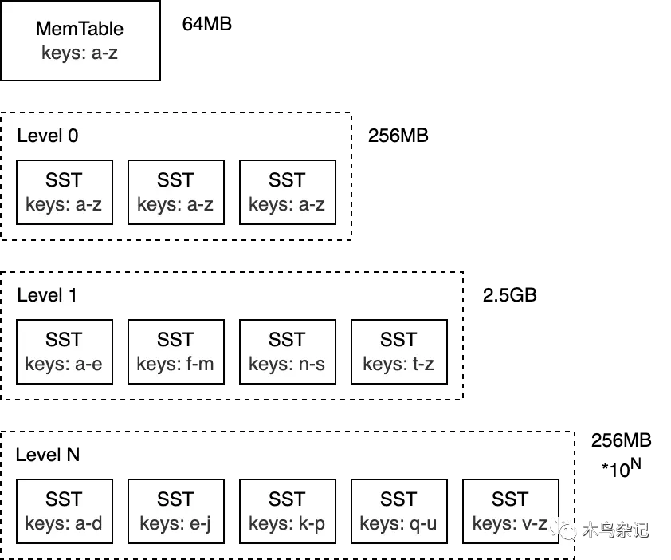

- [一文搞懂 LSM(Log-structured Merge Tree)](https://www.cnblogs.com/wxiaotong/p/15919650.html)
- [在 Golang 中实现 LSM 树：综合指南](https://dzone.com/articles/implementing-lsm-trees-in-golang)
- [LSMTree 笔记](https://huanglei.rocks/posts/note-on-lsmt/)
- [DDIA 读书笔记（三）：B-Tree 和 LSM-Tree](https://www.qtmuniao.com/2022/04/16/ddia-reading-chapter3-part1/)
- [B+树,B-link 树,LSM 树...一个视频带你了解常用存储引擎数据结构](https://www.bilibili.com/video/BV1se4y1U7Dn)
  https://jasonkayzk.github.io/2022/11/05/BTree%E3%80%81B-Tree%E5%92%8CLSM-Tree%E5%B8%B8%E7%94%A8%E5%AD%98%E5%82%A8%E5%BC%95%E6%93%8E%E6%95%B0%E6%8D%AE%E7%BB%93%E6%9E%84%E6%80%BB%E7%BB%93/
- [【数据结构与算法】LSM-Tree 的实现原理](https://www.bilibili.com/video/BV1oUtKerE5n)
- [初探 rocksdb 之 lsm tree](https://www.bilibili.com/video/BV11u411P7GP)

---

1. LSM 树并没有一种固定死的实现方式，更多的是一种将：
   **“磁盘顺序写” + “多个树(状数据结构)” + “冷热（新老）数据分级” + “定期归并” + “非原地更新”这几种特性统一在一起的思想**

   设计原则：
   先内存再磁盘
   内存原地更新
   磁盘追加更新
   归并保留新值

   `如果说 B/B+树的读写性能基本平衡的话，LSM 树的设计原则通过舍弃部分读性能，换取了无与伦比的写性能。该数据结构适合用于写吞吐量远远大于读吞吐量的场景，得到了 NoSQL 届的喜爱和好评。`

2. LSM 树通过将数据分为内存组件和磁盘组件来工作：

- MemTable (in-memory component): A balanced tree structure that temporarily stores recent writes
  MemTable (内存组件)：一种平衡树结构，临时存储最近的写入

  MemTable is an in-memory data structure holding data before they are flushed to SST files. It serves both read and write - new writes always insert data to memtable, and reads has to query memtable before reading from SST files, because data in memtable is newer. Once a memtable is full, it becomes immutable and replaced by a new memtable. A background thread will flush the content of the memtable into a SST file, after which the memtable can be destroyed.
  MemTable 是一个内存数据结构，用于在数据刷新到 SST 文件之前保存数据。它同时支持读和写——新的写入总是将数据插入到 memtable 中，而读取必须在从 SST 文件读取之前查询 memtable，因为 memtable 中的数据更新。 一旦 memtable 满了，它就变为不可变，并被一个新的 memtable 替换。一个后台线程将把 memtable 的内容刷新到 SST 文件中，之后 memtable 可以被销毁。

- SSTables (on-disk component): Sorted String tables that store data permanently, organized in levels
  SSTables (磁盘组件)：排序字符串表，永久存储数据，按层级组织

The basic operation flow is as follows:
基本操作流程如下：

- Writes are handled by the MemTable.
- When the MemTable exceeds a threshold size, it is flushed to disk as a sorted SSTable.
  当 MemTable 超过阈值大小时，它会被刷新到磁盘作为一个排序的 SSTable 。
- Reads first check the MemTable, and if the key is not found, it searches through the on-disk SSTables.
  读取第一个检查 MemTable ，如果未找到密钥，则在磁盘上的 SSTable 中进行搜索。
- Background processes periodically merge and compact the SSTables to improve performance and manage disk space efficiently.
  后台进程定期合并和压缩 SSTable 以提高性能并有效管理磁盘空间。

3. https://github.com/facebook/rocksdb/wiki/MemTable
   **RocksDB 的数据结构比较：选择跳表的原因是跳表支持并发插入。**
   
4. 流程图
   
   
   如果想让一个引擎工程上可用，还会做大量的性能优化。对于 LSM-Tree 来说，包括

   - 优化 SSTable 的查找。
   - 层级化组织 SSTable。

5. 同一个 Key 会存多遍，一般使用 MVCC 进行控制。
6. 小徐先生笔记
   https://github.com/981377660LMT/golsm

7. 公司去年在推用 RocksDB 取代 innodb，主要原因是能够`节省 70%的存储空间`
8. 木鸟杂记
   LSM Tree 是什么？ - 木鸟杂记的回答 - 知乎
   https://www.zhihu.com/question/446544471/answer/3048704390
   https://artem.krylysov.com/blog/2023/04/19/how-rocksdb-works/

   1. RocksDB 是什么
      RocksDB 是一种可持久化的、内嵌型 kv 存储。
      它是为了存储大量的 key 及其对应 value 设计出来的数据库。可以基于这种简单 kv 数据模型来`构建倒排索引、文档数据库、SQL 数据库、缓存系统和消息代理等复杂系统。`
      RocksDB 是 `2012 年从 Google 的 LevelDB fork 出来的分支`，并针对跑在 SSD 上的服务器进行了优化。目前，RocksDB 由 Meta 开发和维护。
      RocksDB 使用 C++ 编写而成，因此除了支持 C 和 C++ 之外，还能通过 С binding 的形式嵌入到使用其他语言编写的应用中，例如 Rust、Go 或 Java。

      > C binding 是指在 C 语言中调用其他语言的函数，或者在其他语言中调用 C 语言的函数。这种技术可以让你在不同的语言之间共享代码，从而提高代码的复用性。
      > `使用目标语言提供的 FFI（Foreign Function Interface，外部函数接口）机制，加载并调用 C 库中的函数。`

      如果你之前用过 SQLite，你肯定知道什么是内嵌式数据库。
      在数据库领域，特别是在 RocksDB 的上下文中，“内嵌”意味着：

      - 该数据库`没有独立进程`，而是被集成进应用中，和应用共享内存等资源，从而避免了跨进程通信的开销
      - 它`没有内置服务器`，无法通过网络进行远程访问。
      - 它`不是分布式的`，这意味着它不提供容错性、冗余或分片（sharding）机制。

   2. LSMTree
      
      MemTable -> WAL -> SSTable -> Compaction k 路归并

   从零开始写一个生产级别的 kv 存储是非困难的：

   - `硬件和操作系统随时都有可能丢失或损坏数据。`
   - `性能优化需要大量时间投入。`

   RocksDB 解决了上述两个问题，从而让你可以专注于上层业务逻辑实现。这也使得 RocksDB 成为构建数据库的优秀模块。

9. 为什么 lsmTree 需要多层
   想象一下一层会有什么问题
   如果 LSM Tree 只有单层，所有的 SSTables 都在同一层级，每次有新数据刷写到磁盘时，都需要与这一层中的 SSTables 进行合并（Compaction）。
   这会导致高频率的磁盘写操作，增加了 `写放大（Write Amplification） 效应，即实际写入磁盘的数据量远大于用户应用层写入的数据量。`
   多层结构的优势：
   通过将 SSTables 分配到多个层级，可以有效减少每层的写放大。

---

level compaction 类似二进制分组

空间放大是存储数据所用实际空间与逻辑上数据大小的比值。假设一个数据库需要 2 MB 磁盘空间来存储逻辑上的 1 MB 大小的键值对是，那么它的空间放大率是 2。
