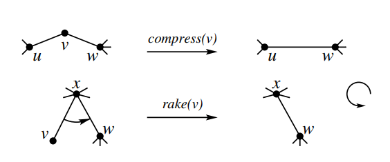
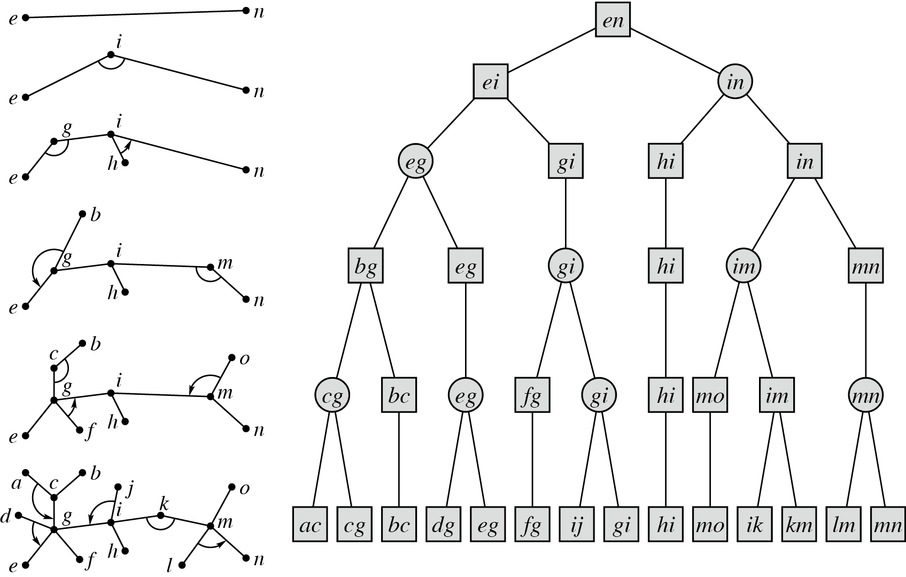

# `动态树dp(带修改的树上动态DP)`

Static Top Tree 的方法

- atcoder
  https://atcoder.jp/contests/abc351/editorial/9868
  Static top tree の用途は木 DP の更新の高速化だけではありません。
  https://atcoder.jp/contests/abc351/submissions/52777033
  https://zenn.dev/blue_jam/articles/0526c70b74f6bb
- 模版
  https://maspypy.github.io/library/graph/ds/static_toptree.hpp
  https://hitonanode.github.io/cplib-cpp/data_structure/static_toptree.hpp

- 博客
  [top tree 杂谈](https://negiizhao.blog.uoj.ac/blog/4912)
  [Top Tree 相关理论扯淡](https://www.cnblogs.com/ExplodingKonjac/p/17890636.html)

  1. comparess & rake：任何一棵树都可以只用 compress 操作 和 rake 操作来将它收缩为一条边
     rake 消除一个度为 1 的点，compress 消除一个度为 2 的点
     
  2. 簇(cluster)：树上的一个连通子图，只有不超过 2 个点和外部的点邻接
     一个簇可以表示为三元组(u,v,E)，其中 u 和 v 是簇的两个端点，E 是簇内的边集合
     **簇代表了原树的一个路径以及一个子树**，其中路径为两个端点之间的路径，而子树自然是直接忘掉对簇指定的 2 个端点即可。
     形象地理解，一个簇可以看做是一条边，而 rake 操作是把一条边“拍”到另一条边上，compress 操作就是把两条边“拼”成一条。

  3. top tree：描述树收缩过程的一颗二叉树合并结构
     
     其叶子节点表示一条边，我们称其为基簇（base cluster）。
     其根节点表示包含整棵树的簇，我们称其为根簇（root cluster）。
     基于重量平衡构建一个深度是 O(logn)的 Top Tree
  4. 作用：动态维护路径和子树信息(线段树的树上版本)
     路径：由 rake 操作合并的簇的路径是原簇之一所对应的路径，由 compress 操作合并的簇的路径是原来两个簇对应的路径的连接。
     子树：合并出的簇的子树则是原本对应的两个子树的并。
  5. 维护方式：
     关于边的信息储存在这条边对应的簇中，关于点的信息在消除这个点之后加入簇中（也就是说，簇内维护的信息，不包括端点上的信息）

- 例题

  1. 维护动态直径
  2. 维护动态重心
  3. 维护动态 DP
     可以维护“边约束”的树上的动态 DP 问题。所谓“边约束”是指代价、限制可以写成关于边的相互独立的形式。
     [动态树上最大权独立集(没有上司的舞会)](https://www.luogu.com.cn/problem/P4751)
  4. 树分治
  5. 树分块

---

マージテクと高さ O(logn) のマージ過程との融合
https://www.mathenachia.blog/mergetech-and-logn/#bracket-star

HLD、LCT 的方法

- https://ouuan.github.io/post/tree-dp-with-modification/
  “动态 DP”通过树链剖分将带修改的树上 DP 问题拆分为规模更小的序列上的半群合并问题和树上 DP 问题，从而可以快速地支持修改。
