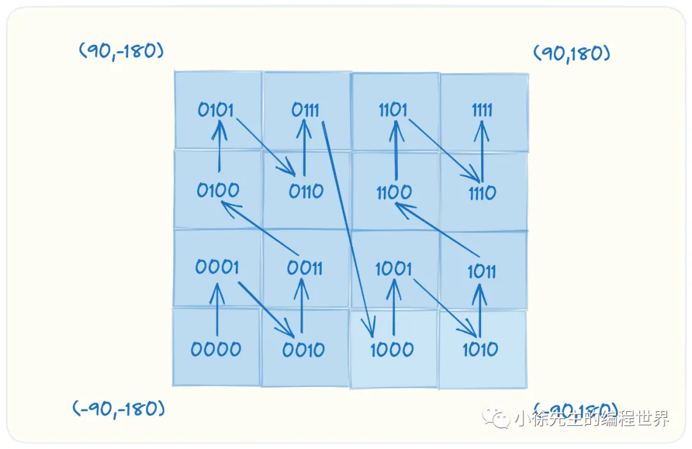
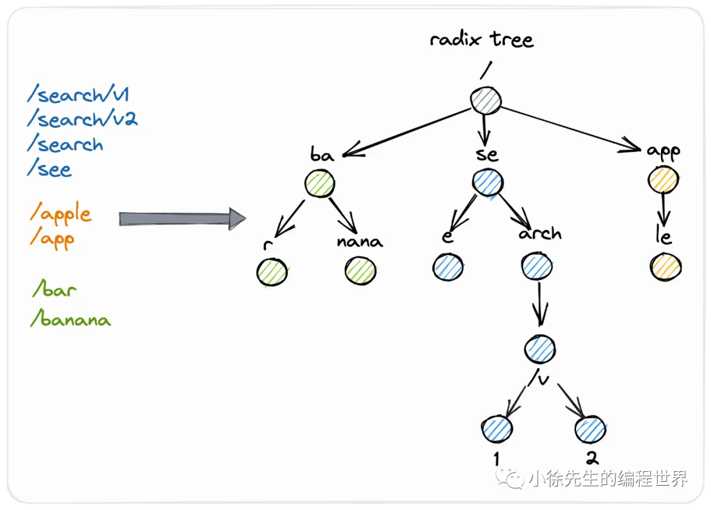

https://mp.weixin.qq.com/s?__biz=MzkxMjQzMjA0OQ==&mid=2247484473&idx=1&sn=3c4e3f0b5b4ca29ebc4f317f825f73ed

- trie 这个名称源自于单词 retrieval，表示检索。trie 是一种树形数据结构，用于存储字符串集合，通常用于检索、排序和存储大量字符串。

- 当存储拥有公共前缀的内容时，可以在很大程度上节省空间提高节点利用率. 同时由于这种公共前缀的设计方式，也赋以了 trie 能够支持前缀频率统计以及前缀模糊匹配的功能

- trie 应用介绍

  - 搜索提示
  - **geohash 算法**
    geohash 是一种地址编码方式，通过将经纬度二维坐标通过递归二分的方式压缩成一个一维字符串，并能够在很大程度上保证拥有越长公共前缀的两个字符串之间的相对距离就越小
    

    geohash `使用 trie 作为经纬度哈希编码存储结构`

---

- 压缩前缀树/基数树 radixtree
  倘若某个父节点有且仅有一个子节点，并且不存在单词以这个父节点作为结尾，则此时 radix tree 会将这个父节点与子节点进行合并
  

  - gin 框架中的路由树就是基于 radix tree 实现的
    之所以选用 radix tree 而非 hashmap，其原因在于
    - 模糊匹配的需求
    - 更好的空间利用率
