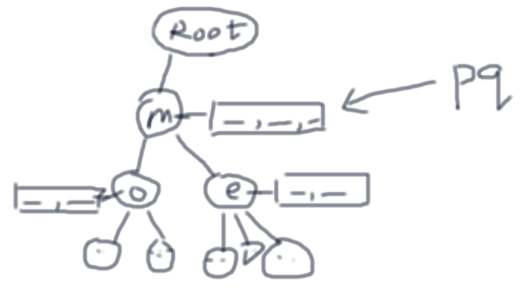

  
每个 TrieNode
里有 children 和 suggestion

suggestion 可以是固定大小的堆 用来维持字典序最小的固定数目多个 word

Build Trie
k = 3
n = number of charcters in the products list
m = number of characters in the longest product
Time: `O(nklog(k))`
Space: O(nkm)

Output Result
s = number of characters in searchword
Time: `O(sklog(k))`
Space: O(sk)
