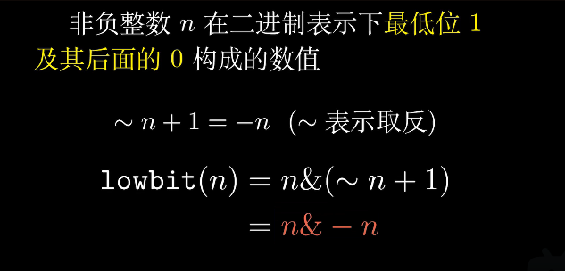
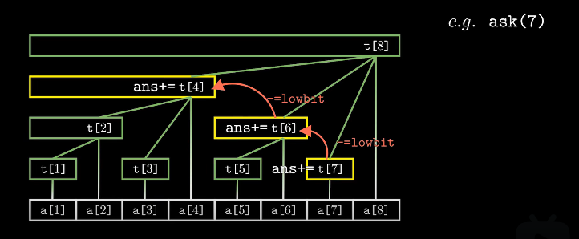

1. 快速求前缀和
2. 修改某一个数
3. 树状数组求第 k 小的数(count_tree)

- 241.  楼兰图腾 (左右缀+树状数组)

求数组中递增三元组、递减三元组的数目
`5999. 统计数组中好三元组数目`

## 树状数组维护前缀区间最大值的原理

重新复习一遍树状数组：
https://www.bilibili.com/video/BV1pE41197Qj?spm_id_from=333.337.search-card.all.click

![tree[i]的父节点为tree[i+lowbit(i)]，自身维护[i-lowbit(i)+1,i]区间信息，更新是从左下往右上](image/note/1651934125284.png)

`注意到更新 x 处最值时更新了所有的父节点，所以查询时大于等于 x 的下标的最值都会被更新`
