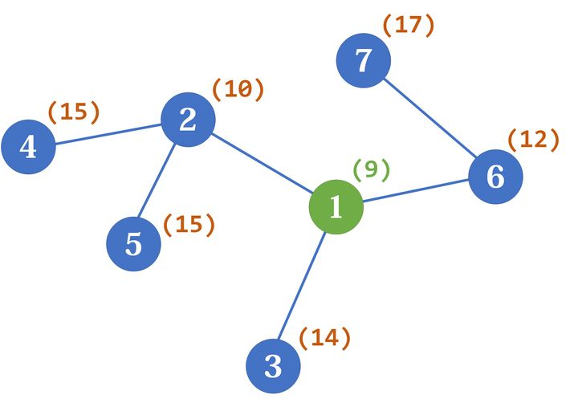

```JS
function findCentre(n: number, edges: [next: number, weight: number][][]): number[] {
  const res: number[] = []
  // 最大连通块大小
  const maxSizeOfSubtree = Array<number>(n).fill(Infinity)
  // 树的大小
  const treeSize = Array<number>(n).fill(Infinity)

  function dfs(cur: number, parent: number) {
    treeSize[cur] = 1
    maxSizeOfSubtree[cur] = 0

    for (const [next, _] of edges[cur]) {
      if (next === parent) continue
      dfs(next, cur)
      // dfs更新阶段
      // 后序,更新cur:此时cur可以拿到各个next的信息，更新cur
      maxSizeOfSubtree[cur] = Math.max(maxSizeOfSubtree[cur], treeSize[next])
      treeSize[cur] += treeSize[next]
    }

    // dfs结算阶段:准备离开cur了，最后检查cur是否合法
    maxSizeOfSubtree[cur] = Math.max(maxSizeOfSubtree[cur], n - treeSize[cur])
    if (maxSizeOfSubtree[cur] <= n / 2) res.push(cur)
  }
  dfs(0, -1)

  console.log(treeSize, maxSizeOfSubtree)
  return res
}
```

后序 dfs 的两个地方：`要在脑海里想象递归树`

```JS
function dfs(cur: number, parent: number) {
    treeSize[cur] = 1
    maxSizeOfSubtree[cur] = 0

    for (const [next, _] of edges[cur]) {
      if (next === parent) continue
      dfs(next, cur)

      // 1....
      // 根据next的信息更新cur
    }

    // 2...
    // 准备撤离cur，结算cur
  }
```

1 那个地方是 cur 用他下面相邻的 next 结点信息更新自己
2 那个地方是 dfs 准备永远离开 cur 结点 做最后的收尾工作

## 树哈希(树的最小表示法/同构)

子树哈希为 `subtreeHash`
包含 root 的树哈希为 `${root.val}(${subtreeHash})`

```JS
function dfs(root: TrieNode): string {
  const subTree: string[] = []
  for (const child of root.children.values()) {
    subTree.push(dfs(child))
  }

  subTree.sort()
  root.subtreeHash = subTree.join('')
  hashCounter.set(root.subtreeHash, (hashCounter.get(root.subtreeHash) || 0) + 1)

  const res = `${root.val}(${root.subtreeHash})`
  return res
}
```

```Python
    def dfs(s: str, index: int) -> str:
        subtree = []
        depthDiff = 0
        for next in range(index + 1, len(s)):  # 找子树结点
            depthDiff += 1 if s[next] == '0' else -1
            if depthDiff == 1 and s[next] == '0':
                subtree.append(dfs(s, next))
            if depthDiff < 0:  # 回上面去了
                break

        # 子树最小表示
        subtree = deque(sorted(subtree))
        subtree.appendleft('(')
        subtree.append(')')

        # 返回整棵树
        subtree.appendleft('#')  # 当前元素
        return ''.join(subtree)
```

---

更新

### 树

n 个顶点的无向图，满足以下条件之一，则称为树：

- n-1 条边，且连通
- n-1 条边，无环
- 任意两点间有唯一路径

### 直径

直径是最长的 path

- 从某个顶点出发`寻找最远的顶点`，直径的两个端点之一必定包含在这些顶点中
- 直径的个数
  - 长为偶数(2d)，所有直径必定经过`中心点`(即直径的中点)，此时答案为以中心点为根，子树中选择两个深度为 d 的顶点的方案数
    **((∑fi)^2-∑fi^2)/2 (fi 为子树大小)**
  - 长为奇数(2d+1)，所有直径必定经过`中心边`，直径个数为中心边左侧深度为 d 的顶点数乘以右侧深度为 d 的顶点数

### 重心

删除顶点 v 后，剩下的各个连通块的大小最小(此时不超过 n/2)，则称 v 为重心

- 一个重心
- 两个重心

### 重心分解

- 比 n 次 dfs 快
- 路径的计数问题

子树相乘->多项式乘法->卷积加速

### LCA

### 欧拉路径

### HLD

欧拉路径中，任意子树编号连续
HLD 中，每段路径编号连续

### 问题集

`∑dist(pi,pi+1)`的最大值/最小值
最大值：https://atcoder.jp/contests/agc018/tasks/agc018_d
最小值：所有边权和的两倍减去直径边权和
