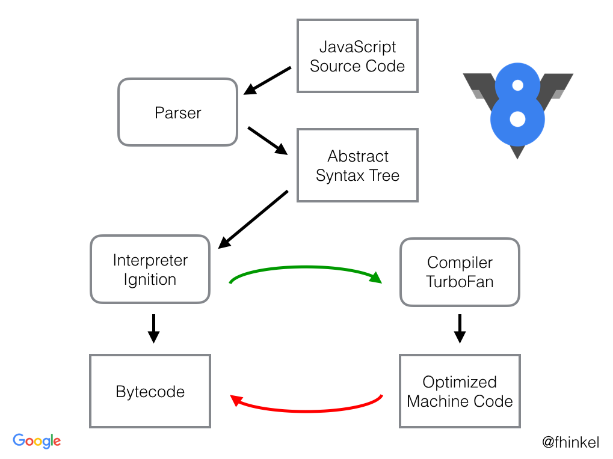

https://www.zhihu.com/question/58470561/answer/3067263492

1. 如果用来写业务，肯定是都用 es6 的写法。
2. 如果特别注重性能的话，尽量避免 es6 的写法，提几个关键的地方：
   - 遍历不要用 forEach/for of，全部用手动 for 循环遍历来代替，特别是 for of。迭代器能比普通遍历慢 10 倍。
   - 普通数组的初始化赋值不用 fill 而是手动遍历赋值(像 golang 那样)，可以快很多。
   - 解构赋值的时候要小心，可能成为性能瓶颈。
3. 能用 TypedArray 优化的全用 TypedArray。比如存储多个元组的[number,number][]类型的数组，如果值不超过 uint32，可以拆成两个 Uint32Array 存储。32 位类型数组占用的空间是普通数组的四分之一左右。此外,类型数组还有几个 API 快的出奇:`set`,`subarray`,`fill`,`copyWithin`。可能是底层实现使用了 `memset/memcpy/memmove`这几个方法。

---

http://incaseofstairs.com/six-speed/

es6 性能全面低于 es5

js 数组优化:
https://gamealchemist.wordpress.com/2013/05/01/lets-get-those-javascript-arrays-to-work-fast/

**预分配长度**
JS 预分配数组长度，到底是变慢还是变快？
https://www.zhihu.com/search?type=content&q=js%E6%95%B0%E7%BB%84%E6%80%A7%E8%83%BD

**按照 golang 的写法写 js,速度是最快的**
https://www.zhihu.com/question/58470561/answer/3067263492

---

研究 V8 源码的目的是写出更加高效的 javascript 代码

**V8 使用“常量折叠（const folding）”优化技巧，导致幂运算有时候不等于 Math.pow()**
常量折叠:编译时进行计算
`99**99` 是在编译时进行计算（常量折叠），而 Math.pow 总是在运行时进行计算

**开启 V8 对象属性的“fast”模式**
开启 V8 对象属性的“fast”模式 - justjavac 的文章 - 知乎
https://zhuanlan.zhihu.com/p/25069272
在 V8 引擎中，对象有 2 中访问模式：Dictionary mode（字典模式） 和 Fast mode（快速模式）。

- Dictionary mode（字典模式）：字典模式也成为哈希表模式，V8 引擎使用哈希表来存储对象。
- Fast mode（快速模式）：快速模式使用类似 C 语言的 struct 来表示对象，如果你不知道什么是 struct，可以理解为是只有属性没有方法的 class。

**从 V8 的单元测试源码看“同值相等”**
看单元测试是了解一个产品接口（API）的重要途径

**使用 D8 分析 javascript 如何被 V8 引擎优化的**
编译完成的可执行文件并不是 V8，而是 D8
ICs 是 inline caches 的缩写，`内联缓存`是一种很常见的优化技术
第一次优化的原因是 small function，add 函数是小函数，为了减小函数调用的开销，V8 引擎对 add 做了优化。
第二次的原因是 hot and stable。内联缓存优化。
https://zhuanlan.zhihu.com/p/111386872

`两种执行模式(二刀流)`

V8 编译 JavaScript 代码时，解析器(parser)将生成一个抽象语法树。语法树是 JavaScript 代码的句法结构的树形表示形式。`解释器 Ignition` 根据语法树生成字节码。TurboFan 是 V8 的优化`编译器，TurboFan `将字节码生成优化的机器代码。

**在 Profile 性能分析中显示原生 JS 函数**
**V8 中的垃圾收集（GC）**
V8 中的垃圾收集（GC），图文指南 - justjavac 的文章 - 知乎
https://zhuanlan.zhihu.com/p/29276031

**JavaScript 在 V8 中的元素种类及性能优化**
JavaScript 引擎可以进行优化的一个有趣的例子是`当属性名是纯数字时`，一个特例就是数组索引的属性。在 V8 中，如果属性名是数字（最常见的形式是 Array 构造函数生成的对象）会被特殊处理。

在语言层面，这就是你所得到的：JavaScript 不区分整数，浮点数和双精度 - 它们只是数字。然而，在引擎级别，我们可以做出更精确的区分。这个数组的元素是 PACKED_SMI_ELEMENTS。在 V8
中，术语 Smi 是指用于存储小整数的特定格式。

密集数组 PACKED 和稀疏数组 HOLEY。

- `更具体的元素种类可以进行更细粒度的优化`。元素类型的在格子中越是向下，该对象的操作越慢。为了获得最佳性能，请避免不必要的不具体类型 - 坚持使用符合您情况的最具体的类型。

- `避免创建洞(hole)`
  一旦数组被标记为有洞，它永远是有洞的 - 即使它被打包了(packed)。从那时起，数组上的任何操作都可能变慢。
- `避免读取超出数组的长度`
  这样 V8 会在原型链上去找这个属性。
- `避免元素种类转换`
  只需给数组添加一个 -0，一个小整数的数组即可将其转换为 PACKED_DOUBLE_ELEMENTS。
  同样还有 NaN 和 Infinity。它们被表示为双精度，因此添加一个 NaN 或 Infinity 会将 SMI_ELEMENTS 转换为
  DOUBLE_ELEMENTS。

  ```js
  const array = [3, 2, 1]
  // PACKED_SMI_ELEMENTS
  array.push(NaN, Infinity)
  // PACKED_DOUBLE_ELEMENTS
  ```

  如果您计划对整数数组执行大量操作，在初始化的时候请考虑规范化 -0，并且防止 NaN 以及 Infinity。这样数组就会保持 PACKED_SMI_ELEMENTS。事实上，如果你对数组进行数学运算，可以考虑使用 TypedArray。每个数组都有专门的元素类型。

- `避免多态`
  如果您的代码需要处理包含多种不同元素类型的数组，则可能会比单个元素类型数组要慢，因为你的代码要对不同类型的数组元素进行多态操作。
  内置方法（如 Array.prototype.forEach）可以更有效地处理这种多态性，因此在性能敏感的情况下考虑使用它们而不是用户库函数。

**JS 预分配数组长度，到底是变慢还是变快？**
初始化的时候分配完空间，就可以避免在数组空间不够用的时候反复的内存申请和 GC 操作。而 FAST_ELEMENTS 和 FAST_HOLEY_ELEMENTS 都不太慢，至少在所有元素中可以排到前二。

**Chrome 61 中关闭了逃逸分析**
为了保护用户的安全，Chrome 团队在 Chrome 61 中关闭了逃逸分析。关闭逃脱分析会对性能产生负面影响，因为它会禁用某些优化。具体来说，以下 ES2015 功能可能会变慢：

解构(destructuring)
for-of 迭代器(for-of iteration)
数组扩展(array spread)
剩余参数(rest parameters)

逃逸分析 (Escape Analysis)是一种“`确定指针动态范围的静态分析，它可以分析在程序的哪些地方可以访问到指针`”。
在 JavaScript 中，如果从当前函数外部可访问某个对象，则这个分配的对象"逃逸(escape)"了。
一句话概括就是，V8 在 JavaScript 堆上分配新对象，使用逃逸分析，**当 V8 分析出此对象只在函数内部起作用（和函数有相同的生命周期），则 V8 可以把对象分配到栈上**，甚至可以把某些变量分配到寄存器中，把对象作为一个简单的局部变量。**如果对象逃逸了，则必须在堆上分配。**

**就是判断一个对象可以开在栈上还是必须开在堆上。如果对象逃逸了，则必须在堆上分配。**
逃逸分析除了可以将堆分配转化为栈分配以外，还可以：
同步省略：如果一个对象被发现只能从一个线程被访问到，那么对于这个对象的操作可以`不考虑同步`(JVM 里的优化)。
分离对象或标量替换:有的对象可能不需要作为一个连续的内存结构存在也可以被访问到，那么对象的部分（或全部）可以不存储在内存，而是存储在 CPU 寄存器中。

**V8 将为 React hooks 改进数组解构的性能**
Mathias 的建议是使用对象解构代替数组解构，这样会带来显著的性能提升。
Dan 最终还是选择了对开发者更加好友的数组解构语法，Dan 觉得大部分 React 程序都不会直接发布 ES2015 版本，`而是编译成了 es5`。
但是随着 web 的发展，随着浏览器的升级，我们不能总是希望开发者提供旧版本的 js 代码。

**JavaScript 引擎基础：Shapes 和 Inline Caches**
https://zhuanlan.zhihu.com/p/38202123

**分支预测：为什么有序数组比无序数组快?**
把所有大于 128 的数累加。

```js
if (data[i] >= 128) {
  sum += data[i]
}

const t = (data[i] - 128) >> 31
sum += ~t & data[i] // 布尔代数(0/1)中的乘法就是与运算,加法就是或运算
```
