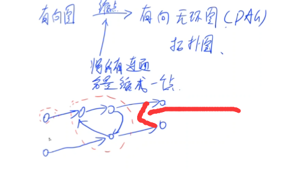

## 定义

连通分量:对于分量中任意两点 u,v 必然可以从 u 走到 v 且从 v 走到 u
强连通分量（Strongly Connected Components，SCC）的定义是：极大的强连通子图。

`强指的是精确，多一个不连通，少一个不是最大的`

```
   o→o→o→o
     ↑ ↓
   o→o→o→o
中间的环缩成一个点
o     o
  ↘ ↗
   o
  ↗ ↘
o     o
```

```Python
缩点
for i=1;i<=n;i++
 for i的所有邻点j
   if i和j不在同一scc中:
    加一条新边id[i]→id[j]
```

## 应用

`作用`：将一张图的每个强连通分量都缩成一个点，**将图转化为 DAG（有向无环)**,可以做拓扑
缩点举例:

应用:
求最短/最长路 递推
求一条路径，可以经过重复结点，要求经过的不同结点数量最多。`缩点+拓扑`

`求有向图强连通分量`：

## Tarjan 有向图的算法

1. tarjan 算法求强连通分量(SCC,Strongly Connected Component)
   `O(V+E)`

```Python
class Tarjan:
    @staticmethod
    def getSCC(
        n: int, adjMap: DefaultDict[int, Set[int]]
    ) -> Tuple[int, List[List[int]], List[int]]:
        """Tarjan求解有向图的强连通分量

        Args:
            n (int): 结点数
            adjMap (DefaultDict[int, Set[int]]): 图

        Returns:
            Tuple[int, List[List[int]], List[int]]: SCC的数量、分组、每个结点对应的SCC编号
        """

        def dfs(cur: int) -> None:
            if visited[cur]:
                return
            visited[cur] = True

            nonlocal dfsId, SCCId
            order[cur] = low[cur] = dfsId
            dfsId += 1
            stack.append(cur)
            inStack[cur] = True
            for next in adjMap[cur]:
                if not visited[next]:
                    dfs(next)
                    # 回退阶段
                    low[cur] = min(low[cur], low[next])
                elif inStack[next]:
                    # next被访问过而且也在stack里面，找到了一个环
                    low[cur] = min(low[cur], low[next])
                # 访问过但是不在stack里的点，说明是在别的SCC里面被统计过了

            # 这个条件说明我们在当前这一轮找到了一个SCC并且cur是SCC的最高点
            if order[cur] == low[cur]:
                while stack:
                    top = stack.pop()
                    inStack[top] = False
                    SCCGroupById[SCCId].append(top)
                    SCCIdByNode[top] = SCCId
                    if top == cur:
                        break
                SCCId += 1

        dfsId = 0
        order, low = [int(1e20)] * n, [int(1e20)] * n

        visited = [False] * n
        stack = []  # 用来存当前DFS访问的点
        inStack = [False] * n

        SCCId = 0
        SCCGroupById = [[] for _ in range(n)]
        SCCIdByNode = [-1] * n

        for cur in range(n):
            if not visited[cur]:
                dfs(cur)

        return SCCId, SCCGroupById, SCCIdByNode
```

有向图 tarjan 缩点技巧类似于`'有向图'的并查集`

2. kosaraju 算法
   略
