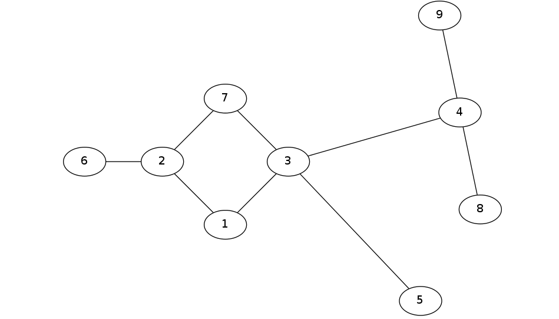
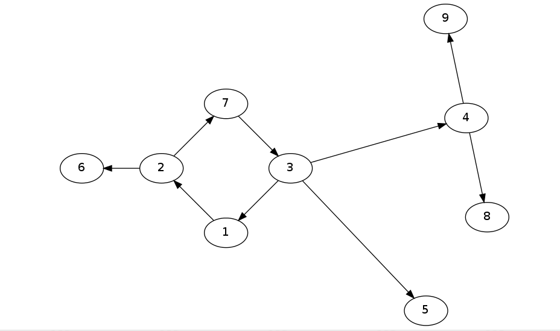
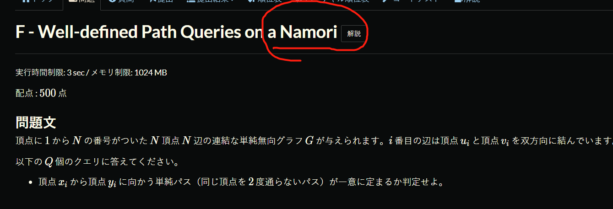

基环树也叫环套树
它的标准定义是：具有 `N 个点 N 条边的连通图`。
**从每个点出发，有一条唯一的边，那么这个图是基环树森林**

如果我们把中间那个醒目的环断开任意一条边，它就会成为一棵树，
如果我们把这个环全部断掉，就会成为一个森林。

所谓内向树的定义是`每个点出度为1`。也就是这棵树给人的大体感觉是向内的。适合寻找环

所谓外向树的定义是`每个点入度为1`。也就是这棵树给人的大题感觉是外向的。适合处理子树

断环成树，然后将若干棵树处理好之后，再考虑环对答案的影响。也就是将环、树分开讨论解决问题。
基环树的一种常用处理方式是`断环`(其实断开环后，就和树形 dp 一样)

基环树的另一种常用处理方式是`分类讨论`

- 基环树：给定一棵由 n 个点构成的树，在树上任意两点之间添加一条边，必然会生成且仅生成一个环。而在换上的每个点会挂有一棵树(或者没有树)，这样的图被称为基环树。
- 外向树：基环上某点上的树上的点都是由父节点指向子节点
- 内向树：基环上某点上的树上的点都是由子节点指向父节点
- 基环森林：由若干棵基环树组成的图
- 外向树森林：多棵外向树构成的森林
- 内向树森林：多棵内向树构成的森林

**基环树建图按照题目建有向还是无向，最好是内向基环树(adjMap)和外向基环树(rAdjMap)都建一下**
内向基环树找环，外向基环树处理子树

1. 找到所有环分组
2. 在每个环分组里处理，结果就是所有环分组结果的和

冷知识:为什么基环树叫做 Namori

