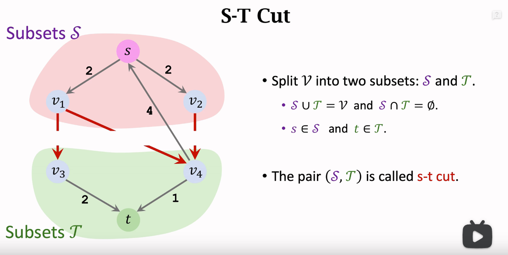

网络流一般用 Dinic 算法,重要点是建图
https://blog.csdn.net/weixin_42638946/article/details/120508463?spm=1001.2014.3001.5502

1. **流网络**
   在网络流相关问题中，在流网络（原网络） G=(V,E) 中不考虑反向边
   **可行流**:
   容量限制
   流量守恒

   **残量网络**
   **增广路径**
   `一个流是最大流当且仅当残量网络中不包括任何增广路径`

2. EK 求最大流(单路增广)
   `时间复杂度:O(V*E^2)`

   0. 根据原图构建残量网络
   1. bfs 在残量图上找增广路
   2. 更新残量网络增广路上的流量
   3. 重复执行 1、2 直到网络里没有增广路

   缺点:每次只增广了一条路

3. Dinic 求最大流(多路增广)
   https://baijiahao.baidu.com/s?id=1612179096991409044&wfr=spider&for=pc
   `时间复杂度:O(V^2*E)`
   稀疏图上，两者相差不大，但在稠密图上（二分匹配之类的）Dinic 的优势就很明显了。

   1. 根据原图构建残量网络
   2. bfs 分层(在 EK 中 bfs 是用于寻找增广路的)
   3. dfs 增广
   4. 重复执行 1、2 直到网络里没有增广路

   Dinic 通过爆搜优化了 EK
   避免环,采用了分层的概念
   每次找增广路径只能从前一层走到后一层

   - 分层有什么用？
     **如果存在环的话，会有无数条增广路径**，可以借助分层图的思想解决该问题
     有了每个点的层数编号，对任意点 u 到点 d 的路径如果有 dep[d]==dep[u]+1，我们就可以判断该路径在一条最短增广路上。
   - 当前弧优化的原理
     对于每个点，我们记录它应该从哪条边开始遍历，而不是全部从头遍历。具体细节参考代码的注释。
     我们在按顺序 dfs 时，先被遍历到的边肯定是已经增广过了（或者已经确定无法继续增广了），那么这条边就可以视为“废边”,`可以标记为删除`
     那么下次我们再到达该节点时，就可以直接无视掉所有废边，只走还有用的边，也就是说，每次 dfs 结束后，下次 dfs 可以更省时间。

   - Dinic 在跑二分图匹配时比匈牙利快很多。

   - dfs 找增广路的三处优化

   ```Python
       def dfsWithCurArc(cur: Vertex, minFlow: int) -> int:
            """dfs增广 采用当前弧优化

            Args:
                cur (int): 当前点
                minFlow (int): 当前增广路上最小流量

            Returns:
                int: 增广路上的容量

            注意到字典存储的键是插入有序的 因此可以用作记录当前弧
            每次分配完的边就不再dfs了

            每个点的当前弧初始化为head
            每次我们找过某条边(弧)时,修改cur数组,改成该边(弧)的编号,
            下次到达该点时,会直接从cur对应的边开始(也)是说从head到cur中间的那一些边(弧)我们就不走了）。
            """

            if cur == end:
                return minFlow

            flow = 0
            while True:
                if flow >= minFlow:  # !重要的优化 当前弧优化的基础
                    break
                try:
                    # 当前弧优化
                    child = next(curArc[cur])
                    if (depth[child] == depth[cur] + 1) and (self._reGraph[cur][child] > 0):
                        min_ = minFlow - flow
                        if self._reGraph[cur][child] < minFlow - flow:
                            min_ = self._reGraph[cur][child]
                        nextFlow = dfsWithCurArc(child, min_)
                        # !优化：不存在路径 删掉这条边
                        if nextFlow == 0:
                            depth[child] = -1
                        self._reGraph[cur][child] -= nextFlow
                        self._reGraph[child][cur] += nextFlow
                        flow += nextFlow
                except StopIteration:
                    break
            return flow
   ```

4. S-T Cut
   
   Cut 截断水流
   最大流最小割定理(最大流的流量等于最小割的容量)
   
