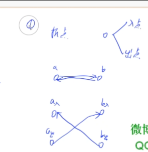

S 到 T 的最小割等于求最大流
最小割问题是指：给出一种有向图（无向图）和两个点 S、T，
以及图中的边的边权，求一个权值和最小的边集，
使得`删除这些边`之后，S 和 T 不连通。
这类问题，一般运用最大流等于最小流定理，求出 S 到 T​ 的最大流来解决。

如果题目问的是`删除点`怎么办?
拆点，一个点拆成两个点(入点和出点)
**把边拆成两条边，a=>b 变成 a=>mid=>b**
那么删除点就变成删除两条边 转换为最小割删边

最小割讲座
https://github.com/tdzl2003/leetcode_live/tree/master/flow20220719

- 狼/羊/障碍/空地问题
  所有非障碍的每个点拆成出点和入点，如果是空地流量为 1 否则为无穷大；虚拟源点连通所有的狼，所有的羊连通虚拟汇点，所有出点连通右边和下面的入点；跑一遍最大流，流量为多少就至少需要放几个障碍，再把最大流路径上的点求出来，如果空地的出点入点都在最大流路径上，那就放一个障碍。
  网格图是二分图，dinic 跑的超级快。
