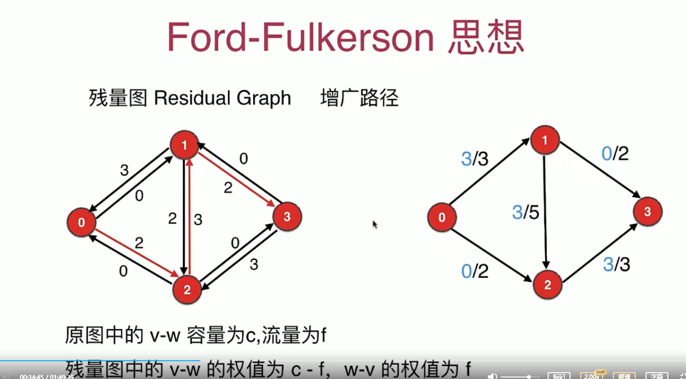
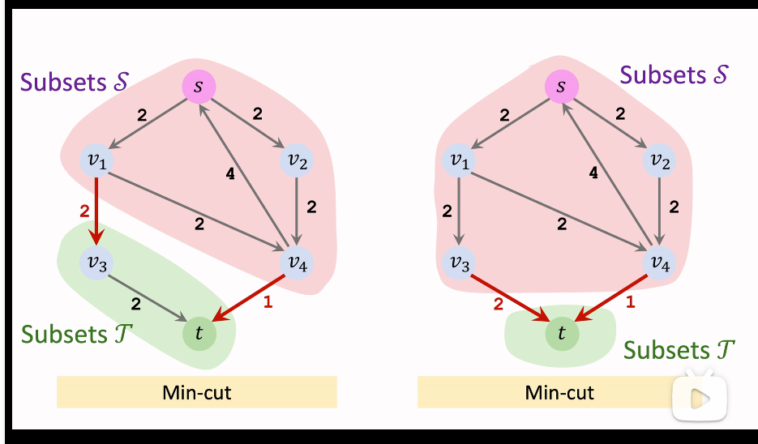

有向有权图最大流算法

- FF 算法:在残量图中不断找增广路径直到没有增广路径为止 O(`maxflow*E`)
  

- `EK 算法` O(VE^2):FF 算法的特例 bfs 在残量图中寻找增广路，再更新残量图；往复继续 bfs 直到残量图中找不到增广路径
- Dinic 算法

`最小割`
一个图，每条边都有一个代价，现在需要破坏**一些边**使图中的某两个点不连通，求最小的代价是多少。
`寻找两个点间的最小割等于寻找两个点间的最大流`
`最大流最小割(Max-flow min-cut)定理提供了对于一个网络流，从源点到目标点的最大的流量等于最小割的每一条边的和`

