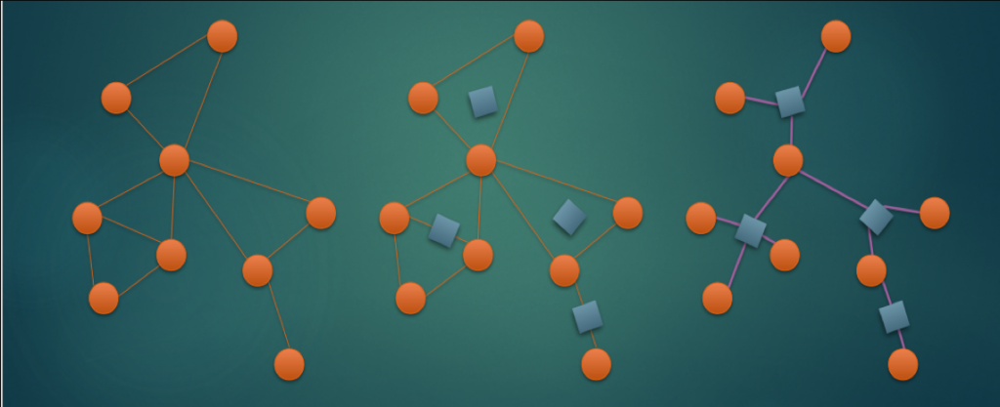

https://blog.csdn.net/a_forever_dream/article/details/103019013
https://www.geeksforgeeks.org/articulation-points-or-cut-vertices-in-a-graph/?ref=lbp

BCC:Biconnected Connected Components(双连通分量)
`注意 Tarjan 的 BCC 和 SCC 写在同一份 paper`
Tarjan 三大算法： 1)有向图的强连通分量 SCC 2) 无向图的双联通分量 EBCC、VBCC 3) 最近公共祖先 LCA

无向图双连通分量的应用：tarjan 缩点成树，可以用树的很多性质例如树形 dp；并查集

1. `点双连通分量(vbcc)，如果说bcc一般指vbcc` 和 边双连通分量(ebcc)
   连通的概念：在无向图中，所有点能互相到达
   `连通分量`：互相联通的子图
   在一张连通的无向图中，对于两个点 u 和 v ，
   如果无论删去哪条边（只能删去一条）都不能使它们不连通，我们就说 u 和 v `边双连通`。
   如果无论删去哪个点（只能删去一个，不能删自己）都不能使它们不连通，我们就说 u 和 v `点双连通`。
   即`边双联通分量里没有桥，点双连通分量里没有割点`
   注意：点双联通的的定义是 仅仅对于该图而言 其中不包含割点，那么称这个图是点双连通的，`也就是说，可以包含原图中的割点。`
2. 桥和割点

   ```
   如何找桥？    x
               /
              y
   cur和next之间是桥 <=> low[next]>order[cur] next无论如何往上走不到cur

   如何找割点？    x
               /
              y
   cur是割点 <=>
   如果cur不是根节点 low[next]>=order[cur] 即为割点
   如果cur是根节点 孩子节点>=2即为割点
   ```

## Tarjan 无向图的算法

- 求双联通分量，一般用于缩点(把环全部缩成点)

```py
LCP 54. 夺回据点-无向图tarjan缩点
点双联通分量内部满足任意两个点都在某个环上（用割点处理），
而边双连通分量保证每条边都在某个环上（用割边处理）。
这里用点双缩点的原因是，如果初始选择的点在割点上，就会使得魔物分成两个连通块，
所以首先应该想到的就是筛割点，然后缩点后简化成一个树去处理。
问题的角度和边被破坏没有关系，只有点被破坏了才会影响问题的答案，所以只往割点/点双连通分量去考虑
```

- 求桥和割点
  > > > 割点和桥；没有关系

## 结论

- 图中任意一个割点都在至少两个点双中。
- 任意一个不是割点的点都只存在于一个点双中。
- 割边不属于任意边双，而其它非割边的边都属于且仅属于一个边双
- 对于一个边双中的任意两个点，它们之间都有至少两条边不重复的路径 (充要条件，将一棵树变成一个边双连通分量最少加边数)
- 点双连通分量可以有公共点，而边双连通分量不能有公共边
- 点双连通分量一定是边双连通分量（除两点一线的特殊情况），反之不一定
- 两个割点之间的边不一定是桥，一个桥的两个端点也不一定是割点

  **找点双和边双模板**
  https://www.acwing.com/blog/content/2926/
  https://www.cnblogs.com/DWVictor/p/11348042.html(推荐)
  https://kirainmoe.com/blog/post/tarjan-algorithm-learning-note/(缩点等应用)

**注意求割点更新 low 时，已经看过的 next 使用 order 数组更新**

```Python
elif visited[next]:
    low[cur] = min(low[cur], order[next])  # 注意这里是order
```

用 low 数组更新是错误的，例如这个样例

<!-- [[0,1],[0,2],[1,2],[2,5],[2,4],[3,4],[3,5],[4,5]] -->

割点割边应该是 `({2}, set())`
low 更新求出来无割点

- 圆方树 (每个点双都建立一个虚拟的方点连接)
  https://blog.aor.sd.cn/archives/418/#:~:text=%E5%9C%86%E6%96%B9%E6%A0%91%E6%98%AF%E5%AF%B9%E4%BA%8E%E8%BF%9E%E9%80%9A,%E7%82%B9%E7%9B%B8%E8%BF%9E%E8%BF%99%E7%A7%8D%E5%BD%A2%E5%BC%8F%E3%80%82
  圆方树是对于连通无向图定义的一颗树，其中每个原图中的点都叫圆点，
  而我们为每个`点双`都新建一个方点，
  而圆方树上所有边都是由一个方点和一个属于其对应点双的圆点相连这种形式。
  
  在圆方树中，原来的每个点对应一个 圆点，每一个点双对应一个 方点。
  而对于每一个点双连通分量，它对应的方点向这个点双连通分量中的每个点连边。
  每个点双形成一个“菊花图”，多个“菊花图”通过原图中的割点连接在一起（因为点双的分隔点是割点）。
  如果原图连通，则“圆方树”才是一棵树，如果原图有 k 个连通分量，则它的圆方树也会形成 k 棵树形成的森林。
  !如果原图中某个连通分量只有一个点，则需要具体情况具体分析，我们在后续讨论中不考虑孤立点。

  例题:

  有一张 n 个点 m 条边的无向连通图，还有 q 个点对，
  你需要输出每个点是多少**给定点对的必经点**（即如果点对为 (u,v)，
  那么如果 u 到 v 无论如何都要经过 x ，那么 x 是该点对的必经点）
  直接建出圆方树，**发现(u,v) 在圆方树路径上的圆点都是必经点，lca 树上差分**一下就可以了。

---

https://github.com/spaghetti-source/algorithm/blob/4fdac8202e26def25c1baf9127aaaed6a2c9f7c7/_note/scc_comparison.cc#L6

//
// Strongly Connected Component Comparison
//
// Gabow = Tarjan < Kosaraju.
// This difference can be ignorable in most cases.
//
// Conclusion:
// `Use Gabow (fast and memory efficient) or Kosaraju (short).`
//
