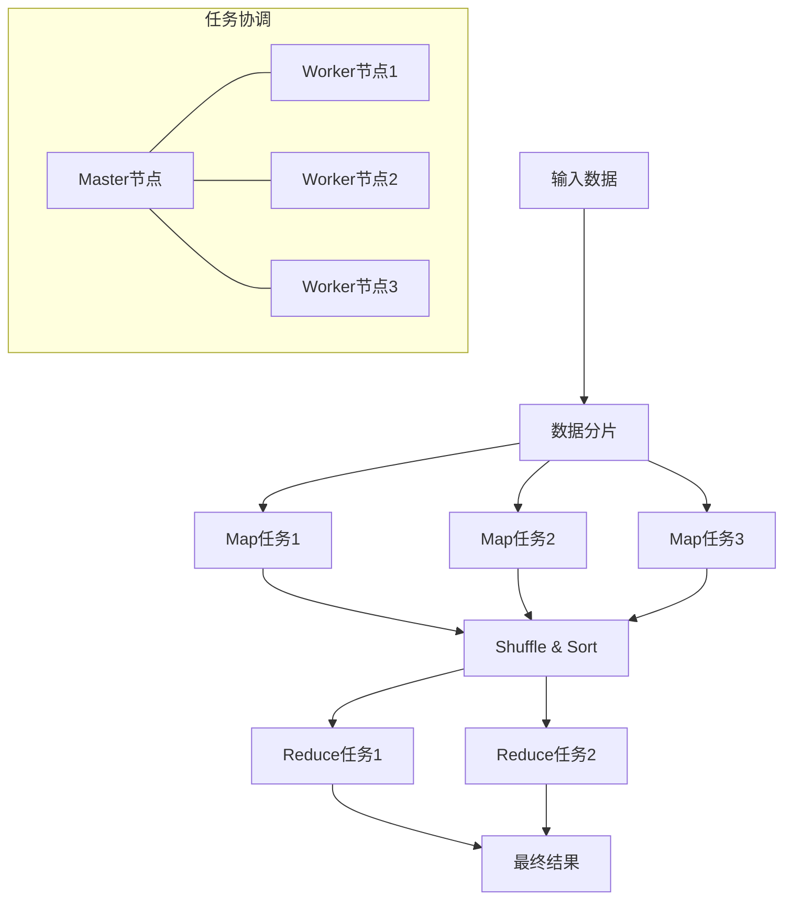
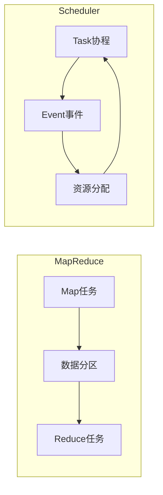

# MapReduce 工作流程与Scheduler对比

## MapReduce工作流程图

## MapReduce与Scheduler的区别

| 特性         | MapReduce                        | Scheduler协程调度器    |
| ------------ | -------------------------------- | ---------------------- |
| **目的**     | 大规模数据处理                   | 任务并发调度           |
| **规模**     | 分布式集群                       | 单进程内               |
| **处理模型** | 数据批处理                       | 事件驱动               |
| **执行方式** | 静态执行计划(Map→Shuffle→Reduce) | 动态响应事件           |
| **任务粒度** | 粗粒度任务                       | 细粒度协程             |
| **容错机制** | 内置(任务重试、数据复制)         | 通常无内置容错         |
| **资源管理** | 集群资源分配                     | 协程调度和资源竞争管理 |
| **通信模式** | 通过文件系统传递数据             | 通过事件和共享状态     |
| **状态保存** | 中间结果持久化                   | 内存中状态传递         |

## 核心概念对比

MapReduce是一个面向数据的分布式计算框架，而Scheduler是一个面向事件的协程调度系统，前者处理大规模数据计算，后者管理任务级并发和资源竞争。
