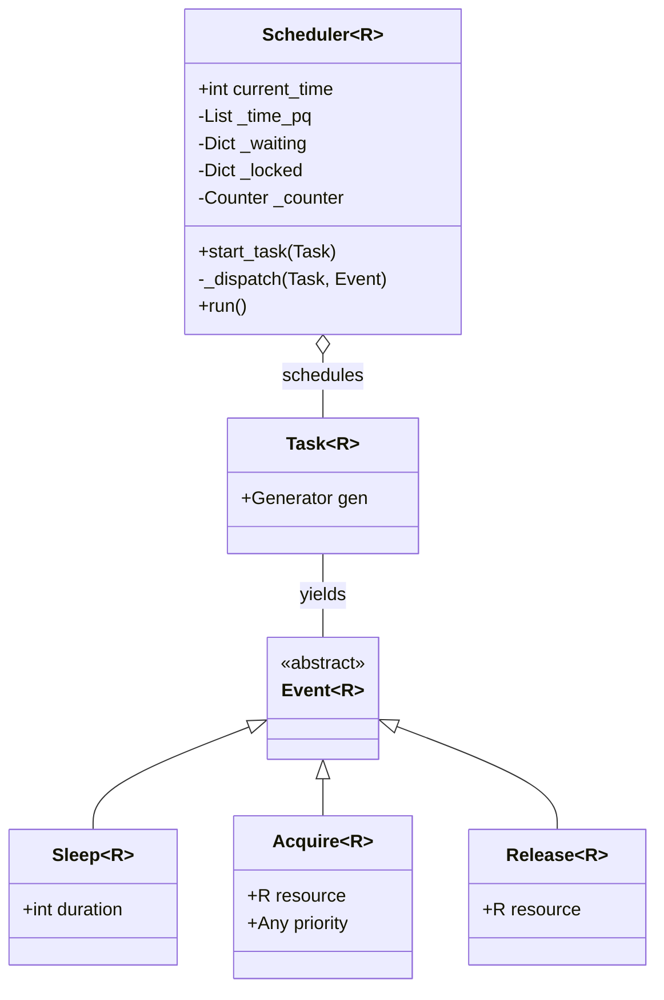
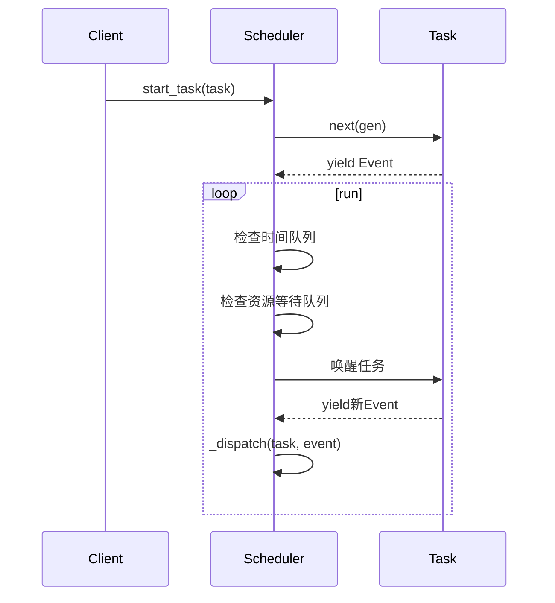
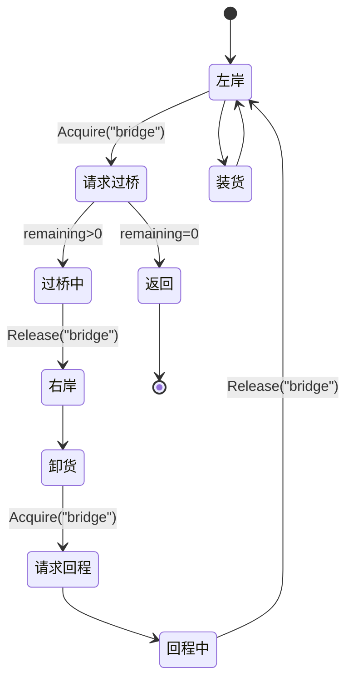

# 协程调度器架构详解

**有框架后，不用关心任何细节，只要用几种原语 acquire、release、sleep 就能创建出更加灵活的任务.**

## 架构概述

这是一个基于事件驱动的协程调度器实现，通过模拟操作系统调度原理，来解决资源竞争问题。

## 系统工作流程

```mermaid
flowchart TD
    A[创建任务] --> B[start_task]
    B --> C[_dispatch]
    C -->|Sleep| D[添加到时间队列]
    C -->|Acquire| E[添加到资源等待队列]
    C -->|Release| F[释放资源]

    G[run方法] --> H{时间队列有到期任务?}
    H -->|Yes| I[唤醒任务]
    H -->|No| J{有可获取资源?}
    J -->|Yes| K[分配资源给最高优先级任务]
    J -->|No| L[快进到下一时间点]

    I --> C
    K --> C
    L --> G
    F --> C
```

## 核心组件解析

### 1. 事件系统

- **Event**: 标记接口，表示协程可以yield的事件类型
- **Sleep**: 请求在指定时长后唤醒
- **Acquire**: 请求获取资源，带优先级
- **Release**: 释放资源，允许其他任务获取

### 2. 任务系统

- **TaskGen**: 协程类型，可以yield出Event对象
- **Task**: 包装协程生成器的类

### 3. 调度器

- ## **数据结构**:

\_time_pq

: 最小堆，按唤醒时间排序

-

\_waiting

: 资源等待队列，按优先级排序

-

\_locked

: 资源占用状态表

## 桥梁过河问题实现

这个调度器架构通过协程和事件机制，优雅地实现了复杂的资源竞争处理，可以扩展到更多场景。

---

这段代码模拟了一个任务调度系统，使用协程来管理 worker 执行运输任务的过程，并通过 `Scheduler` 类调度这些任务的执行。目标是通过多个 worker 把货物从左岸运输到右岸，并计算最后一箱货物到达右岸的时间。

### 代码分析

1. **基本结构**

   - **事件类型（Events）**：定义了 `Sleep`, `Acquire`, `Release` 三种事件，用于描述任务中的不同动作。每个任务都通过 `yield` 来生成这些事件，调度器 (`Scheduler`) 根据这些事件控制任务的执行顺序。
   - **任务类（Task & Scheduler）**：`Task` 类包含一个生成器，生成器每次 `yield` 一个事件，`Scheduler` 类负责调度这些任务，并在每次事件完成后根据事件类型做出相应的处理（例如：过桥、卸货等）。

2. **资源管理**

   - 每个 worker 都有一个独立的生成器 `worker(i)`，每个 worker 的操作包括申请过桥、过桥、卸货、回程等，这些操作通过事件 `Acquire` 和 `Release` 来控制资源（桥）。
   - 桥是共享资源，通过 `Acquire("bridge", ...)` 来申请过桥资源，过桥后释放资源。

3. **调度流程**

   - 调度器的 `run()` 方法是任务调度的核心，持续检查并执行：

     - 时间到的事件优先执行。
     - 如果有可用的资源（桥），优先唤醒等待的任务。
     - 如果没有可执行的任务，就快进到下一个 `wake_time`。

4. **Worker 协程**

   - 每个 worker 执行的任务逻辑是通过生成器（协程）来管理的。每个 worker 在运输货物时，不同的事件在不同的阶段进行 `yield`，并在各个步骤之间切换（如：过桥、卸货、回程等）。
   - `Acquire` 和 `Release` 用于管理资源请求和释放。
   - `Sleep` 用来模拟延迟（如过桥时间、卸货时间等）。

### 存在的问题与优化

#### 1. **性能瓶颈**

- **时间队列与资源等待队列的频繁操作**：

  - 每当有任务被唤醒时，`heappop` 和 `heappush` 会被频繁调用。这些操作的时间复杂度是 O(log N)，但是如果任务非常多（例如 `n` 或 `k` 都很大），这种操作会产生大量的开销。

- **优化建议**：

  - **延迟处理资源请求**：可以通过减少对 `heappop` 和 `heappush` 的调用次数来优化性能。例如，在某些情况下，可以通过批量处理资源申请或事件调度，避免频繁的堆操作。
  - **资源请求优先级的优化**：在每次对资源进行 `Acquire` 操作时，可以考虑根据优先级对任务进行合并处理，减少不必要的堆操作。

#### 2. **`Scheduler` 中的时间推移逻辑**

- **`self.current_time` 的管理**：在每次任务被调度执行时，`self.current_time` 是通过 `heappop(self._time_pq)` 来更新的，表示当前时间是最早的任务的唤醒时间。这个过程可能会存在问题，如果 `self._time_pq` 中的时间并不连续（即存在其他任务在当前时间之前就已被唤醒），会导致任务间的执行错乱。
- **优化建议**：确保时间顺序的统一性，或者使用一个时间模拟器来推算整个系统的时间流程，避免不一致性。

#### 3. **任务与资源的调度冲突**

- **`_waiting` 队列的同步问题**：任务的资源申请是通过 `Acquire` 操作来管理的，当多个任务请求同一资源（如桥）时，可能会因为优先级等原因导致队列中的顺序混乱，从而影响调度。虽然是通过优先级和 `seq` 来保证正确性，但在某些极端情况下，调度的复杂度会增加。
- **优化建议**：

  - 引入更精细的锁机制来保证资源的有效管理。考虑使用线程池或其他形式的异步调度机制。

#### 4. **最后时间的计算**

- **`last_time` 更新逻辑**：当前 `last_time` 只是简单地记录最后一个 `worker` 完成所有任务时的时间，但在并行执行多个任务时，任务完成的顺序可能会影响最后的时间。当前实现没有考虑任务并发执行的正确性。
- **优化建议**：

  - 在调度完成后，应该考虑所有任务的结束时间，并返回最大的 `current_time`。

#### 5. **资源冲突和优先级管理**

- 在任务的调度过程中，`Acquire` 和 `Release` 的优先级管理较为简单，可能导致多个任务之间的资源竞争没有得到合理的调度。当前实现使用了一个简单的优先级排序 `(side, -cross_time, -i)` 来决定谁先过桥，但没有考虑可能的边界条件（如任务时间重叠、多个任务并发等）。
- **优化建议**：

  - 使用更复杂的优先级机制或引入队列调度器来处理多个任务之间的冲突和优先级调度问题。

#### 6. **内存与对象管理**

- 代码中使用了大量的 `Task`, `Event`, `Scheduler` 对象，可能导致内存的频繁分配和垃圾回收。在高并发的情况下，这些对象的创建和销毁可能会带来不必要的性能开销。
- **优化建议**：

  - 尽量减少对象的频繁创建与销毁，使用对象池或内存复用的方式来优化性能。

#### 7. **协程的多次 `yield` 问题**

- 每个任务在执行过程中会 `yield` 多次（例如，过桥、卸货、回程等）。这可能导致协程的切换非常频繁，尤其是在大规模的任务调度下，性能会受到影响。
- **优化建议**：

  - 将任务逻辑分为更少的 `yield` 点，避免频繁的协程切换。

### 结论

这段代码整体上实现了一个事件驱动的调度系统，通过协程和事件模型来模拟多个 worker 执行任务的过程。然而，在性能和资源管理方面存在一些优化空间，尤其是在大规模任务和高并发执行时，可以通过减少堆操作、优化时间推移逻辑、引入更精细的优先级管理等手段来提升性能。同时，最后时间的计算、资源冲突的处理和协程切换的优化也是进一步改进的方向。
