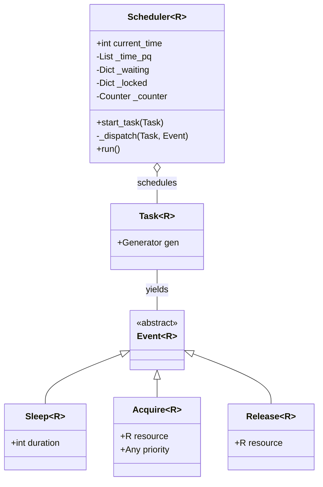
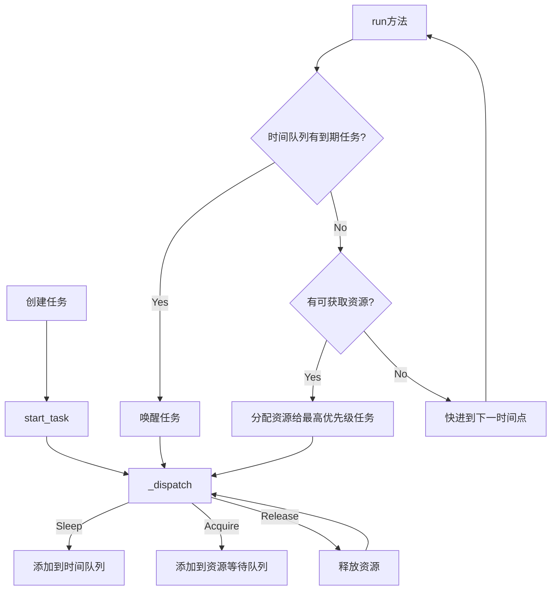
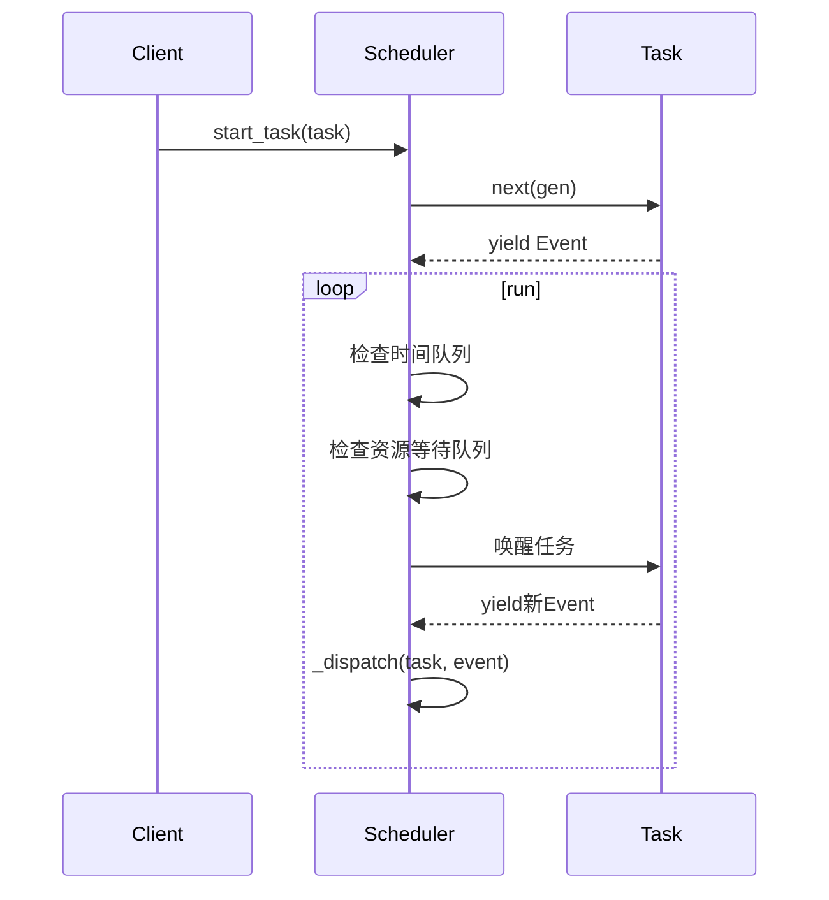
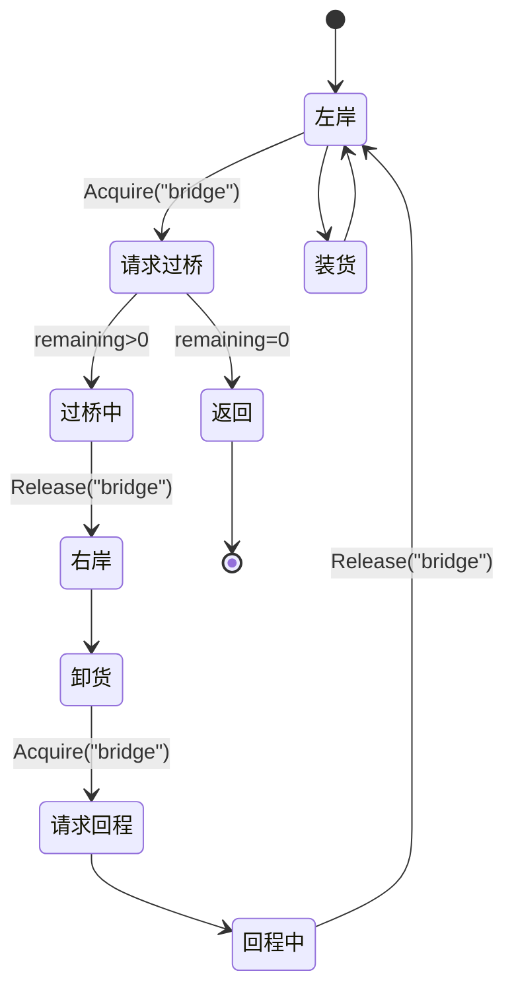

# 协程调度器架构详解

## 架构概述

这是一个基于事件驱动的协程调度器实现，通过模拟操作系统调度原理，来解决资源竞争问题。

## 系统工作流程

## 核心组件解析

### 1. 事件系统

- **Event**: 标记接口，表示协程可以yield的事件类型
- **Sleep**: 请求在指定时长后唤醒
- **Acquire**: 请求获取资源，带优先级
- **Release**: 释放资源，允许其他任务获取

### 2. 任务系统

- **TaskGen**: 协程类型，可以yield出Event对象
- **Task**: 包装协程生成器的类

### 3. 调度器

- **数据结构**:
  -

\_time_pq

: 最小堆，按唤醒时间排序

-

\_waiting

: 资源等待队列，按优先级排序

-

\_locked

: 资源占用状态表

## 桥梁过河问题实现

这个调度器架构通过协程和事件机制，优雅地实现了复杂的资源竞争处理，可以扩展到更多场景。
